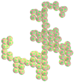

<link rel="stylesheet" href="scripts/style.css">
<meta charset="utf-8">
<link rel="icon" type="image/png" href="catalangems/vr/salas/imagens/icone.png">
<h2>Visualization of Polyhedra with Virtual Reality (VR) in A-frame</h2>
 <b>author:</b> Paulo Henrique Siqueira - Universidade Federal do Paraná
  <b>contact:</b> <a href="#">paulohscwb@gmail.com</a>
  <a href="https://paulohscwb.github.io/polyhedra3/pt-br/">versão em português</a>
 

   New page: the 3D models of polyhedra and fractals can be seen in Virtual Reality (VR).

<h3 style="margin-top:3px"><a target="_blank" href="catalangems/"> Catalan Gems</a></h3>
<h3 style="margin-top:3px"><a target="_blank" href="dragon-archimedes/"> Archimedes and Catalan Dragon Fractals</a></h3>
<h3 style="margin-top:3px"><a target="_blank" href="kites/"> Star kites</a></h3>
<h3 style="margin-top:3px"><a target="_blank" href="araucaria/"> Araucaria with polyhedrons</a></h3>
<h3 style="margin-top:3px"><a target="_blank" href="dragon-nonconvex/"> Dragon fractals of non-convex polyhedra</a></h3>
<h3 style="margin-top:3px"><a target="_blank" href="fractal-catalan/"> Catalan fractals</a></h3>
<!--<h3 style="margin-top:3px"><a target="_blank" href="deltahedra/"> Deltahedra</a></h3>
<h3 style="margin-top:3px"><a target="_blank" href="unicorn-platonic/"> Plato's Unicorn Fractals</a></h3>
<h3 style="margin-top:3px"><a target="_blank" href="dragon-catalan/"> Catalan Dragon Fractals</a></h3>
<h3 style="margin-top:3px"><a target="_blank" href="fractalnonconvex1/"> Fractals of non-convex polyhedra</a></h3>
<h3 style="margin-top:3px"><a target="_blank" href="truncated-archimedes/"> Truncated Archimedean polyhedra</a></h3>
<h3 style="margin-top:3px"><a target="_blank" href="unicorn-catalan/"> Catalan Unicorn Fractals</a></h3>
<h3 style="margin-top:3px"><a target="_blank" href="fractalnonconvex2/"> Fractals of non-convex polyhedra 2</a></h3>
<h3 style="margin-top:3px"><a target="_blank" href="unicorn-archimedes/"> Archimedes Unicorn Fractals</a></h3>
<h3 style="margin-top:3px"><a target="_blank" href="fractalnonconvex3/"> Fractals of non-convex polyhedra 3</a></h3>
<h3 style="margin-top:3px"><a target="_blank" href="truncated-catalan/"> Truncated Catalan polyhedra</a></h3>
<h3 style="margin-top:3px"><a target="_blank" href="unicorn-nonconvex1/"> Unicorn fractals of non-convex polyhedra</a></h3>
<h3 style="margin-top:3px"><a target="_blank" href="dragon-nonconvex2/"> Dragon fractals of non-convex polyhedra 2</a></h3>
<h3 style="margin-top:3px"><a target="_blank" href="unicorn-nonconvex2/"> Unicorn fractals of non-convex polyhedra 2</a></h3>
<h3 style="margin-top:3px"><a target="_blank" href="fractalnonconvex4/"> Fractals of non-convex polyhedra 4</a></h3>
<h3 style="margin-top:3px"><a target="_blank" href="dragon-nonconvex3/"> Dragon fractals of non-convex polyhedra 3</a></h3>
<h3 style="margin-top:3px"><a target="_blank" href="fractalnonconvex5/"> Fractals of non-convex polyhedra 5</a></h3>
<h3 style="margin-top:3px"><a target="_blank" href="unicorn-nonconvex3/"> Unicorn fractals of non-convex polyhedra 3</a></h3>
<h3 style="margin-top:3px"><a target="_blank" href="fractalnonconvex6/"> Fractals of non-convex polyhedra 6</a></h3>-->

<!--<h3 style="margin-top:5px; text-align:center;"><a target="_blank" href="all/">&#x1f4c4; Complete list of polyhedra</a></h3>-->
<h3 style="margin-top:5px; text-align:center;"><a target="_blank" href="../polyhedra/">&#x2B50; Polyhedra - first part</a></h3>
<h3 style="margin-top:5px; text-align:center;"><a target="_blank" href="../polyhedra2/">&#x2B50; Polyhedra - second part</a></h3>

<h3 align="center">Virtual Reality</h3>

<h3 align="center">3D models</h3>

 The orbit scripts developed by <b>Kevin Ngo</b> were used in the Virtual Reality pages of the 3D models: <a href="https://github.com/supermedium/superframe/tree/master/components/orbit-controls/" target="_blank"> Orbit controls for A-Frame</a>.
 The teleport scripts developed by <b>Fernando Serrano</b> were used in the Virtual Reality pages of the 3D models: <a  href="https://aframe.io/blog/teleport-component/" target="_blank"> Developing an A-Frame Teleport Component</a>
 

  Polyhedra 3: visualization with Virtual Reality by <a xmlns:cc="http://creativecommons.org/ns#" href="https://paulohscwb.github.io/polyhedra3/" property="cc:attributionName" rel="cc:attributionURL">Paulo Henrique Siqueira</a> is licensed with a license <a rel="license" href="http://creativecommons.org/licenses/by-nc-nd/4.0/">Creative Commons Attribution-NonCommercial-NoDerivatives 4.0 International</a>.

<h4>How to cite this work:</h4> 

Siqueira, P.H., "Polyhedra 3: Visualization of polyhedra with Virtual Reality". Available in: <https://paulohscwb.github.io/polyhedra3/>, February 2025.

<!---->

 <b>References:</b>
 Weisstein, Eric W. "Archimedean Solid" From MathWorld-A Wolfram Web Resource. <a href="http://mathworld.wolfram.com/ArchimedeanSolid.html" target="_blank">http://mathworld.wolfram.com/ArchimedeanSolid.html</a>
 Weisstein, Eric W. "Platonic Solid" From MathWorld-A Wolfram Web Resource. <a href="http://mathworld.wolfram.com/PlatonicSolid.html" target="_blank">http://mathworld.wolfram.com/PlatonicSolid.html</a>
 Weisstein, Eric W. "Archimedean Dual" From MathWorld-A Wolfram Web Resource. <a href="https://mathworld.wolfram.com/ArchimedeanDual.html" target="_blank">https://mathworld.wolfram.com/ArchimedeanDual.html</a>
 Weisstein, Eric W. "Uniform Polyhedron." From MathWorld--A Wolfram Web Resource. <a href="https://mathworld.wolfram.com/UniformPolyhedron.html" target="_blank">https://mathworld.wolfram.com/UniformPolyhedron.html</a>
 Wikipedia <a href="https://en.wikipedia.org/wiki/Archimedean_solid" target="_blank">https://en.wikipedia.org/wiki/Archimedean_solid</a>
 Wikipedia <a href="https://en.wikipedia.org/wiki/en.wikipedia.org/wiki/Platonic_solid" target="_blank">https://en.wikipedia.org/wiki/Platonic_solid</a>
 McCooey, David I. "Visual Polyhedra". <a href="http://dmccooey.com/polyhedra/" target="_blank">http://dmccooey.com/polyhedra/</a>
