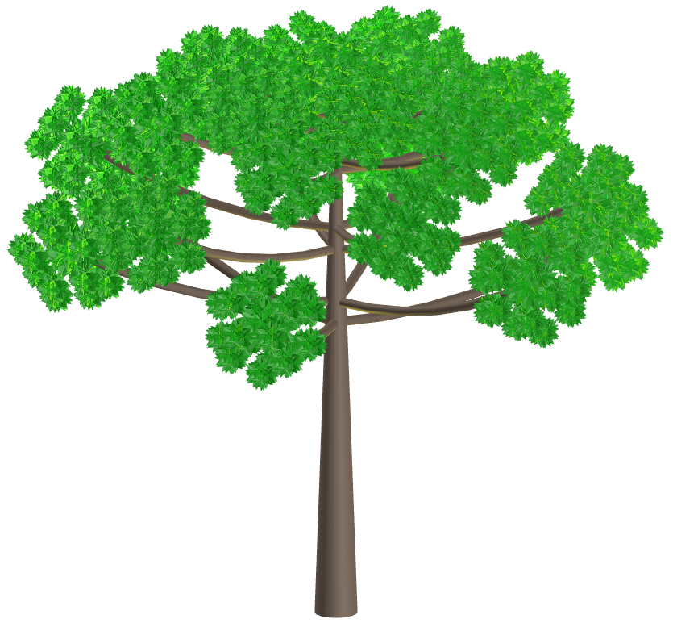
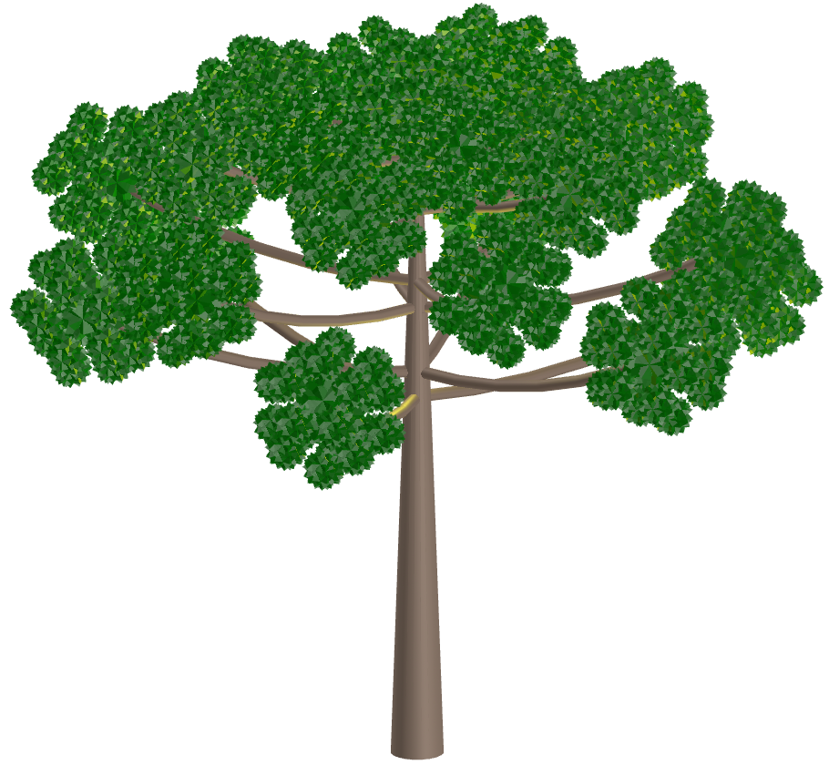
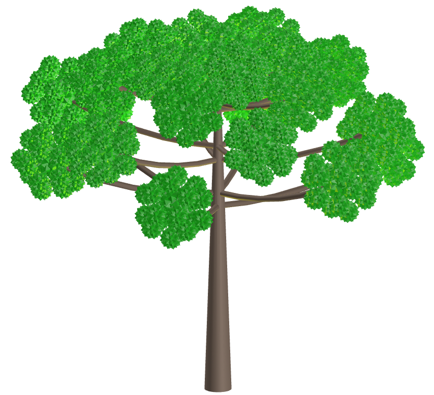
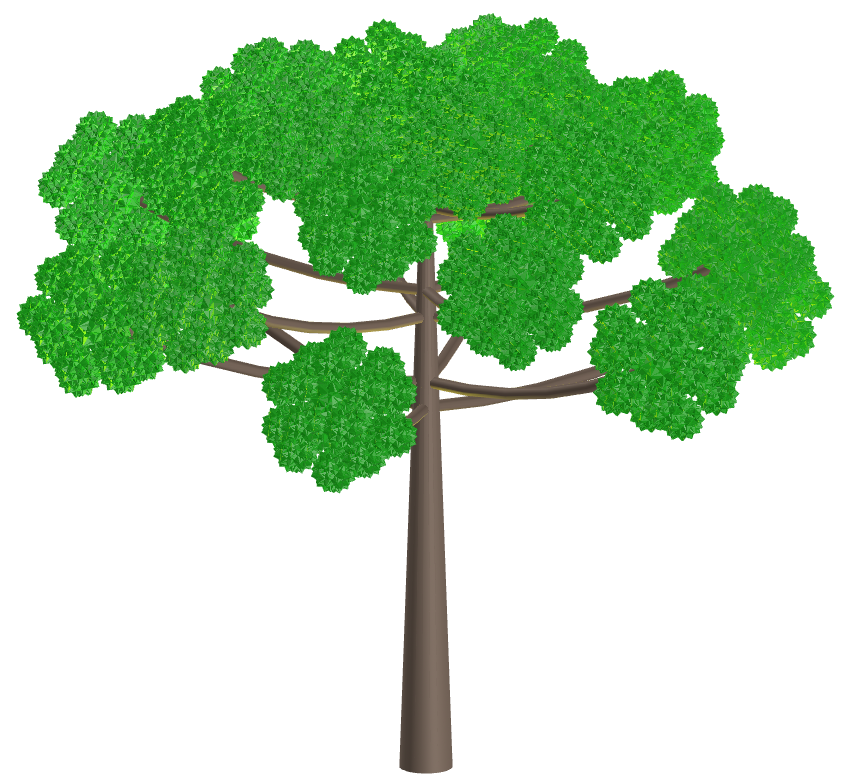
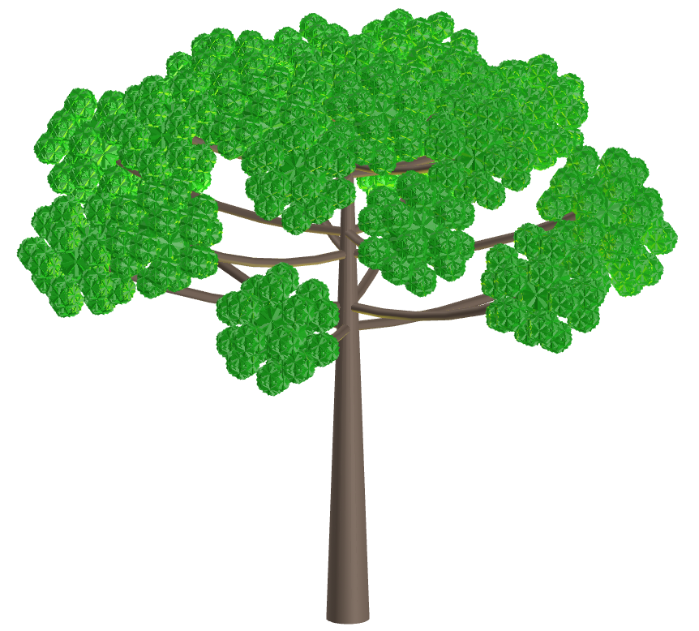
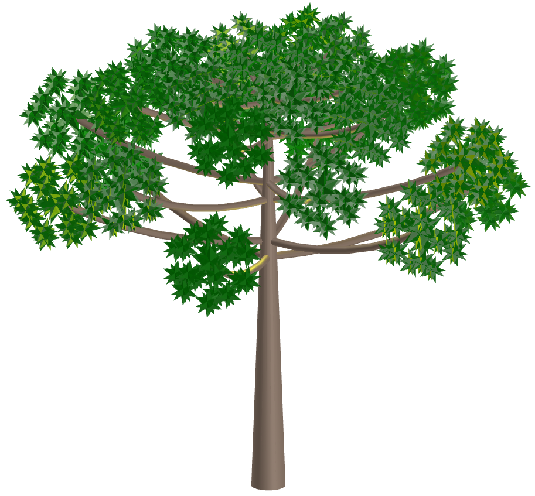
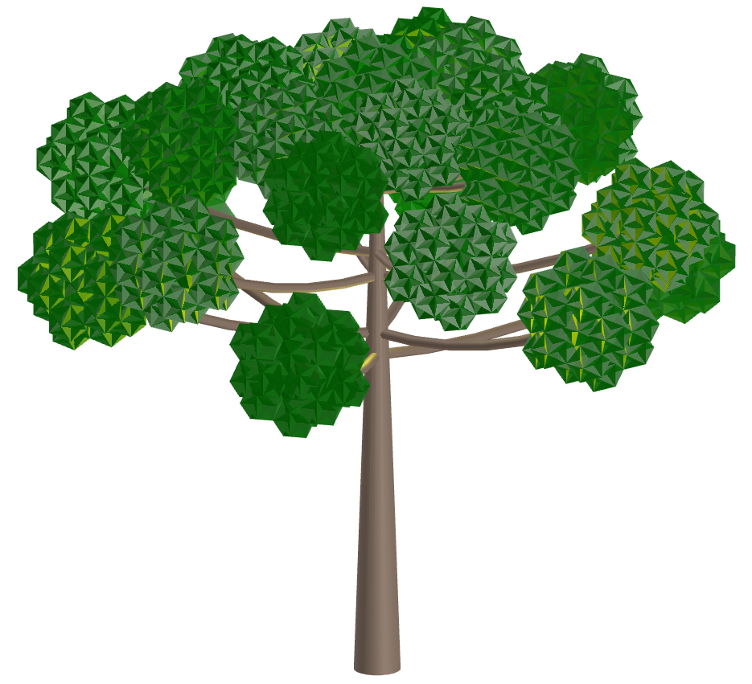
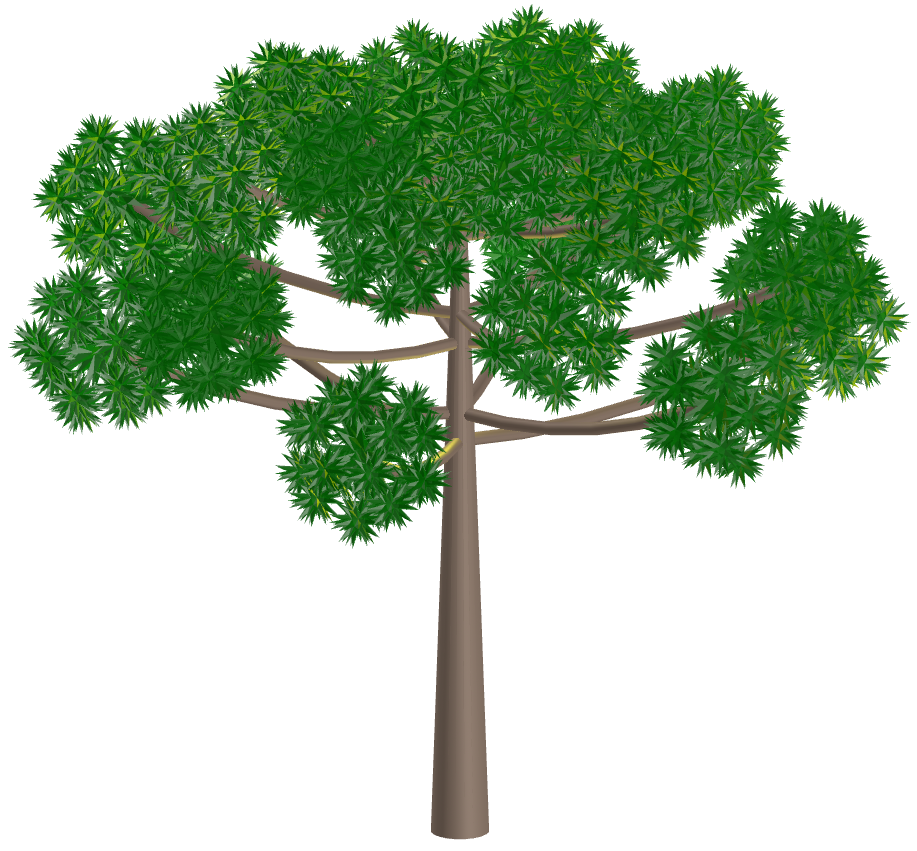

<link rel="stylesheet" href="../scripts/style.css">
<meta charset="utf-8">
<link rel="icon" type="image/png" href="vr/salas/imagens/icone.png">
<h2>Visualization of Polyhedra with Virtual Reality (VR) in A-frame</h2>
 <b>author:</b> Paulo Henrique Siqueira - Universidade Federal do Paraná
  <b>contact:</b> <a href="#">paulohscwb@gmail.com</a>
  <a href="https://paulohscwb.github.io/polyhedra3/araucaria/pt-br/">versão em português</a>
 <form style="margin: 0 auto; float:right; text-align:right; width:100%; margin-bottom:15px;">
	<select id="url" onchange="urlHandler(this.value)" style="color:royalblue;">
		<option disabled selected value>More solids:</option>
		<option value="../catalangems/">Catalan gems</option>
		<option value="../dragon-archimedes/">Archimedes Dragon Fractals</option>
		<option value="../kites/">Star kites</option>
		<option disabled value="../araucaria/">Araucaria with polyhedrons</option>
		<!--<option value="../fractal_catalan/">Catalan fractals</option>
		<option value="../deltahedra/">Deltahedra</option>
		<option value="../unicorn_platonic/">Plato's Unicorn Fractals</option>
		<option value="../dragon_catalan/">Catalan Dragon Fractals</option>
		<option value="../fractalnonconvex1/">Fractals of non-convex polyhedra</option>
		<option value="../truncated_archimedes/">Truncated Archimedean polyhedra</option>
		<option value="../unicorn_catalan/">Catalan Unicorn Fractals</option>
		<option value="../dragon_nonconvex/">Dragon fractals of non-convex polyhedra</option>
		<option value="../fractalnonconvex2/">Fractals of non-convex polyhedra 2</option>
		<option value="../unicorn_archimedes/">Archimedes Unicorn Fractals</option>
		<option value="../fractalnonconvex3/">Fractals of non-convex polyhedra 3</option>
		<option value="../truncated_catalan/">Truncated Catalan polyhedra</option>
		<option value="../unicorn_nonconvex1/">Unicorn fractals of non-convex polyhedra</option>
		<option value="../dragon_nonconvex2/">Dragon fractals of non-convex polyhedra 2</option>
		<option value="../unicorn_nonconvex2/">Unicorn fractals of non-convex polyhedra 2</option>
		<option value="../fractalnonconvex4/">Fractals of non-convex polyhedra 4</option>
		<option value="../dragon_nonconvex3/">Dragon fractals of non-convex polyhedra 3</option>
		<option value="../fractalnonconvex5/">Fractals of non-convex polyhedra 5</option>
		<option value="../unicorn_nonconvex3/">Unicorn fractals of non-convex polyhedra 3</option>
		<option value="../fractalnonconvex6/">Fractals of non-convex polyhedra 6</option>-->
	</select>
</form>

  <h2 align="center"> Araucaria with polyhedrons</h2>
Also known as Brazilian pine, Araucaria is a genus of coniferous trees that includes species native to Brazil, especially in the South. Araucaria angustifolia is a large tree that can live for hundreds of years. Some characteristics of this tree are its pointed leaves and the production of pine nuts, an edible fruit vital for wildlife, the economy of local communities, and biodiversity.
 This work demonstrates the modeling of Araucaria trees using Fractal Geometry and polyhedra, constructed for viewing in Virtual Reality.

<a href="#m3d">3D Models</a>&nbsp;&nbsp;|&nbsp;&nbsp;<a href="../">Home</a>

 

 

<h3 id="m3d" align="center">3D models</h3>
<!--<iframe width="560" height="315" style="max-width:100%" src="https://www.youtube.com/embed/videoseries?list=PLy0I_lGW8HxWEW5GUh83TNyIm0O2TXWEI" title="YouTube video player" frameborder="0" allow="accelerometer; autoplay; clipboard-write; encrypted-media; gyroscope; picture-in-picture; web-share" allowfullscreen></iframe>-->
<h4>1. Araucaria Fractal</h4>

  Araucaria modeled with Fractal Geometry using cone frustums.
  

<h4>2. Great Dirhombicosidodecacron</h4>

  Araucaria modeled with Great Dirhombicosidodecacron.
  

<h4>3. Small Hexagrammic Hexecontahedron</h4>

  Araucaria modeled with Small Hexagrammic Hexecontahedron.
  

<h4>4. Great Pentagrammic Hexecontahedron</h4>

  Araucaria modeled with Great Pentagrammic Hexecontahedron.
  

<h4>5. Great Dirhombicosidodecahedron</h4>

  Araucaria modeled with Great Dirhombicosidodecahedron.
  

<h4>6. Small Retrosnub Icosicosidodecahedron</h4>

  Araucaria modeled with Small Retrosnub Icosicosidodecahedron.
  

<h4>7. Great Inverted Pentagonal Hexecontahedron</h4>

  Araucaria modeled with Great Inverted Pentagonal Hexecontahedron.
  

<h4>8. Great Inverted Snub Icosidodecahedron</h4>

  Araucaria modeled with Great Inverted Snub Icosidodecahedron.
  

<h4>9. Great Hexagonal Hexecontahedron</h4>

  Araucaria modeled with Great Hexagonal Hexecontahedron.
  

<h4>10. Inverted Snub Dodecadodecahedron</h4>

  Araucaria modeled with Inverted Snub Dodecadodecahedron.
  

<a href="#p1" class="topo">back to top</a>

<h4>11. Great Pentagonal Hexecontahedron</h4>

  Araucaria modeled with Great Pentagonal Hexecontahedron.
  

<h4>12. Great Snub Icosidodecahedron</h4>

  Araucaria modeled with Great Snub Icosidodecahedron.
  

<h4>13. Great Snub Dodecicosidodecahedron</h4>

  Araucaria modeled with Great Snub Dodecicosidodecahedron.
  

<h4>14. Great Disnub Dirhombidodecahedron</h4>

  Araucaria modeled with Great Disnub Dirhombidodecahedron.
  

<h4>15. Great Dodecicosacron</h4>

  Araucaria modeled with Great Dodecicosacron.
  

<h4>16. Rhombicosacron</h4>

  Araucaria modeled with Rhombicosacron.
  

<h4>17. Great Truncated Icosidodecahedron</h4>

  Araucaria modeled with Great Truncated Icosidodecahedron.
  

<h4>18. Great Stellated Dodecahedron</h4>

  Araucaria modeled with Great Stellated Dodecahedron.
  

<h4>19. Great Dodecahedron</h4>

  Araucaria modeled with Great Dodecahedron.
  

<h4>20. Great Icosahedron</h4>

  Araucaria modeled with Great Icosahedron.
  

<a href="#p1" class="topo">back to top</a>

<h4>21. Small Icosihemidodecacron</h4>

  Araucaria modeled with Small Icosihemidodecacron.
  

<h4>22. Small Dodecahemicosahedron</h4>

  Araucaria modeled with Small Dodecahemicosahedron.
  

<h4>23. Great Dodecahemidodecacron</h4>

  Araucaria modeled with Great Dodecahemidodecacron.
  

<h4>24. Great Icosacronic Hexecontahedron</h4>

  Araucaria modeled with Great Icosacronic Hexecontahedron.
  

<h4>25. Echidnahedron</h4>

  Araucaria modeled with Echidnahedron.
  

<h4>26. Great Deltoidal Hexecontahedron</h4>

  Araucaria modeled with Great Deltoidal Hexecontahedron.
  

<h4>27. Great Rhombidodecacron</h4>

  Araucaria modeled with Great Rhombidodecacron.
  

<h4>28. Great Stellapentakis Dodecahedron</h4>

  Araucaria modeled with Great Stellapentakis Dodecahedron.
  

<h4>29. Small Stellated Dodecahedron</h4>

  Araucaria modeled with Small Stellated Dodecahedron.
  

<h4>30. Dodecahedral star kites</h4>

  Araucaria modeled with Dodecahedral star kites.
  

<a href="#p1" class="topo">back to top</a>

<h4>31. Rhombicosidodecahedral star kites</h4>

  Araucaria modeled with Rhombicosidodecahedral star kites.
  

<h4>32. Truncated icosahedron star kites</h4>

  Araucaria modeled with Truncated icosahedron star kites.
  

<a href="#p1" class="topo">back to top</a>

  Araucaria with polyhedrons: visualization with Virtual Reality by <a xmlns:cc="http://creativecommons.org/ns#" href="https://paulohscwb.github.io/polyhedra3/araucaria/" property="cc:attributionName" rel="cc:attributionURL">Paulo Henrique Siqueira</a> is licensed with a license <a rel="license" href="http://creativecommons.org/licenses/by-nc-nd/4.0/">Creative Commons Attribution-NonCommercial-NoDerivatives 4.0 International</a>.

<h4>How to cite this work:</h4> 

Siqueira, P.H., "Araucaria with polyhedrons: visualization with Virtual Reality". Available in: <https://paulohscwb.github.io/polyhedra3/araucaria/>, August 2025.

<!---->
  <b>References:</b>
 Weisstein, Eric W. "Polyhedra." From MathWorld--A Wolfram Web Resource. <a href="https://mathworld.wolfram.com/topics/Polyhedra.html" target="_blank"> https://mathworld.wolfram.com/topics/Polyhedra.html</a>
 McCooey, D. I. "Visual Polyhedra". <a href="http://dmccooey.com/polyhedra/" target="_blank">http://dmccooey.com/polyhedra/</a>
