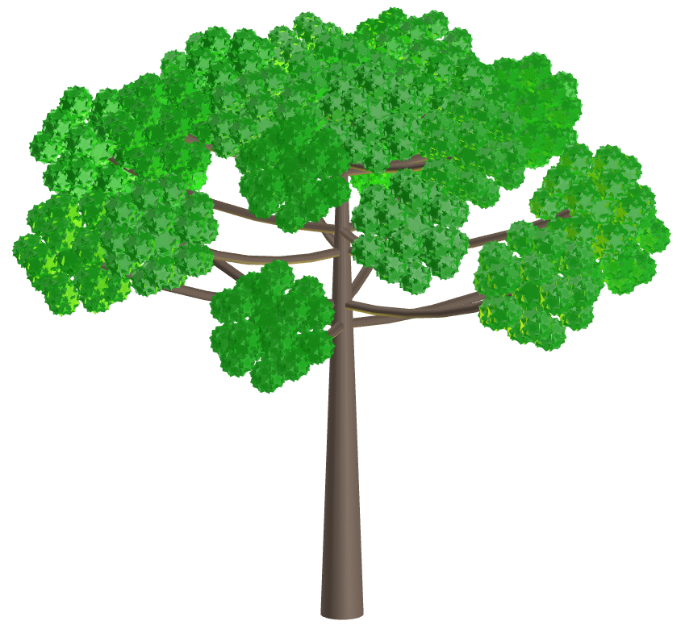
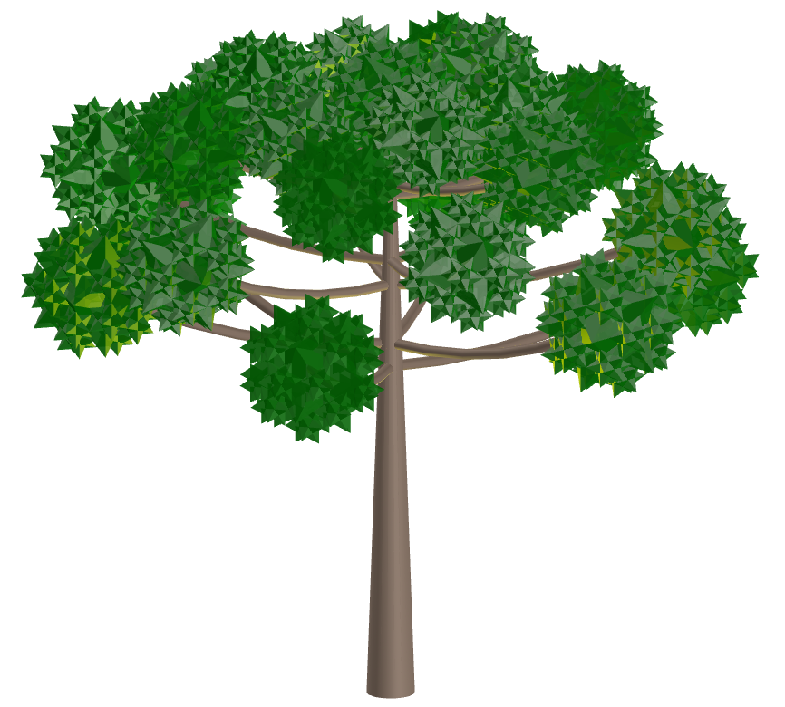

<link rel="stylesheet" href="../../scripts/style.css">
<meta charset="utf-8">
<link rel="icon" type="image/png" href="../vr/salas/imagens/icone.png">
<h2>Visualização de Poliedros com Realidade Virtual (RV) em A-frame</h2>
<b>autor:</b> Paulo Henrique Siqueira - Universidade Federal do Paraná
 <b>contato:</b> <a href="#"> paulohscwb@gmail.com </a>
 <a href="https://paulohscwb.github.io/polyhedra3/araucaria/">english version</a>
<form style="margin: 0 auto; float:right; text-align:right; width:100%; margin-bottom:15px;">
	<select id="url" onchange="urlHandler(this.value)" style="color:royalblue;">
		<option disabled selected>Mais sólidos:</option>
		<option value="../../catalangems/pt-br/">Gemas de Catalan</option>
		<option value="../../dragon-archimedes/pt-br/">Fractais do dragão de Arquimedes</option>
		<option value="../../kites/pt-br/">Estrelas com pipas</option>
		<option disabled value="../../araucaria/pt-br/">Araucárias com poliedros</option>
		<!--<option value="../../fractal_catalan/pt-br/">Fractais de Catalan</option>
		<option value="../../deltahedra/pt-br/">Deltaedros</option>
		<option value="../../unicorn_platonic/pt-br/">Fractais do unicórnio de Platão</option>
		<option value="../../dragon_catalan/pt-br/">Fractais do dragão de Catalan</option>
		<option value="../../fractalnonconvex1/pt-br/">Fractais de poliedros não convexos</option>
		<option value="../../truncated_archimedes/pt-br/">Poliedros Arquimedianos truncados</option>
		<option value="../../unicorn_catalan/pt-br/">Fractais do unicórnio de Catalan</option>
		<option value="../../dragon_nonconvex/pt-br/">Fractais de dragão de poliedros não convexos</option>
		<option value="../../fractalnonconvex2/pt-br/">Fractais de poliedros não convexos 2</option>
		<option value="../../unicorn_archimedes/pt-br/">Fractais do unicórnio de Arquimedes</option>
		<option value="../../fractalnonconvex3/pt-br/">Fractais de poliedros não convexos 3</option>
		<option value="../../truncated_catalan/pt-br/">Poliedros de Catalan truncados</option>
		<option value="../../unicorn_nonconvex1/pt-br/">Fractais do unicórnio de poliedros não convexos</option>
		<option value="../../dragon_nonconvex2/pt-br/">Fractais de dragão de poliedros não convexos 2</option>
		<option value="../../unicorn_nonconvex2/pt-br/">Fractais do unicórnio de poliedros não convexos 2</option>
		<option value="../../fractalnonconvex4/pt-br/">Fractais de poliedros não convexos 4</option>
		<option value="../../dragon_nonconvex3/pt-br/">Fractais de dragão de poliedros não convexos 3</option>
		<option value="../../fractalnonconvex5/pt-br/">Fractais de poliedros não convexos 5</option>
		<option value="../../unicorn_nonconvex3/pt-br/">Fractais do unicórnio de poliedros não convexos 3</option>
		<option value="../../fractalnonconvex6/pt-br/">Fractais de poliedros não convexos 6</option>-->
	</select>
</form>

  <h2 align="center"> Araucárias com poliedros</h2>
  Também conhecida como pinheiro-brasileiro, a Araucária é um gênero de árvores coníferas que inclui espécies nativas do Brasil, especialmente na região Sul. A Araucaria angustifolia é uma árvore de grande porte que pode viver centenas de anos. Algumas características desta árvore são suas folhas pontiagudas e a produção do pinhão, um fruto comestível vital para a fauna, para a economia de comunidades locais e para a biodiversidade.
 Este trabalho mostra a modelagem de Araucárias utilizando Geometria Fractal e poliedros, construídos para visualização em Realidade Virtual.
 
<a href="#m3d">Modelos 3D</a>&nbsp;&nbsp;|&nbsp;&nbsp;<a href="../../pt-br/">Página Inicial</a>

  

 

<h3 id="m3d" align="center">Modelos 3D</h3>
<!--<iframe width="560" height="315" style="max-width:100%" src="https://www.youtube.com/embed/videoseries?list=PLy0I_lGW8HxWEW5GUh83TNyIm0O2TXWEI" title="YouTube video player" frameborder="0" allow="accelerometer; autoplay; clipboard-write; encrypted-media; gyroscope; picture-in-picture; web-share" allowfullscreen></iframe>-->
<h4>1. Araucária Fractal</h4>

  Araucária modelada com Geometria Fractal usando troncos de cones.
  

<h4>2. Grande Dirombicosidodecacron</h4>

  Araucária modelada com Grande Dirombicosidodecacron.
  

<h4>3. Pequeno Hexecontaedro Hexagrâmico</h4>

  Araucária modelada com Pequeno Hexecontaedro Hexagrâmico.
  

<h4>4. Grande Hexecontaedro Pentagrâmico</h4>

  Araucária modelada com Grande Hexecontaedro Pentagrâmico.
  

<h4>5. Grande Dirombicosidodecaedro</h4>

  Araucária modelada com Grande Dirombicosidodecaedro.
  

<h4>6. Pequeno Icosicosidodecaedro Retrosnub</h4>

  Araucária modelada com Pequeno Icosicosidodecaedro Retrosnub.
  

<h4>7. Grande Hexecontaedro Pentagonal Invertido</h4>

  Araucária modelada com Grande Hexecontaedro Pentagonal Invertido.
  

<h4>8. Grande Icosidodecaedro Snub Invertido</h4>

  Araucária modelada com Grande Icosidodecaedro Snub Invertido.
  

<h4>9. Grande Hexecontaedro Hexagonal</h4>

  Araucária modelada com Grande Hexecontaedro Hexagonal.
  

<h4>10. Dodecadodecaedro Snub Invertido</h4>

  Araucária modelada com Dodecadodecaedro Snub Invertido.
  

<a href="#p1" class="topo">voltar ao topo</a>

<h4>11. Grande Hexecontaedro Pentagonal</h4>

  Araucária modelada com Grande Hexecontaedro Pentagonal.
  

<h4>12. Grande Icosidodecaedro Snub</h4>

  Araucária modelada com Grande Icosidodecaedro Snub.
  

<h4>13. Grande Dodecicosidodecaedro Snub</h4>

  Araucária modelada com Grande Dodecicosidodecaedro Snub.
  

<h4>14. Grande Dirombidodecaedro Disnub</h4>

  Araucária modelada com Grande Dirombidodecaedro Disnub.
  

<h4>15. Grande Dodecicosacron</h4>

  Araucária modelada com Grande Dodecicosacron.
  

<h4>16. Rombicosacron</h4>

  Araucária modelada com Rombicosacron.
  

<h4>17. Grande Icosidodecaedro Truncado</h4>

  Araucária modelada com Grande Icosidodecaedro Truncado.
  

<h4>18. Grande Dodecaedro Estrelado</h4>

  Araucária modelada com Grande Dodecaedro Estrelado.
  

<h4>19. Grande Dodecaedro</h4>

  Araucária modelada com Grande Dodecaedro.
  

<h4>20. Grande Icosaedro</h4>

  Araucária modelada com Grande Icosaedro.
  

<a href="#p1" class="topo">voltar ao topo</a>

<h4>21. Pequeno Icosihemidodecacron</h4>

  Araucária modelada com Pequeno Icosihemidodecacron.
  

<h4>22. Pequeno Dodecahemicosaedro</h4>

  Araucária modelada com Pequeno Dodecahemicosaedro.
  

<h4>23. Grande Dodecahemidodecacron</h4>

  Araucária modelada com Grande Dodecahemidodecacron.
  

<h4>24. Grande Hexecontaedro Icosacrônico</h4>

  Araucária modelada com Grande Hexecontaedro Icosacrônico.
  

<h4>25. Equidnaedro</h4>

  Araucária modelada com Equidnaedro.
  

<h4>26. Grande Hexecontaedro Deltoidal</h4>

  Araucária modelada com Grande Hexecontaedro Deltoidal.
  

<h4>27. Grande Rombidodecacron</h4>

  Araucária modelada com Grande Rombidodecacron.
  

<h4>28. Grande Dodecaedro Stellapentakis</h4>

  Araucária modelada com Grande Dodecaedro Stellapentakis.
  

<h4>29. Pequeno Dodecaedro Estrelado</h4>

  Araucária modelada com Pequeno Dodecaedro Estrelado.
  

<h4>30. Estrela dodecaédrica com pipas</h4>

  Araucária modelada com Estrela dodecaédrica com pipas.
  

<a href="#p1" class="topo">voltar ao topo</a>

<h4>31. Estrela Rombicosidodecaédrica com pipas</h4>

  Araucária modelada com Estrela Rombicosidodecaédrica com pipas.
  

<h4>32. Estrela de icosaedro truncado com pipas</h4>

  Araucária modelada com Estrela de icosaedro truncado com pipas.
  

<a href="#p1" class="topo">voltar ao topo</a>

  Araucaria with polyhedrons: visualization with Virtual Reality de <a xmlns:cc="http://creativecommons.org/ns#" href="https://paulohscwb.github.io/polyhedra3/araucaria/pt-br/" property="cc:attributionName" rel="cc:attributionURL">Paulo Henrique Siqueira</a> está licenciado com uma Licença <a rel="license" href="http://creativecommons.org/licenses/by-nc-nd/4.0/">Creative Commons Atribuição-NãoComercial-SemDerivações 4.0 Internacional</a>.

<h4>Como citar este trabalho:</h4> 

Siqueira, P.H., "Araucaria with polyhedrons: visualization with Virtual Reality". Disponível em: <https://paulohscwb.github.io/polyhedra3/araucaria/pt-br/>, Agosto de 2025.

<!---->
  <b>Referências:</b>
 Weisstein, Eric W. "Polyhedra." From MathWorld--A Wolfram Web Resource. <a href="https://mathworld.wolfram.com/topics/Polyhedra.html" target="_blank"> https://mathworld.wolfram.com/topics/Polyhedra.html</a>
 McCooey, D. I. "Visual Polyhedra". <a href="http://dmccooey.com/polyhedra/" target="_blank">http://dmccooey.com/polyhedra/</a>
