<link rel="stylesheet" href="../scripts/style.css">
<meta charset="utf-8">
<link rel="icon" type="image/png" href="vr/salas/imagens/icone.png">
<h2>Visualization of Polyhedra with Virtual Reality (VR) in A-frame</h2>
 <b>author:</b> Paulo Henrique Siqueira - Universidade Federal do Paraná
  <b>contact:</b> <a href="#">paulohscwb@gmail.com</a>
  <a href="https://paulohscwb.github.io/polyhedra3/catalangems/pt-br/">versão em português</a>
 <form style="margin: 0 auto; float:right; text-align:right; width:100%; margin-bottom:15px;">
	<select id="url" onchange="urlHandler(this.value)" style="color:royalblue;">
		<option disabled selected value>More solids:</option>
		<option disabled value="../catalangems/">Catalan gems</option>
		<!--<option value="../dragon_archimedes/">Archimedes Dragon Fractals</option>
		<option value="../fractal_catalan/">Catalan fractals</option>
		<option value="../kites/">Platonic kites</option>
		<option value="../unicorn_platonic/">Plato's Unicorn Fractals</option>
		<option value="../dragon_catalan/">Catalan Dragon Fractals</option>
		<option value="../fractalnonconvex1/">Fractals of non-convex polyhedra</option>
		<option value="../truncated_archimedes/">Truncated Archimedean polyhedra</option>
		<option value="../unicorn_catalan/">Catalan Unicorn Fractals</option>
		<option value="../dragon_nonconvex/">Dragon fractals of non-convex polyhedra</option>
		<option value="../fractalnonconvex2/">Fractals of non-convex polyhedra 2</option>
		<option value="../unicorn_archimedes/">Archimedes Unicorn Fractals</option>
		<option value="../fractalnonconvex3/">Fractals of non-convex polyhedra 3</option>
		<option value="../truncated_catalan/">Truncated Catalan polyhedra</option>
		<option value="../unicorn_nonconvex1/">Unicorn fractals of non-convex polyhedra</option>
		<option value="../dragon_nonconvex2/">Dragon fractals of non-convex polyhedra 2</option>
		<option value="../unicorn_nonconvex2/">Unicorn fractals of non-convex polyhedra 2</option>
		<option value="../fractalnonconvex4/">Fractals of non-convex polyhedra 4</option>
		<option value="../dragon_nonconvex3/">Dragon fractals of non-convex polyhedra 3</option>
		<option value="../fractalnonconvex5/">Fractals of non-convex polyhedra 5</option>
		<option value="../unicorn_nonconvex3/">Unicorn fractals of non-convex polyhedra 3</option>
		<option value="../fractalnonconvex6/">Fractals of non-convex polyhedra 6</option>-->
	</select>
</form>

  <h2 align="center">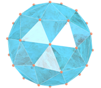 Catalan gems</h2>
Catalan polyhedra are duals of Archimedean polyhedra. They are known as Catalan solids in honor of the Belgian mathematician who first published them in 1862.
 This work shows Catalan polyhedra with gem textures, modeled for viewing in Virtual Reality.

<a href="#m3d">3D Models</a>&nbsp;&nbsp;|&nbsp;&nbsp;<a href="../">Home</a>

 
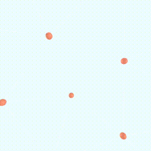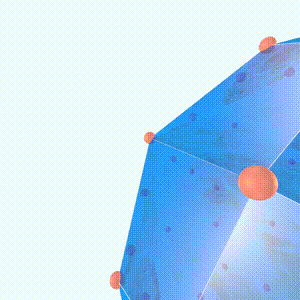
 

<h3 id="m3d" align="center">3D models</h3>
<!--<iframe width="560" height="315" style="max-width:100%" src="https://www.youtube.com/embed/videoseries?list=PLy0I_lGW8HxVEvPQGN_8Y86B_opMhsoQ2" title="YouTube video player" frameborder="0" allow="accelerometer; autoplay; clipboard-write; encrypted-media; gyroscope; picture-in-picture; web-share" allowfullscreen></iframe>-->
<h4>1. Deltoidal hexecontahedron</h4>
<a href="vr/deltoidal_hexecontahedron.htm" target="_blank" title="3D model" class="fotoA">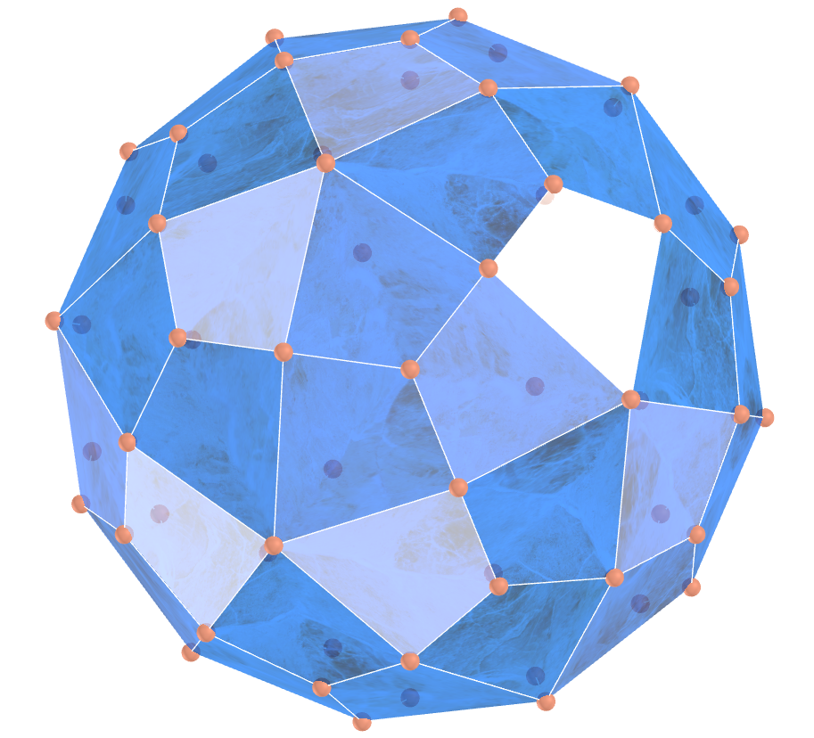</a>
  The deltoidal hexecontahedron is the 60-faced dual polyhedron of the small rhombicosidodecahedron. It is sometimes also called the trapezoidal hexecontahedron, strombic hexecontahedron or dyakis hexecontahedron.
  

<h4>2. Deltoidal icositetrahedron</h4>
<a href="vr/deltoidal_icositetrahedron.htm" target="_blank" title="3D model" class="fotoA">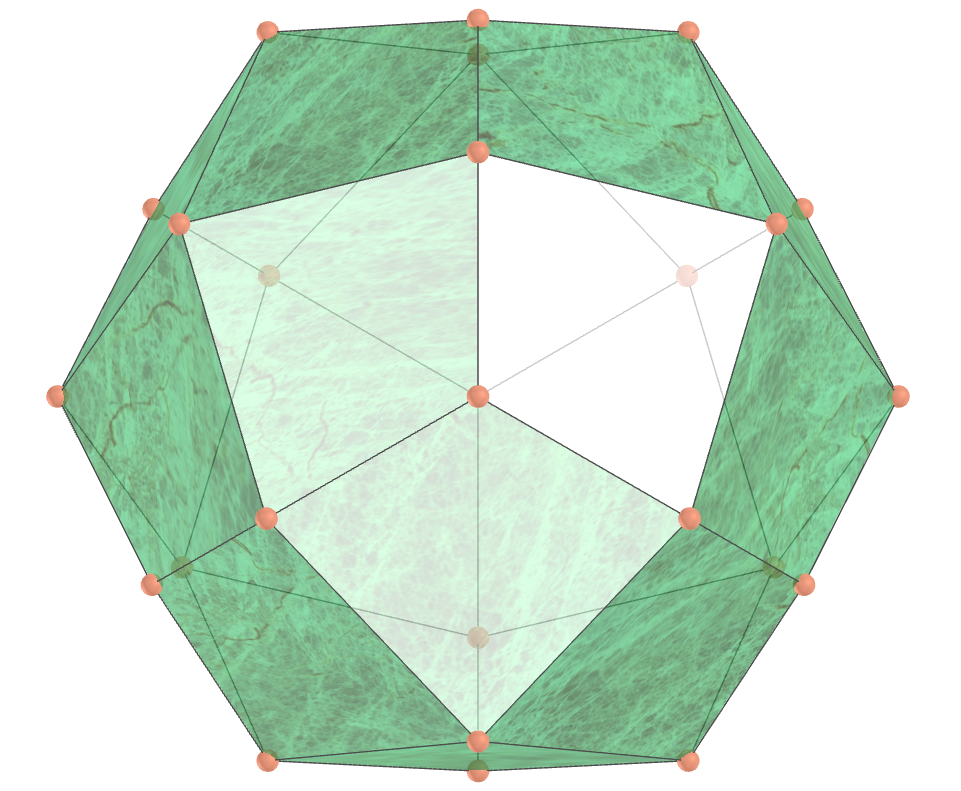</a>
  The deltoidal icositetrahedron is the 24-faced dual polyhedron of the small rhombicuboctahedron. It is also called the trapezoidal icositetrahedron. A deltoidal icositetrahedron appears in the middle right as one of the polyhedral "stars" in M. C. Escher's 1948 wood engraving "Stars".
  

<h4>3. Disdyakis dodecahedron</h4>
<a href="vr/disdyakis_dodecahedron.htm" target="_blank" title="3D model" class="fotoA">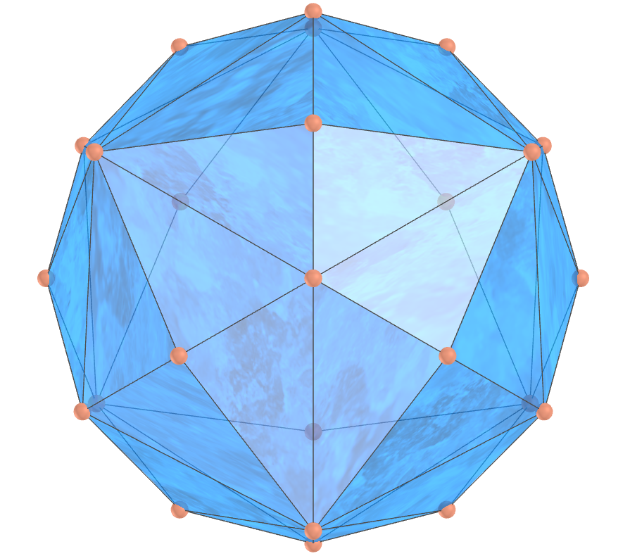</a>
  The disdyakis dodecahedron is the dual polyhedron of the Archimedean great rhombicuboctahedron. It is also called the hexakis octahedron.
  

<h4>4. Disdyakis triacontahedron</h4>
<a href="vr/disdyakis_triacontahedron.htm" target="_blank" title="3D model" class="fotoA">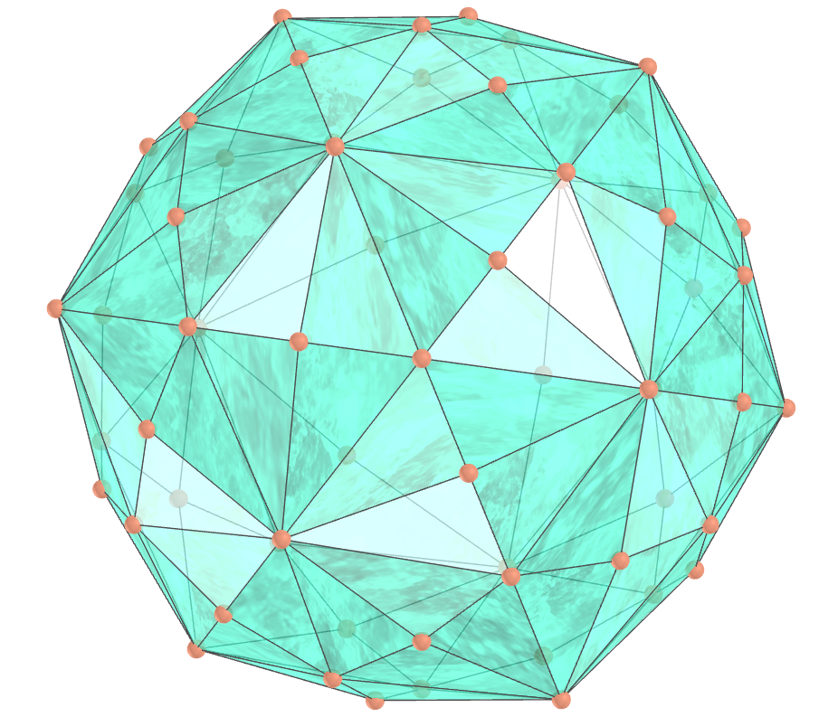</a>
  The disdyakis triacontahedron is the dual polyhedron of the Archimedean great rhombicosidodecahedron. It is also known as the hexakis icosahedron. A tetrahedron 10-compound, octahedron 5-compound, cube 5-compound, icosahedron, dodecahedron and icosidodecahedron can be inscribed in the vertices of a disdyakis triacontahedron.
  

<h4>5. Pentagonal hexecontahedron</h4>
<a href="vr/pentagonal_hexecontahedron.htm" target="_blank" title="3D model" class="fotoA">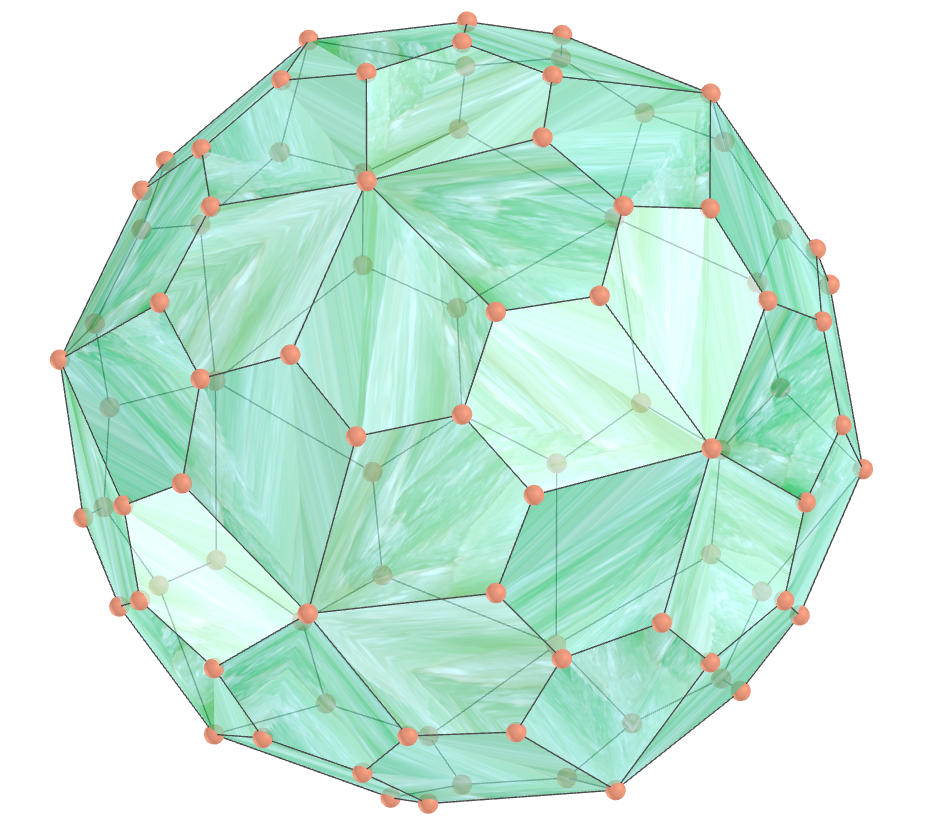</a>
  The pentagonal hexecontahedron is the 60-faced dual polyhedron of the snub dodecahedron. A tetrahedron 10-compound, cube 5-compound, icosahedron, and dodecahedron can be inscribed in the vertices of the pentagonal hexecontahedron.
  

<h4>6. Pentagonal icositetrahedron</h4>
<a href="vr/pentagonal_icositetrahedron.htm" target="_blank" title="3D model" class="fotoA">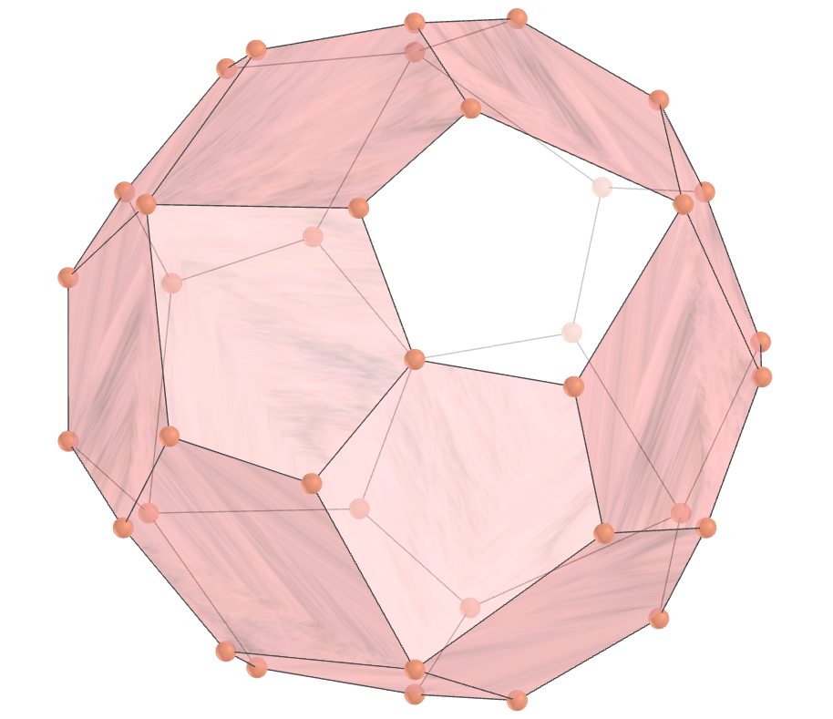</a>
  The pentagonal icositetrahedron is the 24-faced dual polyhedron of the snub cube. The mineral cuprite (Cu2O) forms in pentagonal icositetrahedral crystals. A cube, octahedron, and stella octangula can all be inscribed on the pentagonal icositetrahedron.
  

<h4>7. Pentakis dodecahedron</h4>
<a href="vr/pentakis_dodecahedron.htm" target="_blank" title="3D model" class="fotoA">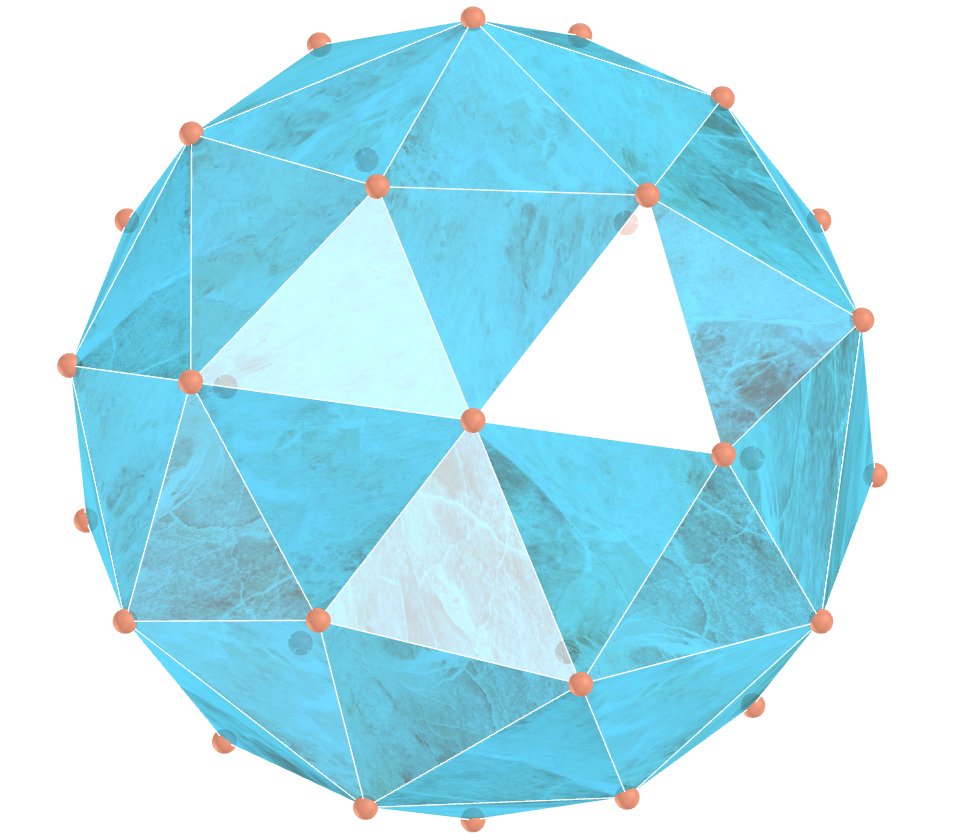</a>
  The pentakis dodecahedron is the 60-faced dual polyhedron of the truncated icosahedron. It can be constructed by augmentation of a unit edge-length dodecahedron by a pyramid. A tetrahedron 10-compound, cube 5-compound, icosahedron, and dodecahedron can be inscribed in the vertices of the pentakis dodecahedron.
  

<a href="#p1" class="topo">back to top</a>

<h4>8. Rhombic dodecahedron</h4>
<a href="vr/rhombic_dodecahedron.htm" target="_blank" title="3D model" class="fotoA">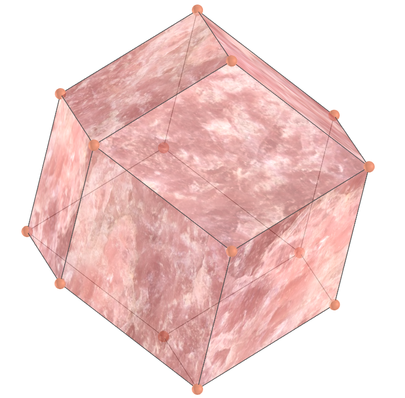</a>
  The "first" rhombic dodecahedron is the dual polyhedron of the cuboctahedron. It is sometimes also called the rhomboidal dodecahedron, and the "first" may be included when needed to distinguish it from the Bilinski dodecahedron.
  

<h4>9. Rhombic triacontahedron</h4>
<a href="vr/rhombic_triacontahedron.htm" target="_blank" title="3D model" class="fotoA">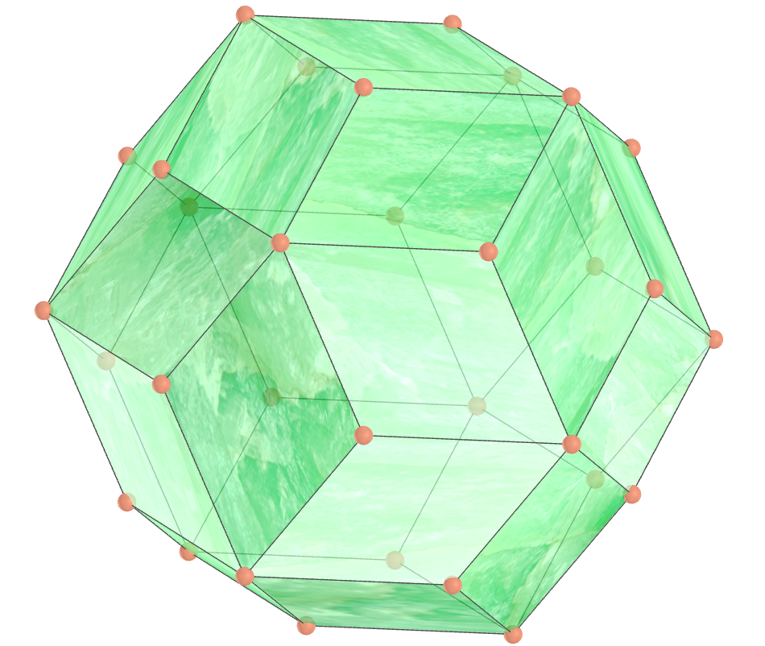</a>
  The rhombic triacontahedron is the dual polyhedron of the icosidodecahedron. It is composed of 30 rhombi and 32 vertices. The intersecting edges of the dodecahedron-icosahedron compound form the diagonals of 30 rhombi which comprise the triacontahedron. 
  

<h4>10. Tetrakis hexahedron</h4>
<a href="vr/tetrakis_hexahedron.htm" target="_blank" title="3D model" class="fotoA">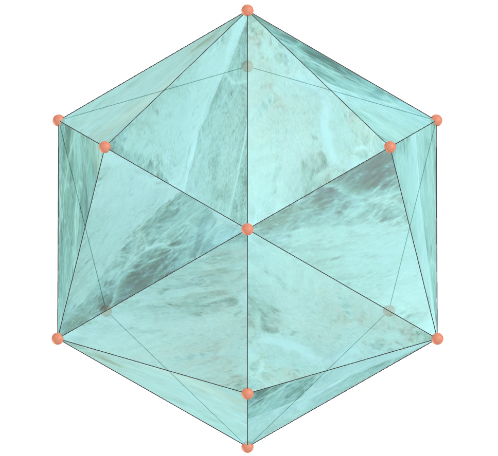</a>
  The tetrakis hexahedron is the 24-faced dual polyhedron of the truncated octahedron. A tetrakis hexahedron is a non-regular icositetrahedron that can be constructed as a positive augmentation of a cube. Such a solid is also known as a tetrahexahedron, especially to mineralogists.
  

<h4>11. Triakis icosahedron</h4>
<a href="vr/triakis_icosahedron.htm" target="_blank" title="3D model" class="fotoA">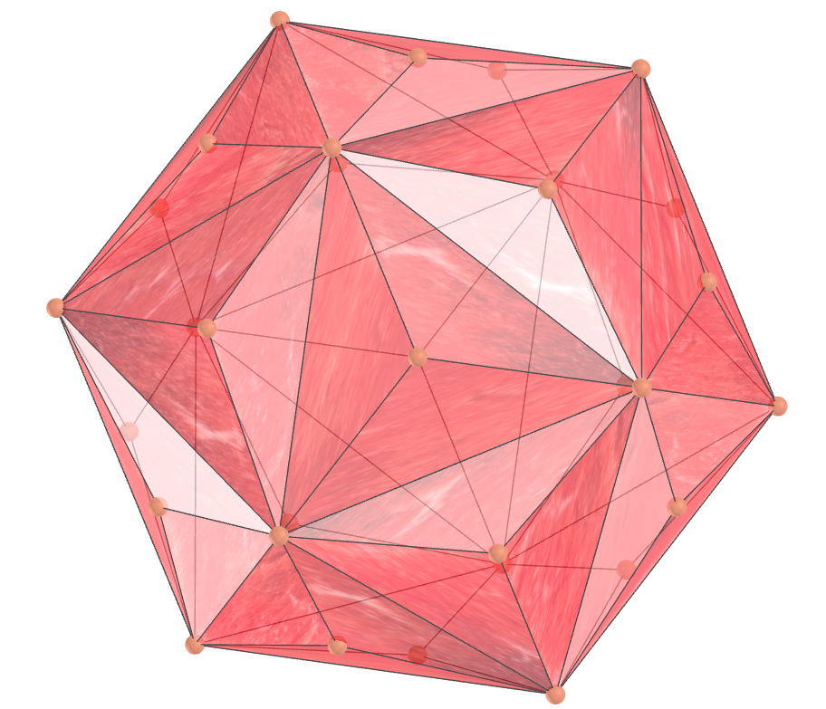</a>
  The triakis icosahedron is the dual polyhedron of the truncated dodecahedron. A tetrahedron 10-compound, cube 5-compound, icosahedron, and dodecahedron can be inscribed on the vertices of the triakis icosahedron.
  

<h4>12. Triakis octahedron</h4>
<a href="vr/triakis_octahedron.htm" target="_blank" title="3D model" class="fotoA">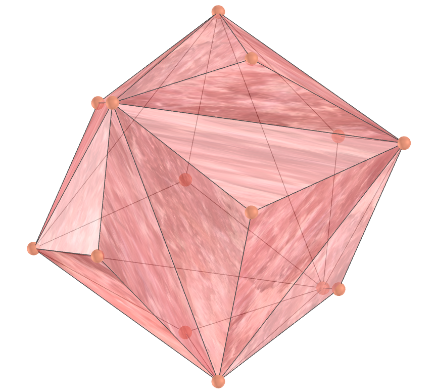</a>
  A triakis octahedron is a non-regular icositetrahedron that can be constructed as a positive augmentation of regular octahedron. Such a solid is also known as a trisoctahedron, especially to mineralogists. While the resulting icositetrahedron is not regular, its faces are all identical.
  

<h4>13. Triakis tetrahedron</h4>
<a href="vr/triakis_tetrahedron.htm" target="_blank" title="3D model" class="fotoA">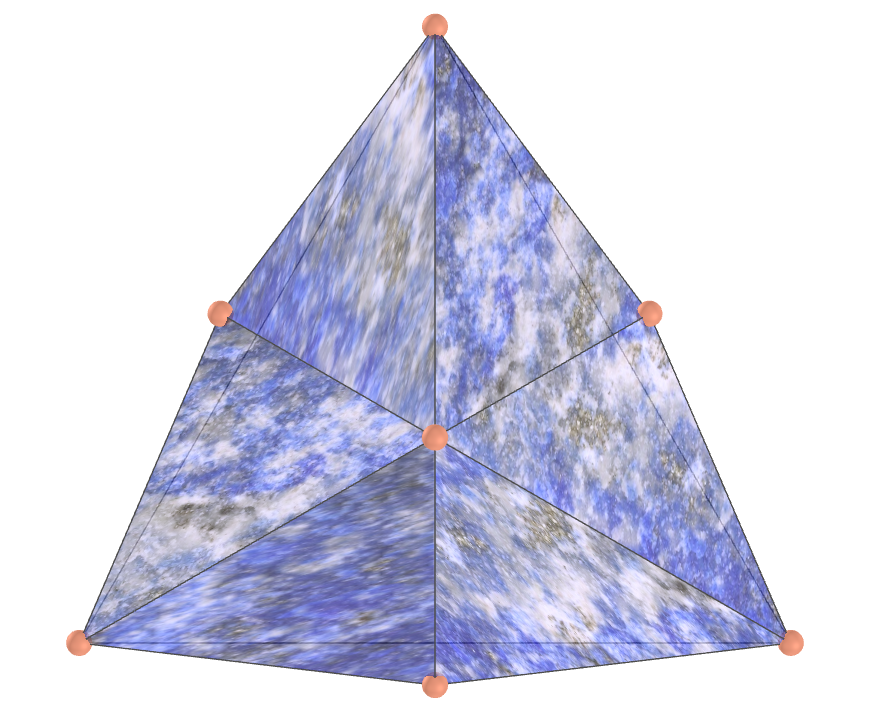</a>
  A triakis tetrahedron is a non-regular dodecahedron that can be constructed as a positive augmentation of a regular tetrahedron. Such a solid is also known as a tristetrahedron, especially to mineralogists. While the resulting dodecahedron is not regular, its faces are all identical.
  

<a href="#p1" class="topo">back to top</a>

  Catalan Gems: polyhedra and visualization with Virtual Reality by <a xmlns:cc="http://creativecommons.org/ns#" href="https://paulohscwb.github.io/polyhedra3/catalangems/" property="cc:attributionName" rel="cc:attributionURL">Paulo Henrique Siqueira</a> is licensed with a license <a rel="license" href="http://creativecommons.org/licenses/by-nc-nd/4.0/">Creative Commons Attribution-NonCommercial-NoDerivatives 4.0 International</a>.

<h4>How to cite this work:</h4> 

Siqueira, P.H., "Catalan Gems: polyhedra and visualization with Virtual Reality". Available in: <https://paulohscwb.github.io/polyhedra3/catalangems/>, February 2025.

<!---->
  <b>References:</b>
 Weisstein, Eric W. "Catalan Solid." From MathWorld--A Wolfram Web Resource. <a href="https://mathworld.wolfram.com/CatalanSolid.html" target="_blank"> https://mathworld.wolfram.com/CatalanSolid.html</a>
 McCooey, D. I. "Visual Polyhedra". <a href="http://dmccooey.com/polyhedra/" target="_blank">http://dmccooey.com/polyhedra/</a>
