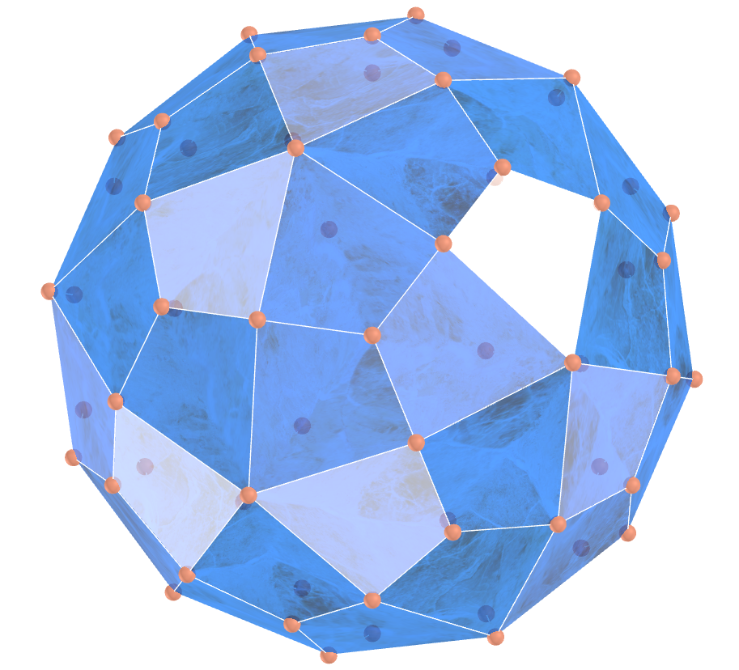
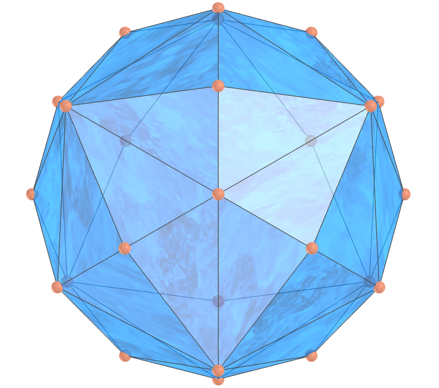
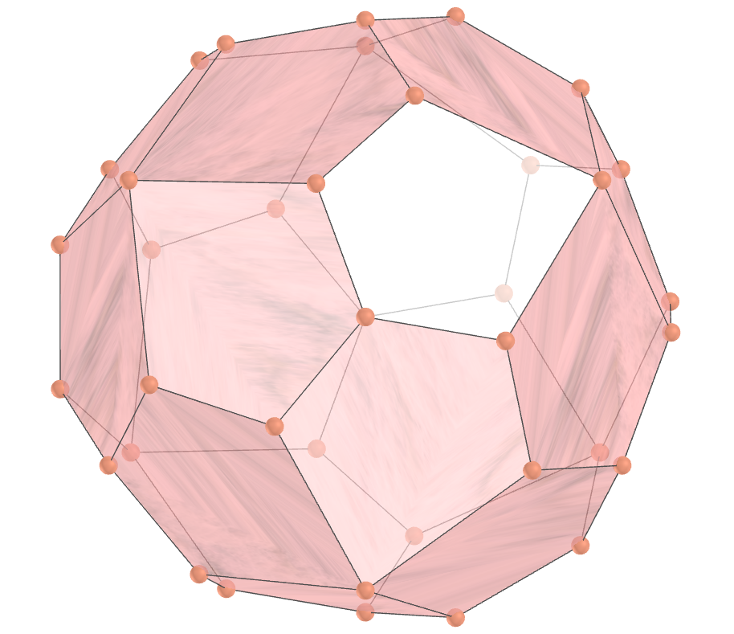
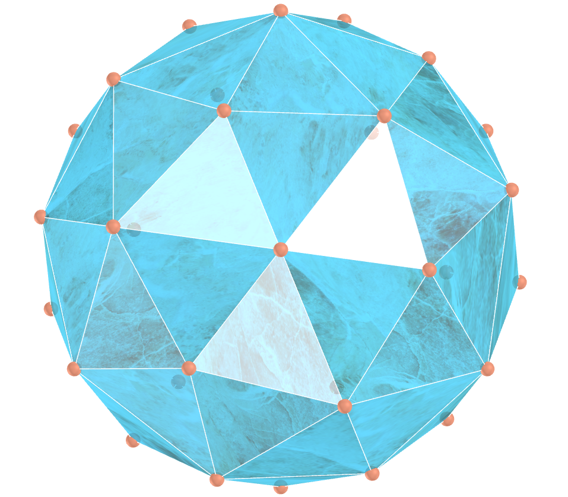
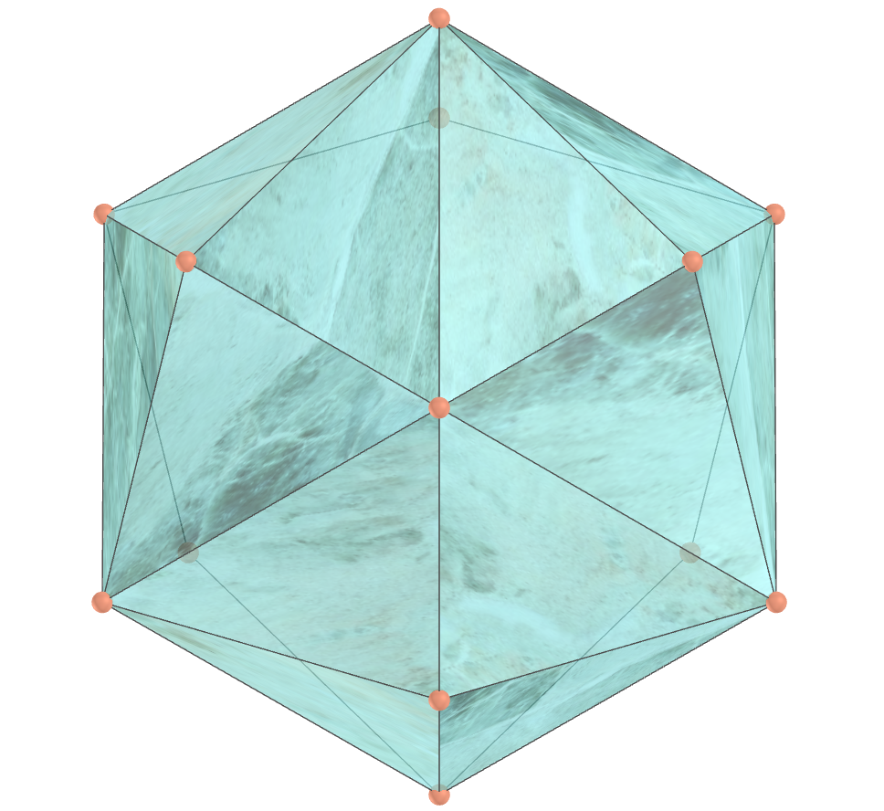

<link rel="stylesheet" href="../../scripts/style.css">
<meta charset="utf-8">
<link rel="icon" type="image/png" href="../vr/salas/imagens/icone.png">
<h2>Visualização de Poliedros com Realidade Virtual (RV) em A-frame</h2>
<b>autor:</b> Paulo Henrique Siqueira - Universidade Federal do Paraná
 <b>contato:</b> <a href="#"> paulohscwb@gmail.com </a>
 <a href="https://paulohscwb.github.io/polyhedra3/catalangems/">english version</a>
<form style="margin: 0 auto; float:right; text-align:right; width:100%; margin-bottom:15px;">
	<select id="url" onchange="urlHandler(this.value)" style="color:royalblue;">
		<option disabled selected>Mais sólidos:</option>
		<option disabled value="../../catalangems/pt-br/">Gemas de Catalan</option>
		<option value="../../dragon_archimedes/pt-br/">Fractais do dragão de Arquimedes</option>
		<!--<option value="../../fractal_catalan/pt-br/">Fractais de Catalan</option>
		<option value="../../kites/pt-br/">Pipas Platônicas</option>
		<option value="../../unicorn_platonic/pt-br/">Fractais do unicórnio de Platão</option>
		<option value="../../dragon_catalan/pt-br/">Fractais do dragão de Catalan</option>
		<option value="../../fractalnonconvex1/pt-br/">Fractais de poliedros não convexos</option>
		<option value="../../truncated_archimedes/pt-br/">Poliedros Arquimedianos truncados</option>
		<option value="../../unicorn_catalan/pt-br/">Fractais do unicórnio de Catalan</option>
		<option value="../../dragon_nonconvex/pt-br/">Fractais de dragão de poliedros não convexos</option>
		<option value="../../fractalnonconvex2/pt-br/">Fractais de poliedros não convexos 2</option>
		<option value="../../unicorn_archimedes/pt-br/">Fractais do unicórnio de Arquimedes</option>
		<option value="../../fractalnonconvex3/pt-br/">Fractais de poliedros não convexos 3</option>
		<option value="../../truncated_catalan/pt-br/">Poliedros de Catalan truncados</option>
		<option value="../../unicorn_nonconvex1/pt-br/">Fractais do unicórnio de poliedros não convexos</option>
		<option value="../../dragon_nonconvex2/pt-br/">Fractais de dragão de poliedros não convexos 2</option>
		<option value="../../unicorn_nonconvex2/pt-br/">Fractais do unicórnio de poliedros não convexos 2</option>
		<option value="../../fractalnonconvex4/pt-br/">Fractais de poliedros não convexos 4</option>
		<option value="../../dragon_nonconvex3/pt-br/">Fractais de dragão de poliedros não convexos 3</option>
		<option value="../../fractalnonconvex5/pt-br/">Fractais de poliedros não convexos 5</option>
		<option value="../../unicorn_nonconvex3/pt-br/">Fractais do unicórnio de poliedros não convexos 3</option>
		<option value="../../fractalnonconvex6/pt-br/">Fractais de poliedros não convexos 6</option>-->
	</select>
</form>

  <h2 align="center"> Gemas de Catalan</h2>
  Os poliedros de Catalan são duais de poliedros Arquimedianos. Eles são conhecidos como sólidos de Catalan em homenagem ao matemático belga que os publicou pela primeira vez em 1862.
 Este trabalho mostra os poliedros de Catalan com texturas de gemas, modelados para visualização em Realidade Virtual.
 
<a href="#m3d">Modelos 3D</a>&nbsp;&nbsp;|&nbsp;&nbsp;<a href="../../pt-br/">Página Inicial</a>

  

 

<h3 id="m3d" align="center">Modelos 3D</h3>
<iframe width="560" height="315" style="max-width:100%" src="https://www.youtube.com/embed/videoseries?list=PLy0I_lGW8HxWEW5GUh83TNyIm0O2TXWEI" title="YouTube video player" frameborder="0" allow="accelerometer; autoplay; clipboard-write; encrypted-media; gyroscope; picture-in-picture; web-share" allowfullscreen></iframe>
<h4>1. Hexecontaedro deltoide</h4>

  O hexecontaedro deltoide é o poliedro dual de 60 faces do pequeno rombicosidodecaedro. Às vezes também é chamado de hexecontaedro trapezoidal, hexecontaedro estrombico ou hexecontaedro diakis.
  

<h4>2. Icositetraedro deltoide</h4>

  O icositetraedro deltoide é o poliedro dual de 24 faces do pequeno rombicuboctaedro. Também é chamado de icositetraedro trapezoidal. Um icositetraedro deltoidal aparece no meio à direita como uma das "estrelas" poliédricas na xilogravura de M. C. Escher de 1948 "Estrelas".
  

<h4>3. Dodecaedro disdiakis</h4>

  O dodecaedro disdiakis é o poliedro dual do grande rombicuboctaedro Arquimediano. Também é chamado de octaedro hexakis.
  

<h4>4. Triacontaedro disdiakis</h4>

  O triacontaedro disdyakis é o poliedro dual do grande rombicosidodecaedro arquimediano. Também é conhecido como icosaedro hexakis. Um tetraedro 10-composto, octaedro 5-composto, cubo 5-composto, icosaedro, dodecaedro e icosidodecaedro podem ser inscritos nos vértices de um triacontaedro disdyakis.
  

<h4>5. Hexecontaedro pentagonal</h4>

  O hexecontaedro pentagonal é o poliedro dual de 60 faces do dodecaedro snub. Um tetraedro 10-composto, cubo 5-composto, icosaedro e dodecaedro podem ser inscritos nos vértices do hexecontaedro pentagonal.
  

<h4>6. Icositetraedro pentagonal</h4>

  O icositetraedro pentagonal é o poliedro dual de 24 faces do cubo snub. O mineral cuprita (Cu2O) se forma em cristais icositetraédricos pentagonais. Um cubo, um octaedro e um octaedro estrelado podem ser inscritos no icositetraedro pentagonal.
  

<h4>7. Dodecaedro pentakis</h4>

  O dodecaedro pentakis é o poliedro dual de 60 faces do icosaedro truncado. Ele pode ser construído pelo aumento de um dodecaedro de comprimento de aresta unitário por uma pirâmide. Um tetraedro 10-composto, cubo 5-composto, icosaedro e dodecaedro podem ser inscritos nos vértices do dodecaedro pentakis.
  

<a href="#p1" class="topo">voltar ao topo</a>

<h4>8. Dodecaedro rômbico</h4>

  O "primeiro" dodecaedro rômbico é o poliedro dual do cuboctaedro. Às vezes, também é chamado de dodecaedro romboidal, e o "primeiro" pode ser incluído quando necessário para distingui-lo do dodecaedro de Bilinski.
  

<h4>9. Triacontaedro rômbico</h4>

  O triacontaedro rômbico é o poliedro dual do icosidodecaedro. Ele é composto de 30 losangos e 32 vértices. As bordas de intersecção do composto dodecaedro-icosaedro formam as diagonais de 30 losangos que compõem o triacontaedro.
  

<h4>10. Hexaedro tetrakis</h4>

  O hexaedro tetrakis é o poliedro dual de 24 faces do octaedro truncado. Um hexaedro tetrakis é um icositetraedro não regular que pode ser construído como um aumento positivo de um cubo. Tal sólido também é conhecido como tetrahexaedro, especialmente para mineralogistas.
  

<h4>11. Icosaedro triakis</h4>

  O icosaedro triakis é o poliedro dual do dodecaedro truncado. Um tetraedro 10-composto, cubo 5-composto, icosaedro e dodecaedro podem ser inscritos nos vértices do icosaedro triakis.
  

<h4>12. Octaedro triakis</h4>

  Um octaedro triakis é um icositetraedro não regular que pode ser construído como um aumento positivo de um octaedro regular. Tal sólido também é conhecido como trisoctaedro, especialmente para mineralogistas. Embora o icositetraedro resultante não seja regular, suas faces são todas idênticas.
  

<h4>13. Tetraedro triakis</h4>

  Um tetraedro triakis é um dodecaedro não regular que pode ser construído como um aumento positivo de um tetraedro regular. Tal sólido também é conhecido como um tristetraedro, especialmente para mineralogistas. Embora o dodecaedro resultante não seja regular, suas faces são todas idênticas. 
  

<a href="#p1" class="topo">voltar ao topo</a>

  Catalan Gems: polyhedra and visualization with Virtual Reality de <a xmlns:cc="http://creativecommons.org/ns#" href="https://paulohscwb.github.io/polyhedra3/catalangems/pt-br/" property="cc:attributionName" rel="cc:attributionURL">Paulo Henrique Siqueira</a> está licenciado com uma Licença <a rel="license" href="http://creativecommons.org/licenses/by-nc-nd/4.0/">Creative Commons Atribuição-NãoComercial-SemDerivações 4.0 Internacional</a>.

<h4>Como citar este trabalho:</h4> 

Siqueira, P.H., "Catalan Gems: polyhedra and visualization with Virtual Reality". Disponível em: <https://paulohscwb.github.io/polyhedra3/catalangems/pt-br/>, Fevereiro de 2025.

<!---->
  <b>Referências:</b>
 Weisstein, Eric W. "Catalan Solid." From MathWorld--A Wolfram Web Resource. <a href="https://mathworld.wolfram.com/CatalanSolid.html" target="_blank"> https://mathworld.wolfram.com/CatalanSolid.html</a>
 McCooey, D. I. "Visual Polyhedra". <a href="http://dmccooey.com/polyhedra/" target="_blank">http://dmccooey.com/polyhedra/</a>
