<link rel="stylesheet" href="../../scripts/style.css">
<meta charset="utf-8">
<link rel="icon" type="image/png" href="../vr/salas/imagens/icone.png">
<h2>Visualização de Poliedros com Realidade Virtual (RV) em A-frame</h2>
<b>autor:</b> Paulo Henrique Siqueira - Universidade Federal do Paraná
 <b>contato:</b> <a href="#"> paulohscwb@gmail.com </a>
 <a href="https://paulohscwb.github.io/polyhedra3/deltahedra/">english version</a>
<form style="margin: 0 auto; float:right; text-align:right; width:100%; margin-bottom:15px;">
	<select id="url" onchange="urlHandler(this.value)" style="color:royalblue;">
		<option disabled selected>Mais sólidos:</option>
		<option value="../../catalangems/pt-br/">Gemas de Catalan</option>
		<option value="../../dragon-archimedes/pt-br/">Fractais do dragão de Arquimedes e Catalan</option>
		<option value="../../kites/pt-br/">Estrelas com pipas</option>
		<option value="../../araucaria/pt-br/">Araucárias com poliedros</option>
		<option value="../../dragon-nonconvex/pt-br/">Fractais de dragão de poliedros não convexos</option>
		<option value="../../fractal-catalan/pt-br/">Fractais de Catalan</option>
		<option disabled value="../../deltahedra/pt-br/">Deltaedros não convexos</option>
		<!--<option value="../../unicorn-platonic/pt-br/">Fractais do unicórnio de Platão</option>
		<option value="../../dragon-catalan/pt-br/">Fractais do dragão de Catalan</option>
		<option value="../../fractalnonconvex1/pt-br/">Fractais de poliedros não convexos</option>
		<option value="../../truncated-archimedes/pt-br/">Poliedros Arquimedianos truncados</option>
		<option value="../../unicorn-catalan/pt-br/">Fractais do unicórnio de Catalan</option>
		<option value="../../fractalnonconvex2/pt-br/">Fractais de poliedros não convexos 2</option>
		<option value="../../unicorn-archimedes/pt-br/">Fractais do unicórnio de Arquimedes</option>
		<option value="../../fractalnonconvex3/pt-br/">Fractais de poliedros não convexos 3</option>
		<option value="../../truncated-catalan/pt-br/">Poliedros de Catalan truncados</option>
		<option value="../../unicorn-nonconvex1/pt-br/">Fractais do unicórnio de poliedros não convexos</option>
		<option value="../../dragon-nonconvex2/pt-br/">Fractais de dragão de poliedros não convexos 2</option>
		<option value="../../unicorn-nonconvex2/pt-br/">Fractais do unicórnio de poliedros não convexos 2</option>
		<option value="../../fractalnonconvex4/pt-br/">Fractais de poliedros não convexos 4</option>
		<option value="../../dragon-nonconvex3/pt-br/">Fractais de dragão de poliedros não convexos 3</option>
		<option value="../../fractalnonconvex5/pt-br/">Fractais de poliedros não convexos 5</option>
		<option value="../../unicorn-nonconvex3/pt-br/">Fractais do unicórnio de poliedros não convexos 3</option>
		<option value="../../fractalnonconvex6/pt-br/">Fractais de poliedros não convexos 6</option>-->
	</select>
</form>

  <h2 align="center">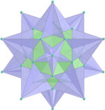 Deltaedros não convexos</h2>
  Henry Martyn Cundy identificou 17 deltaedros côncavos (1952), levando a descoberta publicada por Roger Kaufman (2008) de que existem pelo menos 40 exemplos desse tipo. Os deltaedros são compostos somente por triângulos equiláteros, e existem apenas oito deltaedros convexos: tetraedro, octaedro, icosaedro, dipirâmide triangular (sólido de Johnson J12), dipirâmide pentagonal (J13), disfenoide snub (J84), prisma triaumentado triangular (J51) e dipirâmide quadrada giroalongada (J17).
   Este trabalho mostra alguns deltaedros não convexos modelados para visualização em Realidade Virtual.
 
<a href="#m3d">Modelos 3D</a>&nbsp;&nbsp;|&nbsp;&nbsp;<a href="../../pt-br/">Página Inicial</a>

  
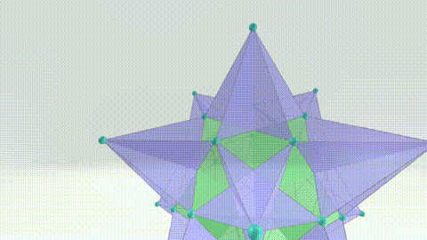
 

<h3 id="m3d" align="center">Modelos 3D</h3>
<!--<iframe width="560" height="315" style="max-width:100%" src="https://www.youtube.com/embed/videoseries?list=PLy0I_lGW8HxU7g9x5hkKKNULwWAdRiCHW" title="YouTube video player" frameborder="0" allow="accelerometer; autoplay; clipboard-write; encrypted-media; gyroscope; picture-in-picture; web-share" allowfullscreen></iframe>-->
<h4>1. Tetraedro aumentado</h4>
<a href="../vr/01_Tetraugmented_Tetrahedron.htm" target="_blank" title="modelo 3D" class="fotoA">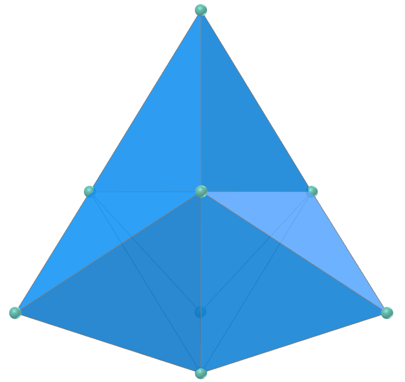</a>
  Este deltaedro é construído a partir de um núcleo tetraédrico regular, ao qual são anexadas "tampas" tetraédricas (aumentos) em suas quatro faces.
  <b>faces:</b> 12  |  <b>arestas:</b> 18  |  <b>vértices:</b> 8
  

<h4>2. Tetraedro giro-aumentado</h4>
<a href="../vr/02_Tetragyraugmented_Tetrahedron.htm" target="_blank" title="modelo 3D" class="fotoA">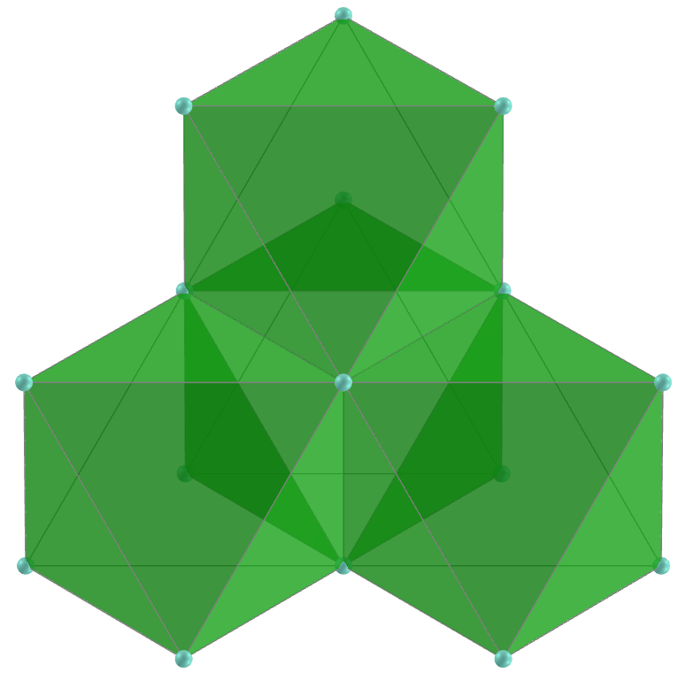</a>
  Este deltaedro é construído a partir de um núcleo tetraédrico regular, ao qual são anexadas "tampas" octaédricas (aumentos) em suas quatro faces.
  <b>faces:</b> 28  |  <b>arestas:</b> 42  |  <b>vértices:</b> 16
  

<h4>3. Octaedro aumentado</h4>
<a href="../vr/03_Octagyraugmented_Octahedron.htm" target="_blank" title="modelo 3D" class="fotoA">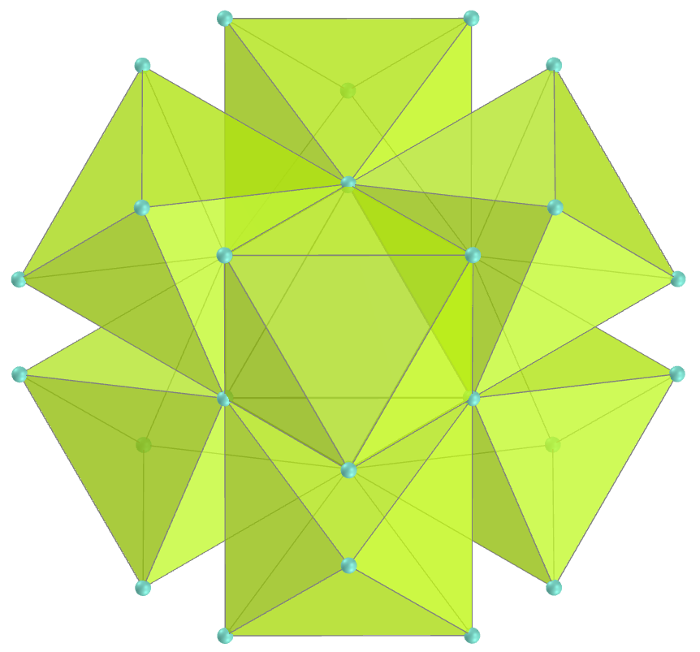</a>
  Este deltaedro é construído a partir de um núcleo tetraédrico regular, ao qual são anexadas "tampas" octaédricas (aumentos) em suas quatro faces.
  <b>faces:</b> 56  |  <b>arestas:</b> 84  |  <b>vértices:</b> 30
  

<h4>4. Octaedro escavado</h4>
<a href="../vr/04_Octa_excavated_Octahedron.htm" target="_blank" title="modelo 3D" class="fotoA">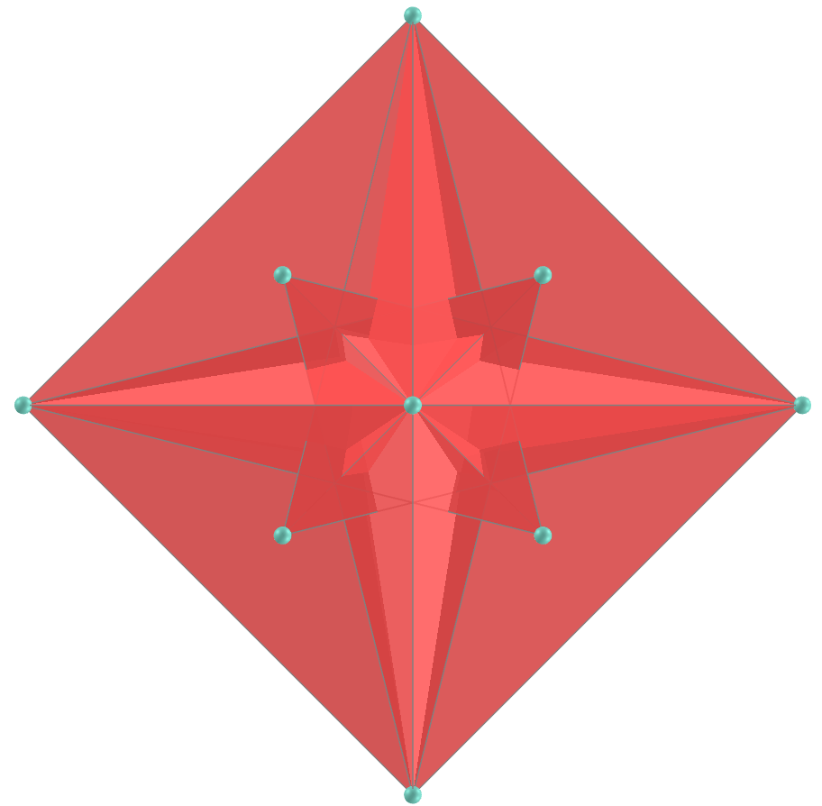</a>
  Este deltaedro é construído a partir de um núcleo octaédrico regular, ao qual são escavados tetraedros regulares em suas oito faces.
  <b>faces:</b> 24  |  <b>arestas:</b> 36  |  <b>vértices:</b> 14
  

<h4>5. Cubo aumentado</h4>
<a href="../vr/05_Hexaugmented_Cube.htm" target="_blank" title="modelo 3D" class="fotoA">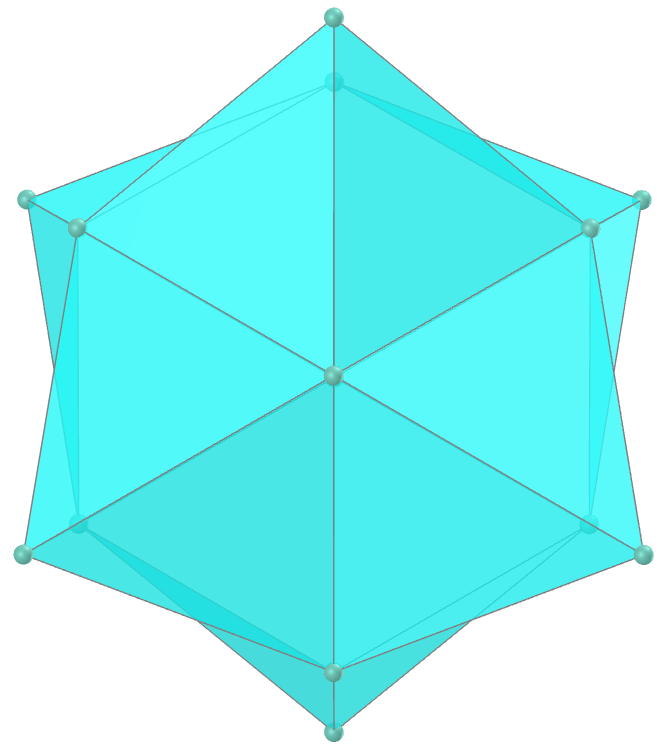</a>
  Este deltaedro é construído a partir de um núcleo cúbico regular, ao qual são anexadas "tampas" em formato de pirâmides quadradas (aumentos) em suas seis faces.
  <b>faces:</b> 24  |  <b>arestas:</b> 36  |  <b>vértices:</b> 14
  

<h4>6. Cubo escavado</h4>
<a href="../vr/06_Excavated_Cube.htm" target="_blank" title="modelo 3D" class="fotoA">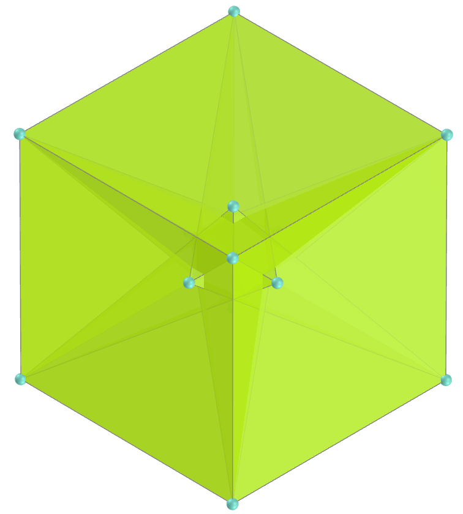</a>
  Este deltaedro é construído a partir de um núcleo cúbico regular, ao qual são excavadas pirâmides quadradas em suas seis faces.
  <b>faces:</b> 24  |  <b>arestas:</b> 36  |  <b>vértices:</b> 14
  

<h4>7. Dodecaedro escavado</h4>
<a href="../vr/07_Dodekexcavated_Dodecahedron.htm" target="_blank" title="modelo 3D" class="fotoA">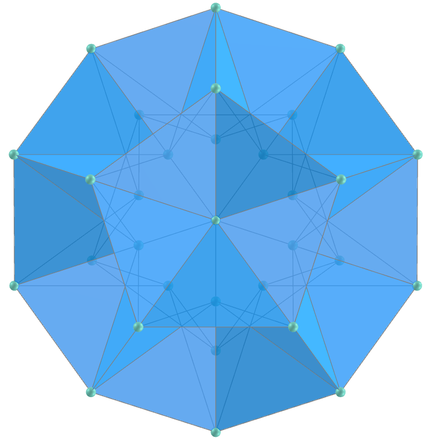</a>
  Este deltaedro é construído a partir de um núcleo dodecaédrico regular, ao qual são escavadas pirâmides pentagonais em suas doze faces.
  <b>faces:</b> 60  |  <b>arestas:</b> 90  |  <b>vértices:</b> 32
  

<h4>8. Dodecaedro aumentado</h4>
<a href="../vr/08_Dodecaugmented_Dodecahedron.htm" target="_blank" title="modelo 3D" class="fotoA">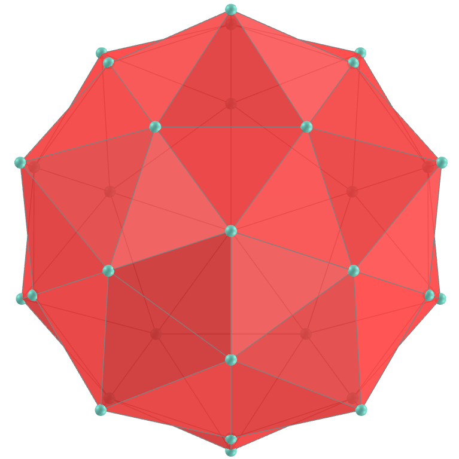</a>
  Este deltaedro é construído a partir de um núcleo dodecaédrico regular, ao qual são anexadas "tampas" em formato de pirâmides pentagonais (aumentos) em suas doze faces.
  <b>faces:</b> 60  |  <b>arestas:</b> 90  |  <b>vértices:</b> 32
  

<h4>9. Dodecaedro snub aumentado</h4>
<a href="../vr/09_Dodecaugmented_Snub_Icosidodecahedron.htm" target="_blank" title="modelo 3D" class="fotoA">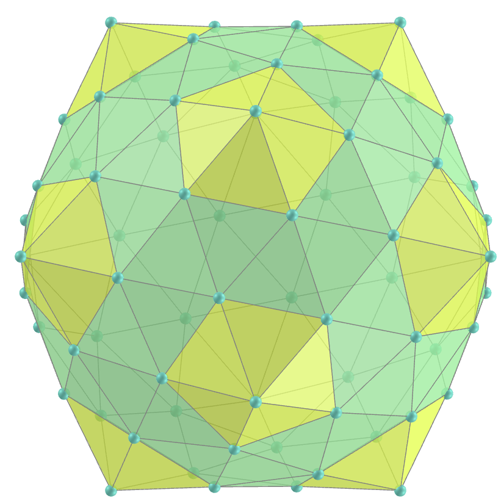</a>
  Este deltaedro é construído a partir de um núcleo dodecaédrico snub regular, ao qual são anexadas "tampas" em formato de pirâmides pentagonais (aumentos) em suas doze faces pentagonais.
  <b>faces:</b> 140  |  <b>arestas:</b> 210  |  <b>vértices:</b> 72
  

<h4>10. Dodecaedro snub escavado</h4>
<a href="../vr/10_Dodekexcavated_Snub_Icosidodecahedron.htm" target="_blank" title="modelo 3D" class="fotoA">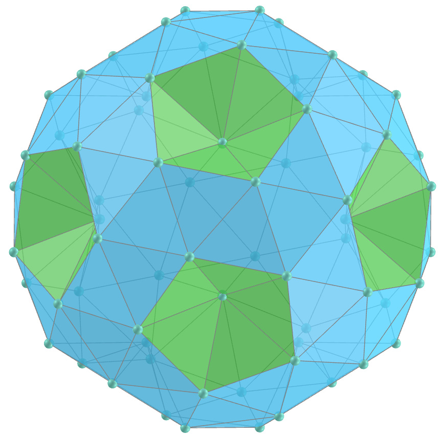</a>
  Este deltaedro é construído a partir de um núcleo dodecaédrico snub regular, ao qual são escavadas pirâmides pentagonais em suas doze faces pentagonais.
  <b>faces:</b> 140  |  <b>arestas:</b> 210  |  <b>vértices:</b> 72
  

<a href="#p1" class="topo">back to top</a>

<h4>11. Rombicuboctaedro aumentado</h4>
<a href="../vr/11_RhombicuboctahedronAugmented.htm" target="_blank" title="modelo 3D" class="fotoA">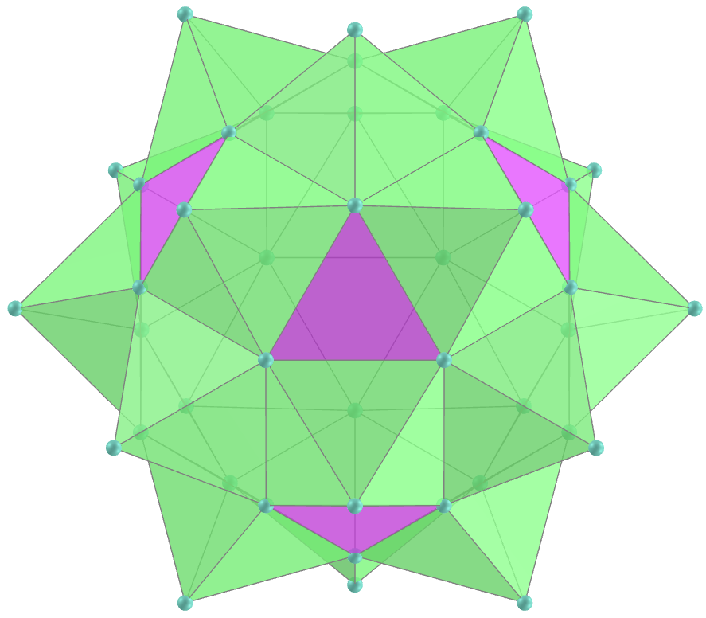</a>
  Este deltaedro é construído a partir de um núcleo rombicuboctaédrico, ao qual são anexadas "tampas" em formato de pirâmides quadradas (aumentos) em suas faces quadradas.
  <b>faces:</b> 80  |  <b>arestas:</b> 120  |  <b>vértices:</b> 42
  

<h4>12. Rombicuboctaedro escavado</h4>
<a href="../vr/12_RhombicuboctahedronExcaveted.htm" target="_blank" title="modelo 3D" class="fotoA">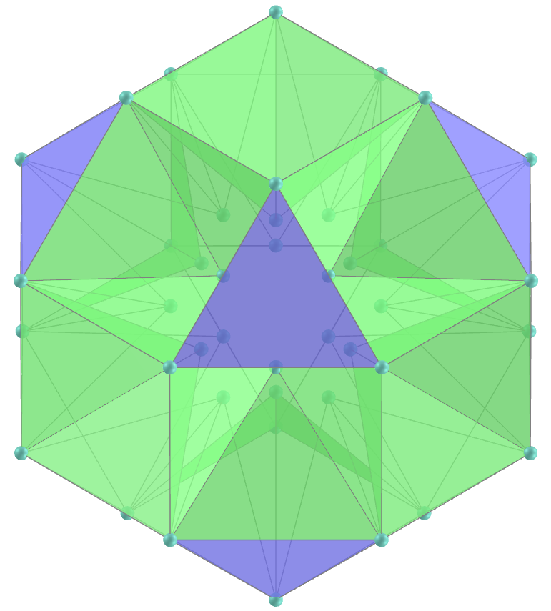</a>
  Este deltaedro é construído a partir de um núcleo rombicuboctaédrico, ao qual são escavadas pirâmides quadradas em suas faces quadradas.
  <b>faces:</b> 80  |  <b>arestas:</b> 120  |  <b>vértices:</b> 42
  

<h4>13. Icosidodecaedro escavado</h4>
<a href="../vr/13_Dodekexcavated_Icosidodecahedron.htm" target="_blank" title="modelo 3D" class="fotoA">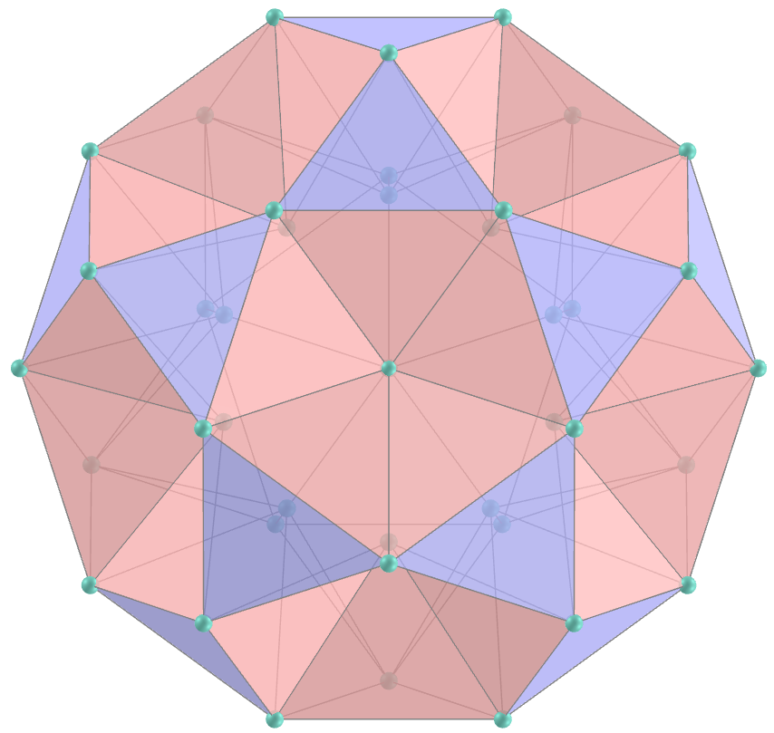</a>
  Este deltaedro é construído a partir de um núcleo icosidodecaédrico, ao qual são escavadas pirâmides pentagonais em suas faces pentagonais.
  <b>faces:</b> 80  |  <b>arestas:</b> 120  |  <b>vértices:</b> 42
  

<h4>14. Cubo snub aumentado</h4>
<a href="../vr/14_Hexaugmented_Snub_Cube.htm" target="_blank" title="modelo 3D" class="fotoA">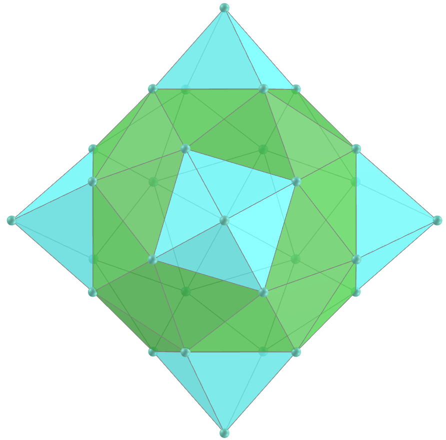</a>
  Este deltaedro é construído a partir de um núcleo de cubo snub, ao qual são anexadas "tampas" em formato de pirâmides quadradas (aumentos) em suas faces quadradas.
  <b>faces:</b> 56  |  <b>arestas:</b> 84  |  <b>vértices:</b> 30
  

<h4>15. Cubo snub escavado</h4>
<a href="../vr/15_Hexexcavated_Snub_Cube.htm" target="_blank" title="modelo 3D" class="fotoA">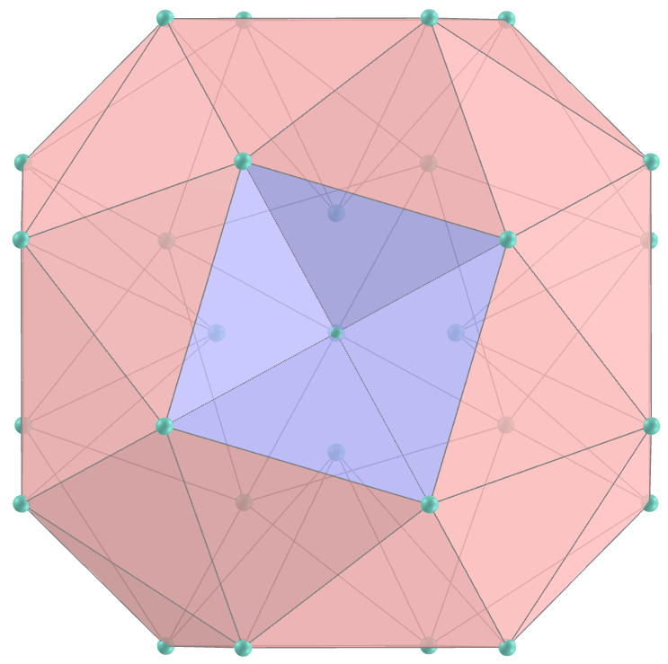</a>
  Este deltaedro é construído a partir de um núcleo de cubo snub, ao qual são escavadas pirâmides quadradas em suas faces quadradas.
  <b>faces:</b> 56  |  <b>arestas:</b> 84  |  <b>vértices:</b> 30
  

<h4>16. Pequeno icosicosidodecaedro snub escavado</h4>
<a href="../vr/16_Dodekexcavated_Seside.htm" target="_blank" title="modelo 3D" class="fotoA">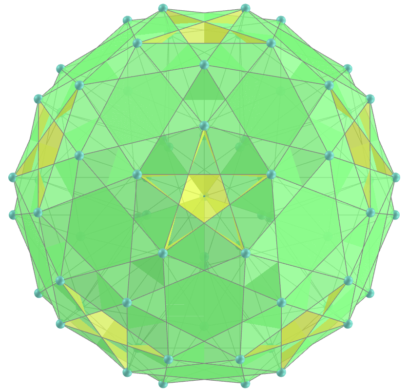</a>
  Este deltaedro é construído a partir de um núcleo de pequeno icosicosidodecaedro snub, ao qual são escavadas pirâmides pentagrâmicas em suas faces pentagrâmicas.
  <b>faces:</b> 160  |  <b>arestas:</b> 240  |  <b>vértices:</b> 82
  

<h4>17. Pequeno icosicosidodecaedro snub aumentado</h4>
<a href="../vr/17_Dodecaugmented_Seside.htm" target="_blank" title="modelo 3D" class="fotoA">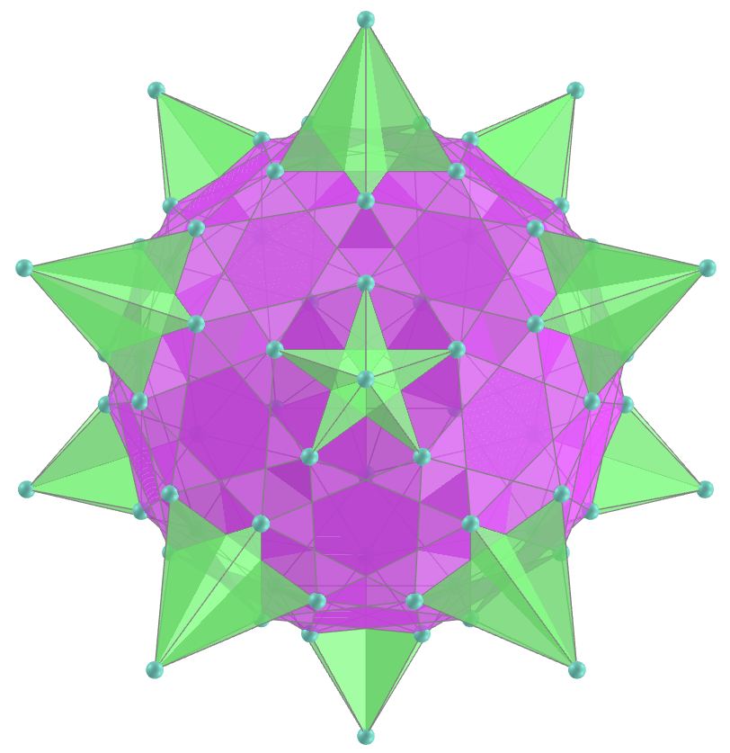</a>
  Este deltaedro é construído a partir de um núcleo de pequeno icosicosidodecaedro snub, ao qual são anexadas "tampas" em formato de pirâmides pentagrâmicas (aumentos) em suas faces pentagrâmicas.
  <b>faces:</b> 160  |  <b>arestas:</b> 240  |  <b>vértices:</b> 82
  

<h4>18. Grande icosaedro aumentado</h4>
<a href="../vr/18_Tetraugmented_Gike.htm" target="_blank" title="modelo 3D" class="fotoA">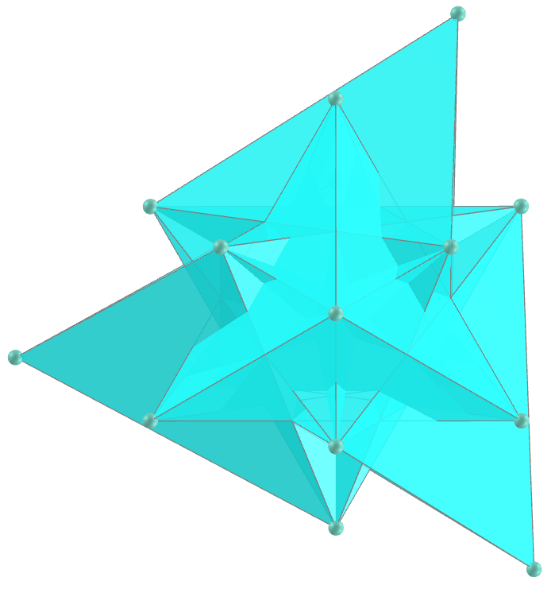</a>
  Este deltaedro é construído a partir de um núcleo de grande icosaedro, ao qual são anexadas "tampas" em formato de tetraedros regulares (aumentos) em quatro faces.
  <b>faces:</b> 28  |  <b>arestas:</b> 42  |  <b>vértices:</b> 16
  

<h4>19. Grande dodecaedro estrelado escavado</h4>
<a href="../vr/19_Dodekexcavated_Gissid.htm" target="_blank" title="modelo 3D" class="fotoA">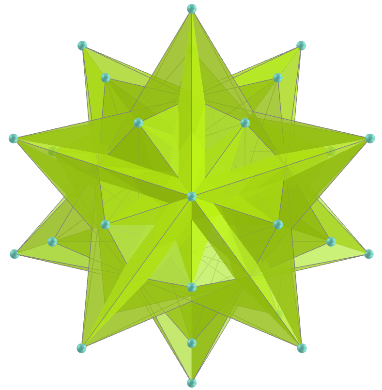</a>
  Este deltaedro é construído a partir de um núcleo de grande dodecaedro estrelado, ao qual são escavadas pirâmides pentagrâmicas em suas faces pentagrâmicas.
  <b>faces:</b> 60  |  <b>arestas:</b> 90  |  <b>vértices:</b> 32
  

<h4>20. Grande icosaedro escavado</h4>
<a href="../vr/20_Icosagyrexcavated_Gike.htm" target="_blank" title="modelo 3D" class="fotoA">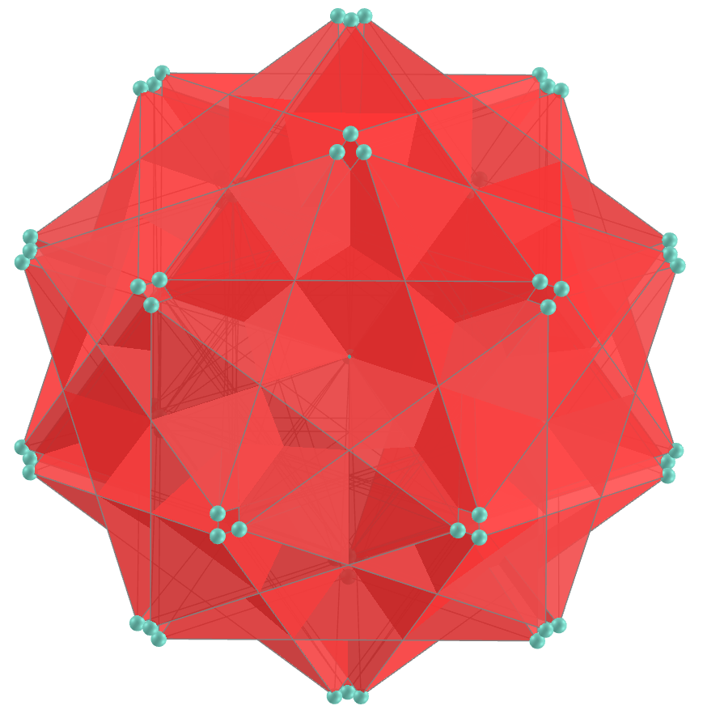</a>
  Este deltaedro é construído a partir de um núcleo de grande icosaedro, ao qual são escavados octaedros regulares em suas faces.
  <b>faces:</b> 140  |  <b>arestas:</b> 210  |  <b>vértices:</b> 72
  

<a href="#p1" class="topo">voltar ao topo</a>

<h4>21. Grande icosidodecaedro ditrigonal escavado</h4>
<a href="../vr/21_Dodekexcavated_Gidtid.htm" target="_blank" title="modelo 3D" class="fotoA">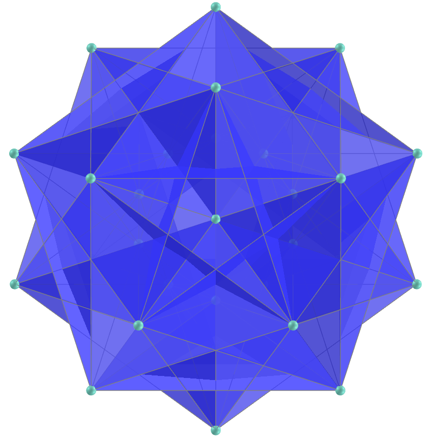</a>
  Este deltaedro é construído a partir de um núcleo de grande icosidodecaedro ditrigonal, ao qual são escavadas pirâmides pentagrâmicas em suas faces pentagrâmicas.
  <b>faces:</b> 80  |  <b>arestas:</b> 120  |  <b>vértices:</b> 42
  

<h4>22. Hexaedro truncado estrelado aumentado</h4>
<a href="../vr/22_Octaugmented_Quith.htm" target="_blank" title="modelo 3D" class="fotoA">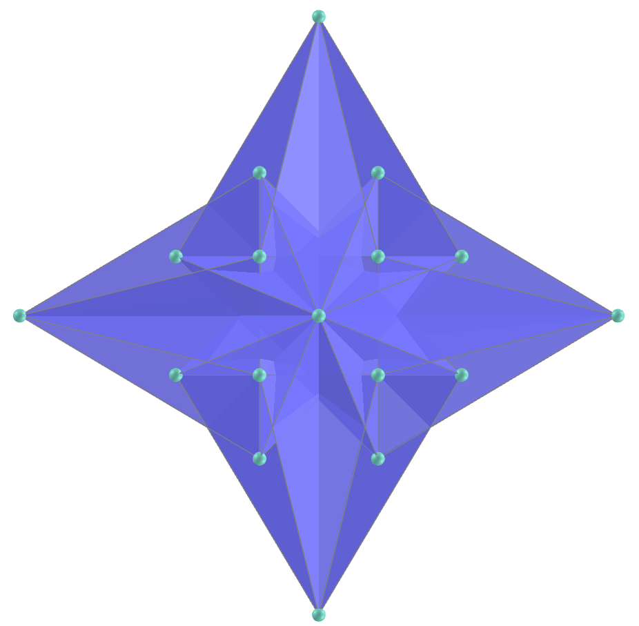</a>
  Este deltaedro é construído a partir de um núcleo de hexaedro truncado estrelado, ao qual são anexadas "tampas" em formato de pirâmides octogrâmicas (aumentos) em suas faces octogrâmicas.
  <b>faces:</b> 56  |  <b>arestas:</b> 84  |  <b>vértices:</b> 30
  

<h4>23. Hexaedro truncado estrelado escavado</h4>
<a href="../vr/23_Octaexcavated_Quith.htm" target="_blank" title="modelo 3D" class="fotoA">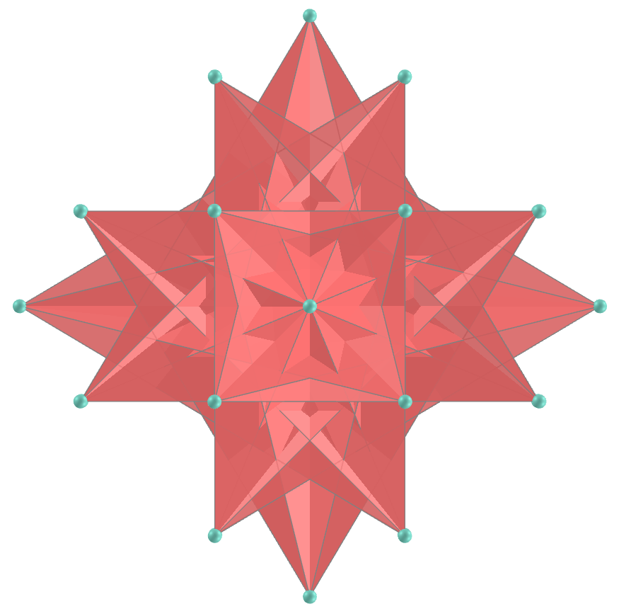</a>
  Este deltaedro é construído a partir de um núcleo de hexaedro truncado estrelado, ao qual são escavadas pirâmides octogrâmicas em suas faces octogrâmicas.
  <b>faces:</b> 56  |  <b>arestas:</b> 84  |  <b>vértices:</b> 30
  

<h4>24. Pequeno icosidodecaedro ditrigonal aumentado</h4>
<a href="../vr/24_Dodecaugmented_Sidtid.htm" target="_blank" title="modelo 3D" class="fotoA">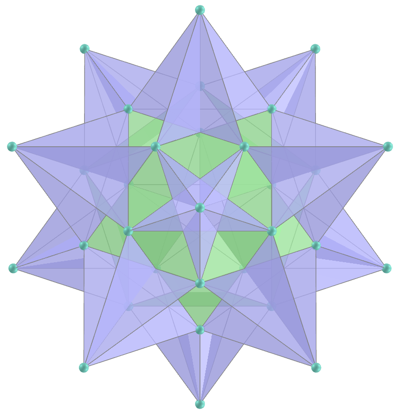</a>
  Este deltaedro é construído a partir de um núcleo de pequeno icosidodecaedro ditrigonal, ao qual são anexadas "tampas" em formato de pirâmides pentagrâmicas (aumentos) em suas faces pentagrâmicas.
  <b>faces:</b> 80  |  <b>arestas:</b> 120  |  <b>vértices:</b> 42
  

<h4>25. Pequeno icosidodecaedro ditrigonal escavado</h4>
<a href="../vr/25_Dodekexcavated_Sidtid.htm" target="_blank" title="modelo 3D" class="fotoA">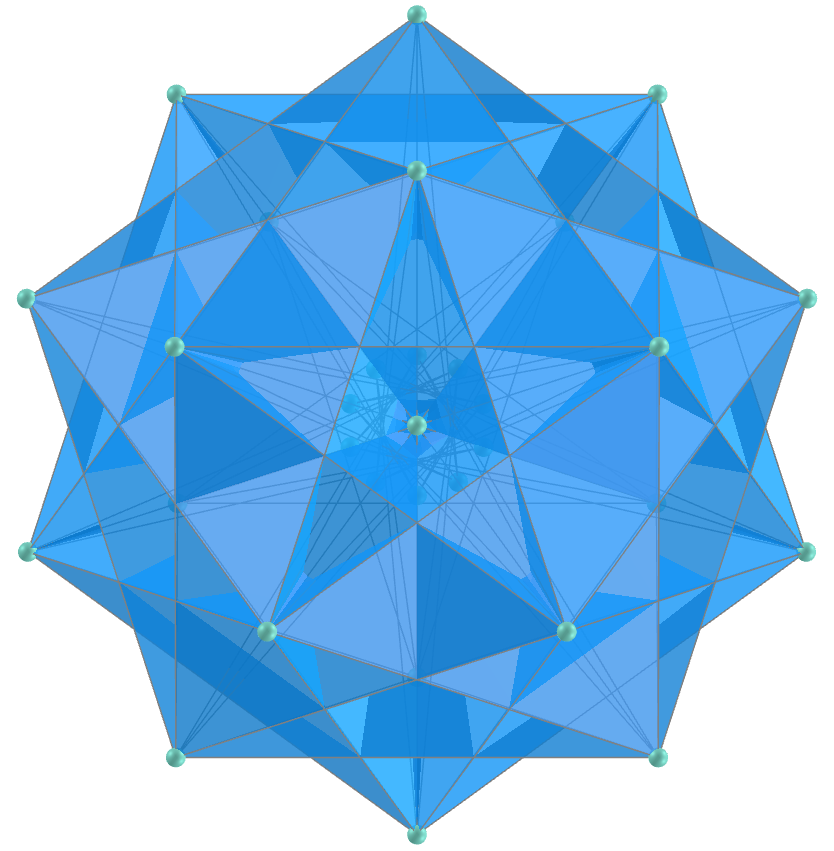</a>
  Este deltaedro é construído a partir de um núcleo de pequeno icosidodecaedro ditrigonal, ao qual são escavadas pirâmides pentagrâmicas em suas faces pentagrâmicas.
  <b>faces:</b> 80  |  <b>arestas:</b> 120  |  <b>vértices:</b> 42
  

<h4>26. Octaedro di-escavado</h4>
<a href="../vr/26_Diexcavated_Octahedron.htm" target="_blank" title="modelo 3D" class="fotoA">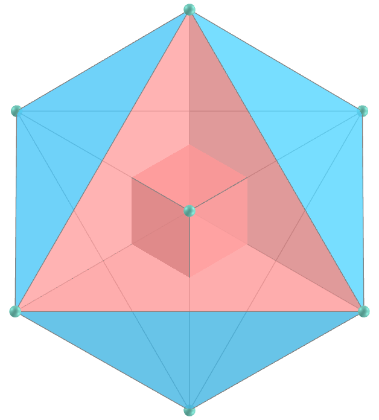</a>
  Este deltaedro é construído a partir de um núcleo de octaedro, ao qual são escavados tetraedros em duas faces paralelas.
   <b>faces:</b> 12  |  <b>arestas:</b> 18  |  <b>vértices:</b> 8
  

<h4>27. Antiprisma quadrado di-escavado</h4>
<a href="../vr/27_Diexcavated_Square_Antiprism.htm" target="_blank" title="modelo 3D" class="fotoA">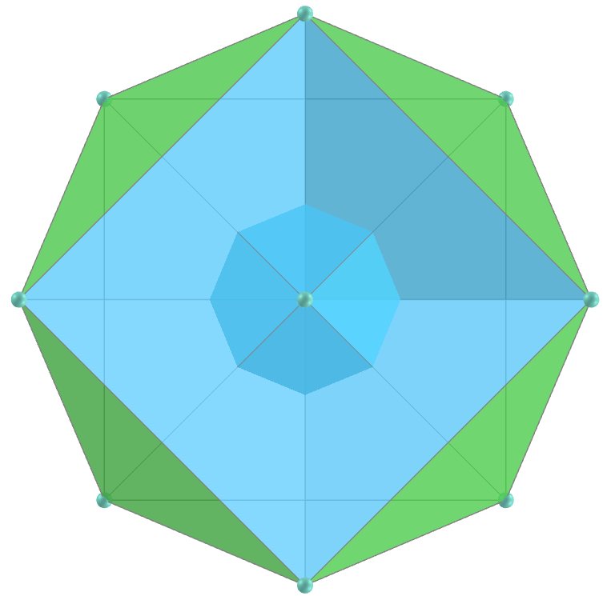</a>
  Este deltaedro é construído a partir de um núcleo de antiprisma quadrado, ao qual são escavadas pirâmides quadradas em suas faces quadradas.
   <b>faces:</b> 16  |  <b>arestas:</b> 24  |  <b>vértices:</b> 10
  

<h4>28. Antiprisma pentagonal di-escavado</h4>
<a href="../vr/28_Diexcavated_Pentagonal_Antiprism.htm" target="_blank" title="modelo 3D" class="fotoA">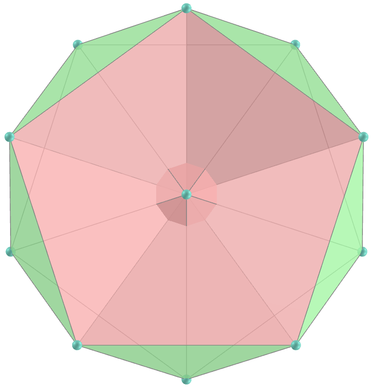</a>
  Este deltaedro é construído a partir de um núcleo de antiprisma pentagonal, ao qual são escavadas pirâmides pentagonais em suas faces pentagonais.
   <b>faces:</b> 20  |  <b>arestas:</b> 30  |  <b>vértices:</b> 12
  

<h4>29. Icosaedro tetrambiado</h4>
<a href="../vr/29_Tetrambiated_Icosahedron.htm" target="_blank" title="modelo 3D" class="fotoA">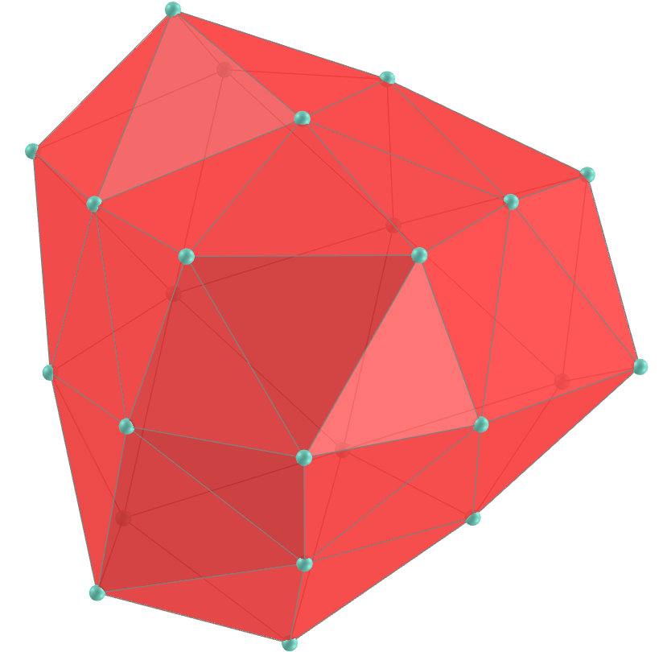</a>
  Este poliedro é formado por quatro conjuntos de quatro triângulos dispostos tetraedricamente no icosaedro, combinados simetricamente com um conjunto de dez triângulos equiláteros, gerando um deltaedro de Cundy com 44 faces.
   <b>faces:</b> 44  |  <b>arestas:</b> 66  |  <b>vértices:</b> 24
  

<h4>30. Icosaedro hexasfeniado</h4>
<a href="../vr/30_Hexaspheniated_Icosahedron.htm" target="_blank" title="modelo 3D" class="fotoA">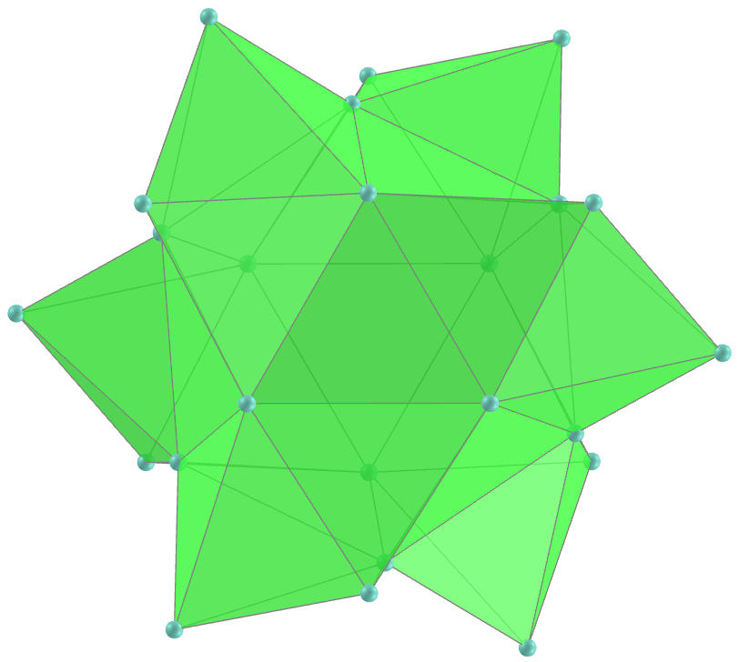</a>
  Esse poliedro é formado pela combinação de estruturas esfenóides (cunhas tetraédricas), unidas a uma estrutura básica de icosaedro.
   <b>faces:</b> 44  |  <b>arestas:</b> 66  |  <b>vértices:</b> 24
  

<a href="#p1" class="topo">voltar ao topo</a>

<h4>31. Antiprisma pentagrâmico aumentado</h4>
<a href="../vr/33_PentagrammicAntiprismAugmented.htm" target="_blank" title="modelo 3D" class="fotoA">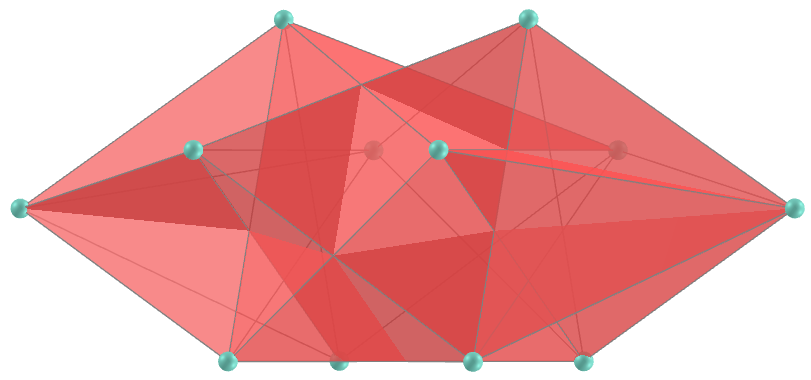</a>
  Este deltaedro é construído a partir de um núcleo de antiprisma pentagrâmico, ao qual são anexadas "tampas" em formato de pirâmides pentagrâmicas (aumentos) em suas faces pentagrâmicas.
   <b>faces:</b> 20  |  <b>arestas:</b> 30  |  <b>vértices:</b> 12
  

<h4>32. Antiprisma pentagrâmico escavado</h4>
<a href="../vr/34_PentagrammicAntiprismExcavated.htm" target="_blank" title="modelo 3D" class="fotoA">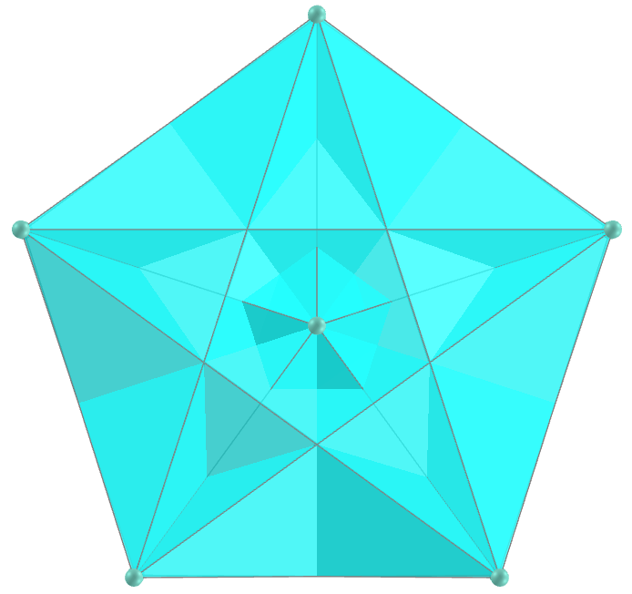</a>
  Este deltaedro é construído a partir de um núcleo de antiprisma pentagrâmico, ao qual são escavadas pirâmides pentagrâmicas em suas faces pentagrâmicas.
   <b>faces:</b> 20  |  <b>arestas:</b> 30  |  <b>vértices:</b> 12
  

<h4>33. Antiprisma cruzado pentagrâmico aumentado</h4>
<a href="../vr/31_PentagrammicCrossedAntiprismAugmented.htm" target="_blank" title="modelo 3D" class="fotoA">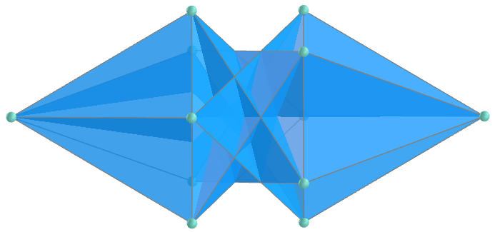</a>
  Este deltaedro é construído a partir de um núcleo de antiprisma cruzado pentagrâmico, ao qual são anexadas "tampas" em formato de pirâmides pentagrâmicas (aumentos) em suas faces pentagrâmicas.
   <b>faces:</b> 20  |  <b>arestas:</b> 30  |  <b>vértices:</b> 12
  

<h4>34. Antiprisma cruzado pentagrâmico escavado</h4>
<a href="../vr/32_PentagrammicCrossedAntiprismExcavated.htm" target="_blank" title="modelo 3D" class="fotoA">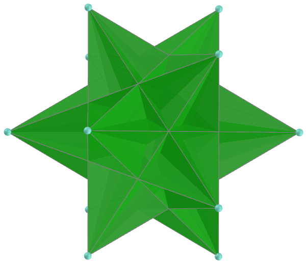</a>
  Este deltaedro é construído a partir de um núcleo de antiprisma cruzado pentagrâmico, ao qual são escavadas pirâmides pentagrâmicas em suas faces pentagrâmicas.
   <b>faces:</b> 20  |  <b>arestas:</b> 30  |  <b>vértices:</b> 12
  

<h4>35. Grande icosidodecaedro aumentado</h4>
<a href="../vr/35_Dodekaugmented_Gid.htm" target="_blank" title="modelo 3D" class="fotoA">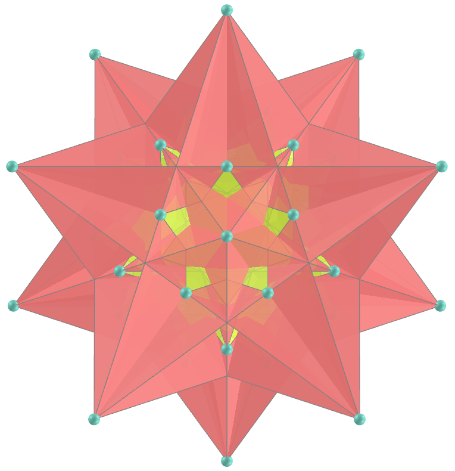</a>
  Este deltaedro é construído a partir de um núcleo de grande icosidodecaedro, ao qual são anexadas "tampas" em formato de pirâmides pentagrâmicas (aumentos) em suas faces pentagrâmicas.
  <b>faces:</b> 80  |  <b>arestas:</b> 120  |  <b>vértices:</b> 42
  

<h4>36. Grande icosidodecaedro escavado</h4>
<a href="../vr/36_Dodekexcavated_Gid.htm" target="_blank" title="modelo 3D" class="fotoA">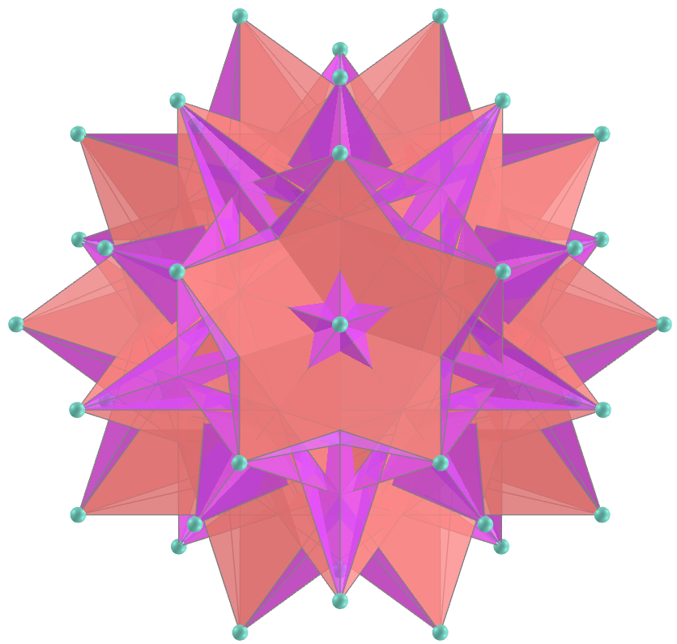</a>
  Este deltaedro é construído a partir de um núcleo de grande icosidodecaedro, ao qual são escavadas pirâmides pentagrâmicas em suas faces pentagrâmicas.
   <b>faces:</b> 80  |  <b>arestas:</b> 120  |  <b>vértices:</b> 42
  

<h4>37. Grande dodecaedro truncado estrelado escavado</h4>
<a href="../vr/37_Dodekexcavated_Quitgissid.htm" target="_blank" title="modelo 3D" class="fotoA">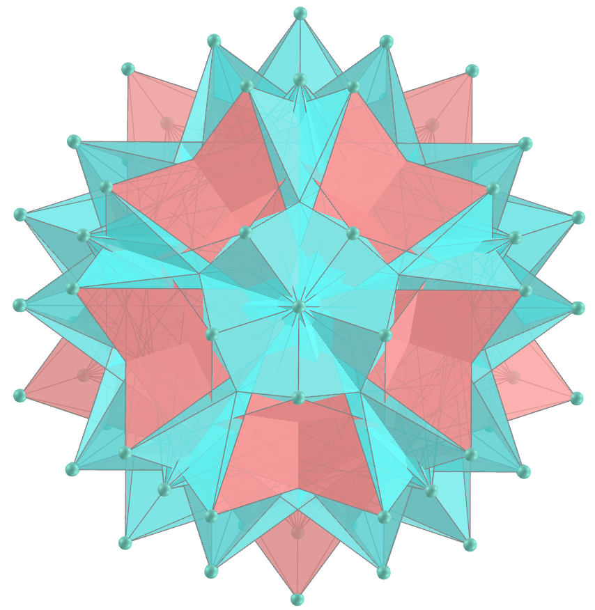</a>
  Este deltaedro é construído a partir de um núcleo de grande dodecaedro truncado estrelado, ao qual são escavadas pirâmides pentagrâmicas em suas faces pentagrâmicas.
   <b>faces:</b> 140  |  <b>arestas:</b> 210  |  <b>vértices:</b> 72
  

<h4>38. Grande dodecaedro truncado estrelado aumentado</h4>
<a href="../vr/38_Dodecaugmented_Quitgissid.htm" target="_blank" title="modelo 3D" class="fotoA">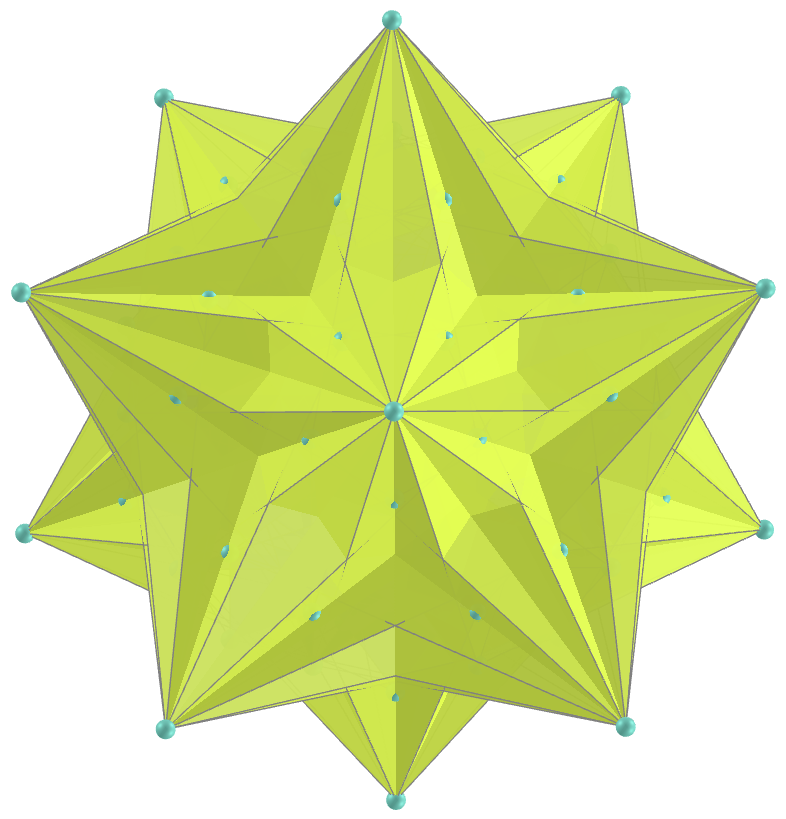</a>
  Este deltaedro é construído a partir de um núcleo de grande dodecaedro truncado estrelado, ao qual são anexadas "tampas" em formato de pirâmides pentagrâmicas (aumentos) em suas faces pentagrâmicas.
   <b>faces:</b> 140  |  <b>arestas:</b> 210  |  <b>vértices:</b> 72
  

<h4>39. Grande icosidodecaedro snub escavado</h4>
<a href="../vr/39_Dodekexcavated_Gisid.htm" target="_blank" title="modelo 3D" class="fotoA">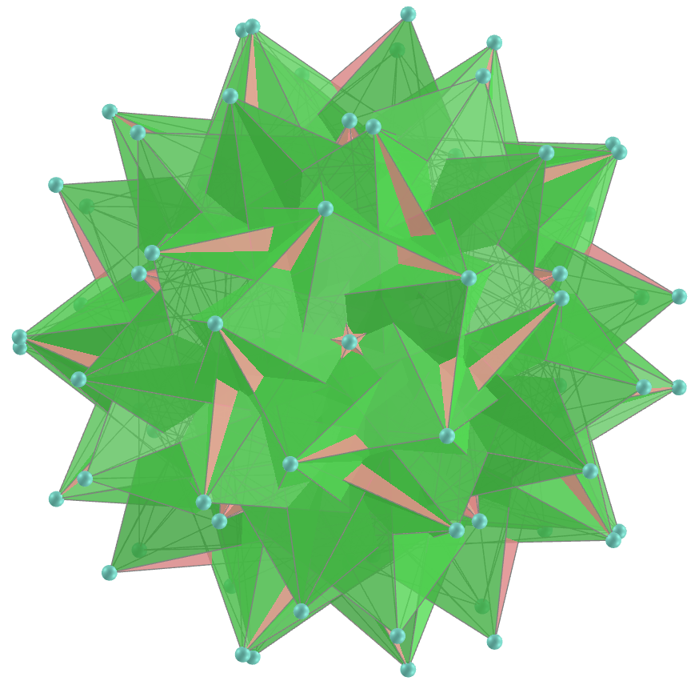</a>
  Este deltaedro é construído a partir de um núcleo de grande icosidodecaedro snub, ao qual são escavadas pirâmides pentagrâmicas em suas faces pentagrâmicas.
   <b>faces:</b> 140  |  <b>arestas:</b> 210  |  <b>vértices:</b> 72
  

<h4>40. Grande icosidodecaedro snub aumentado</h4>
<a href="../vr/40_Dodecaugmented_Gisid.htm" target="_blank" title="modelo 3D" class="fotoA">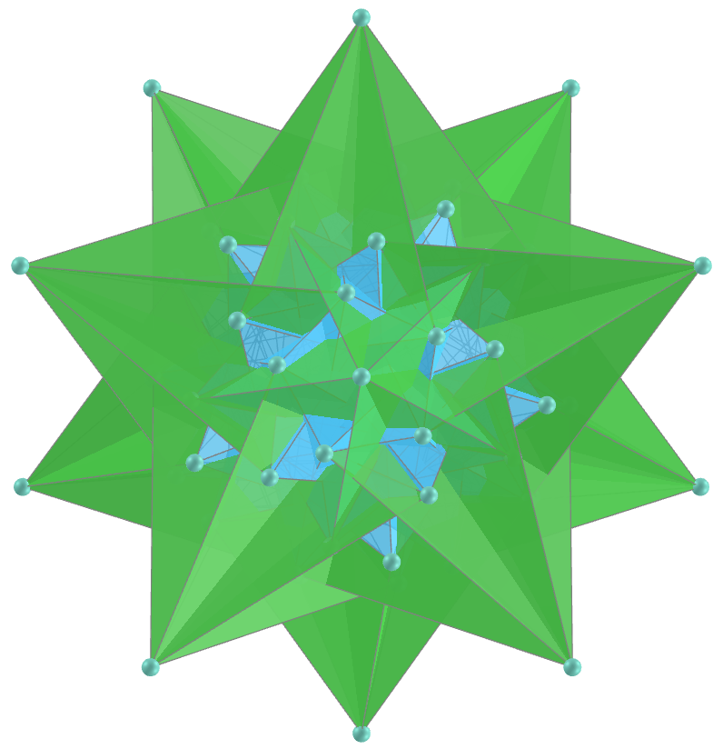</a>
  Este deltaedro é construído a partir de um núcleo de grande icosidodecaedro snub, ao qual são anexadas "tampas" em formato de pirâmides pentagrâmicas (aumentos) em suas faces pentagrâmicas.
   <b>faces:</b> 140  |  <b>arestas:</b> 210  |  <b>vértices:</b> 72
  

<a href="#p1" class="topo">voltar ao topo</a>

<h4>41. Grande icosidodecaedro snub invertido aumentado</h4>
<a href="../vr/41_Dodecaugmented_Gosid.htm" target="_blank" title="modelo 3D" class="fotoA">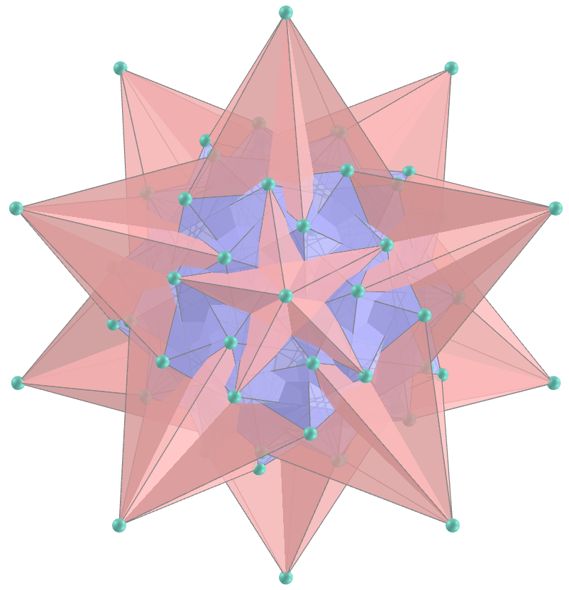</a>
  Este deltaedro é construído a partir de um núcleo de grande icosidodecaedro snub invertido, ao qual são anexadas "tampas" em formato de pirâmides pentagrâmicas (aumentos) em suas faces pentagrâmicas.
   <b>faces:</b> 140  |  <b>arestas:</b> 210  |  <b>vértices:</b> 72
  

<h4>42. Grande icosidodecaedro snub invertido escavado</h4>
<a href="../vr/42_Dodekexcavated_Gosid.htm" target="_blank" title="modelo 3D" class="fotoA">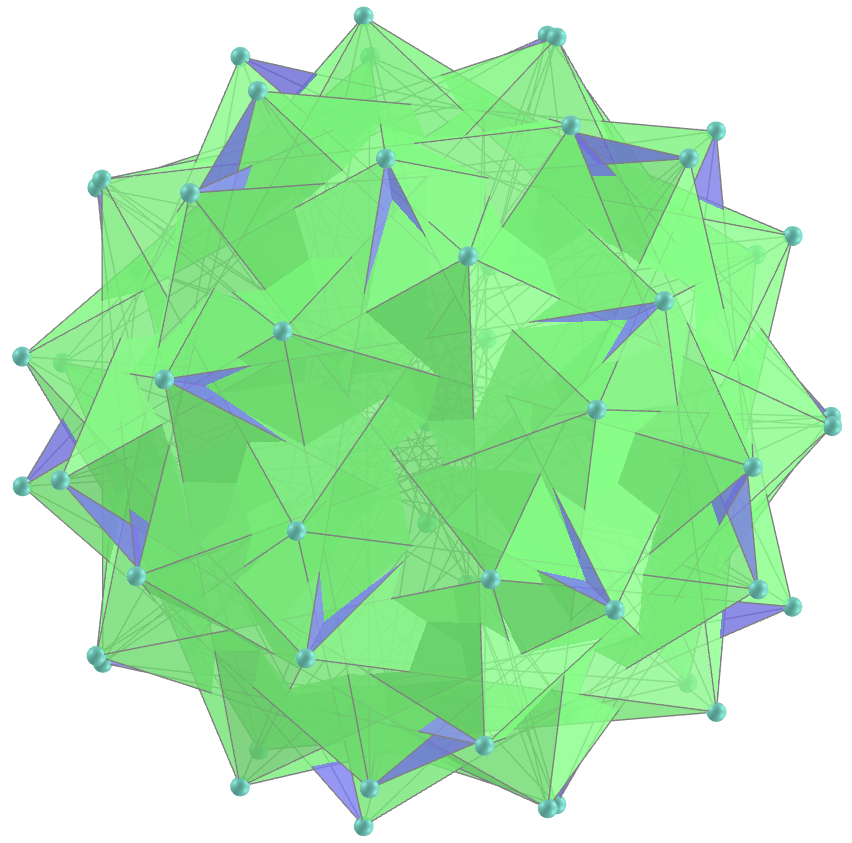</a>
  Este deltaedro é construído a partir de um núcleo de grande icosidodecaedro snub invertido, ao qual são escavadas pirâmides pentagrâmicas em suas faces pentagrâmicas.
   <b>faces:</b> 140  |  <b>arestas:</b> 210  |  <b>vértices:</b> 72
  

<h4>43. Grande icosidodecaedro retrosnub escavado</h4>
<a href="../vr/43_Dodekexcavated_Girsid.htm" target="_blank" title="modelo 3D" class="fotoA">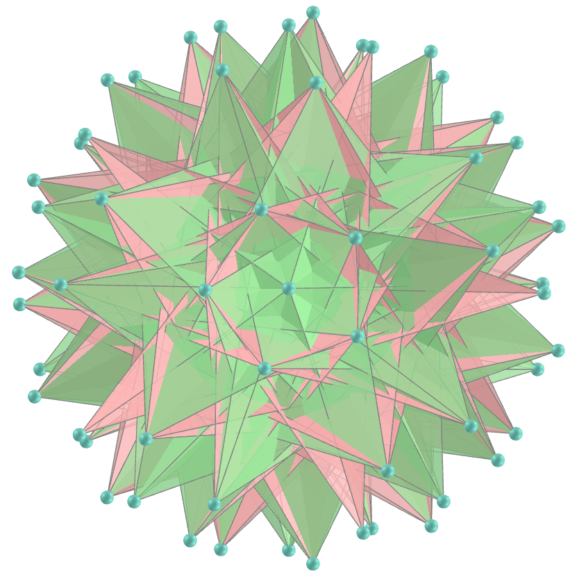</a>
  Este deltaedro é construído a partir de um núcleo de grande icosidodecaedro retrosnub, ao qual são anexadas "tampas" em formato de pirâmides pentagrâmicas (aumentos) em suas faces pentagrâmicas.
   <b>faces:</b> 140  |  <b>arestas:</b> 210  |  <b>vértices:</b> 72
  

<h4>44. Grande icosidodecaedro retrosnub aumentado</h4>
<a href="../vr/44_Dodecaugmented_Girsid.htm" target="_blank" title="modelo 3D" class="fotoA">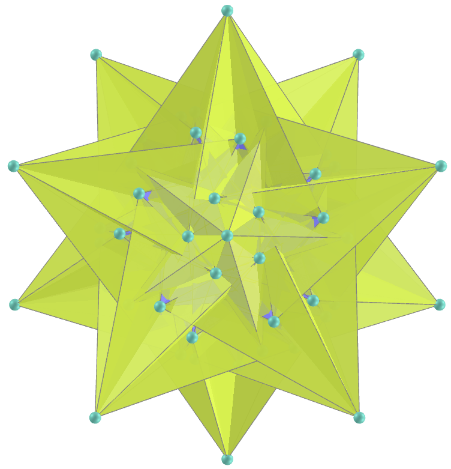</a>
  Este deltaedro é construído a partir de um núcleo de grande icosidodecaedro retrosnub, ao qual são anexadas "tampas" em formato de pirâmides pentagrâmicas (aumentos) em suas faces pentagrâmicas.
   <b>faces:</b> 140  |  <b>arestas:</b> 210  |  <b>vértices:</b> 72
  

<h4>45. Pequeno icosicosidodecaedro retrosnub aumentado</h4>
<a href="../vr/45_Dodecaugmented_Sirsid.htm" target="_blank" title="modelo 3D" class="fotoA">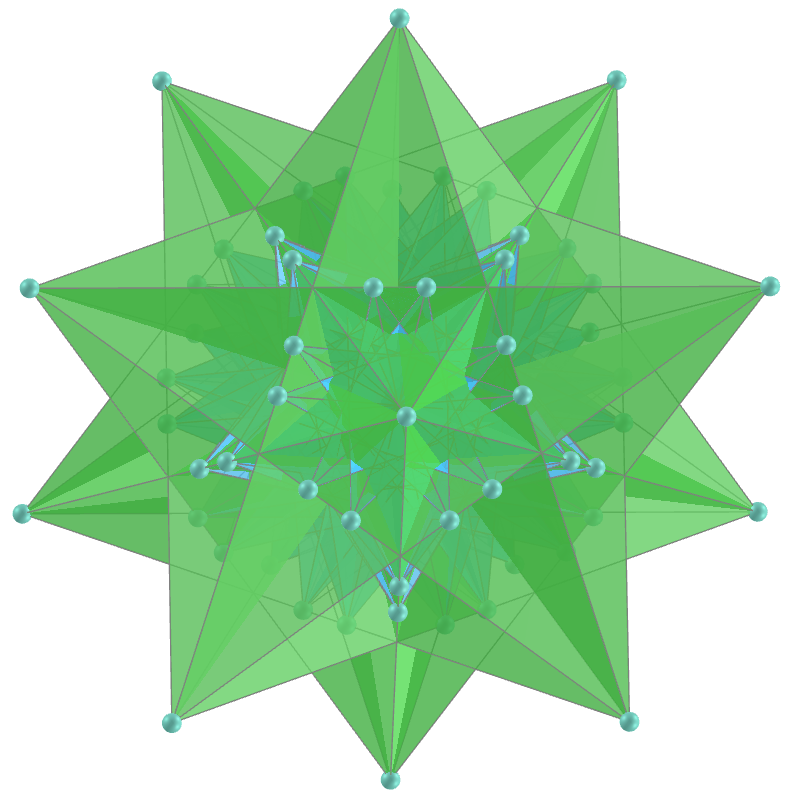</a>
  Este deltaedro é construído a partir de um núcleo de pequeno icosicosidodecaedro retrosnub, ao qual são anexadas "tampas" em formato de pirâmides pentagrâmicas (aumentos) em suas faces pentagrâmicas.
  <b>faces:</b> 160  |  <b>arestas:</b> 240  |  <b>vértices:</b> 82
  

<h4>46. Pequeno icosicosidodecaedro retrosnub escavado</h4>
<a href="../vr/46_Dodekexcavated_Sirsid.htm" target="_blank" title="modelo 3D" class="fotoA">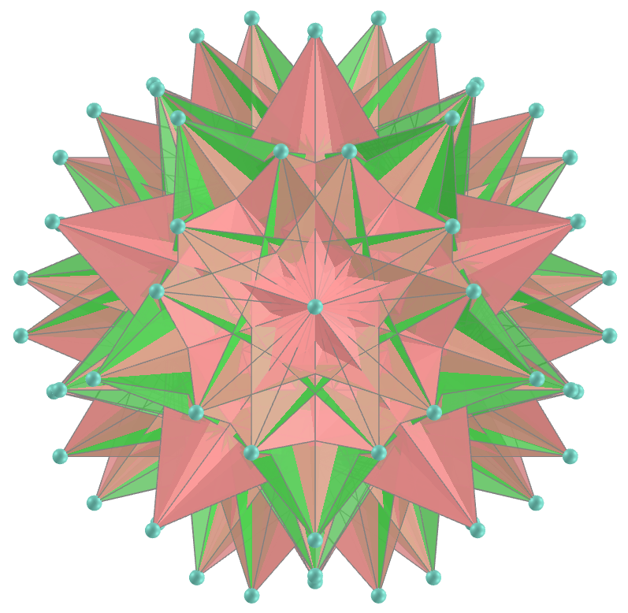</a>
  Este deltaedro é construído a partir de um núcleo de pequeno icosicosidodecaedro retrosnub, ao qual são escavadas pirâmides pentagrâmicas em suas faces pentagrâmicas.
   <b>faces:</b> 160  |  <b>arestas:</b> 240  |  <b>vértices:</b> 82
  

<h4>47. Grande dodecicosidodecaedro snub escavado</h4>
<a href="../vr/47_Dodekexcavated_Gsd.htm" target="_blank" title="modelo 3D" class="fotoA">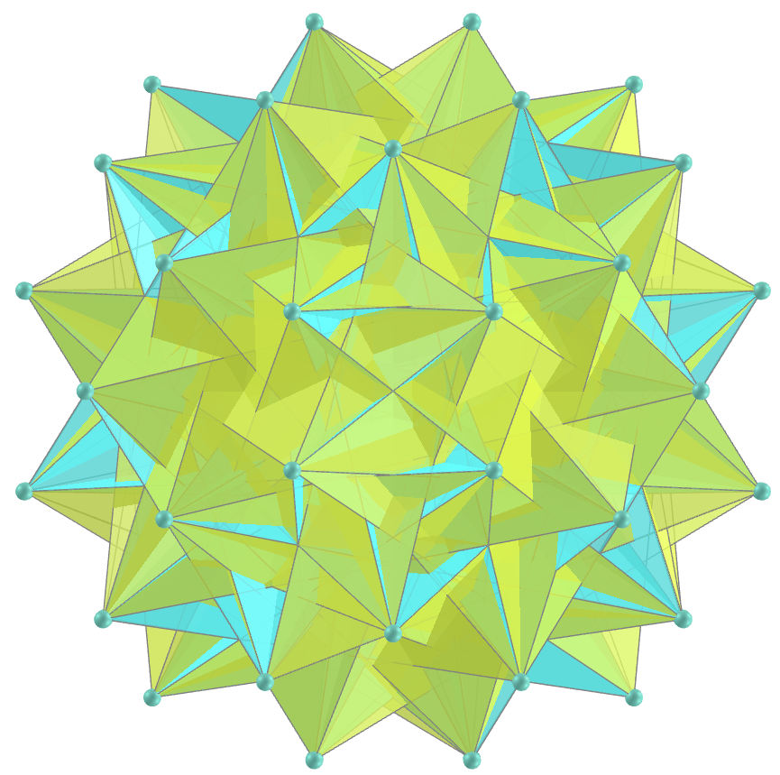</a>
  Este deltaedro é construído a partir de um núcleo de grande dodecicosidodecaedro snub, ao qual são escavadas pirâmides pentagrâmicas em suas faces pentagrâmicas.
   <b>faces:</b> 140  |  <b>arestas:</b> 210  |  <b>vértices:</b> 72
  

<h4>48. Grande dodecicosidodecaedro snub aumentado</h4>
<a href="../vr/48_Dodekaugmented_Gsd.htm" target="_blank" title="modelo 3D" class="fotoA">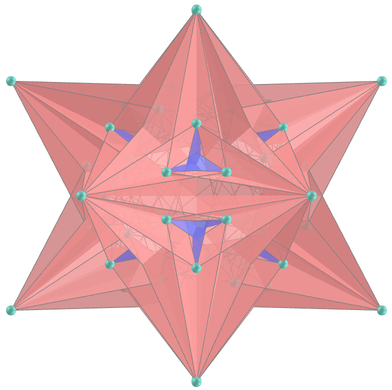</a>
  Este deltaedro é construído a partir de um núcleo de grande dodecicosidodecaedro snub, ao qual são anexadas "tampas" em formato de pirâmides pentagrâmicas (aumentos) em suas faces pentagrâmicas.
   <b>faces:</b> 140  |  <b>arestas:</b> 210  |  <b>vértices:</b> 72
  

<h4>49. Dodecadodecaedro snub aumentado</h4>
<a href="../vr/49_Dodekaugmented_Sd.htm" target="_blank" title="modelo 3D" class="fotoA">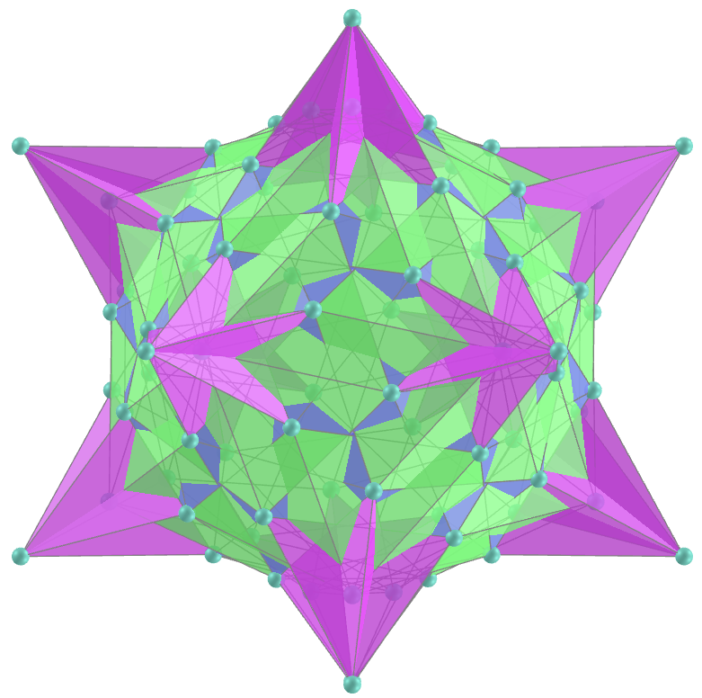</a>
  Este deltaedro é construído a partir de um núcleo de dodecadodecaedro snub, ao qual são anexadas "tampas" em formato de pirâmides pentagrâmicas e pentagonais (aumentos) em suas faces pentagrâmicas e pentagonais.
   <b>faces:</b> 140  |  <b>arestas:</b> 210  |  <b>vértices:</b> 84
  

<h4>50. Dodecadodecaedro snub escavado</h4>
<a href="../vr/50_Dodekexcavated_Sd.htm" target="_blank" title="modelo 3D" class="fotoA">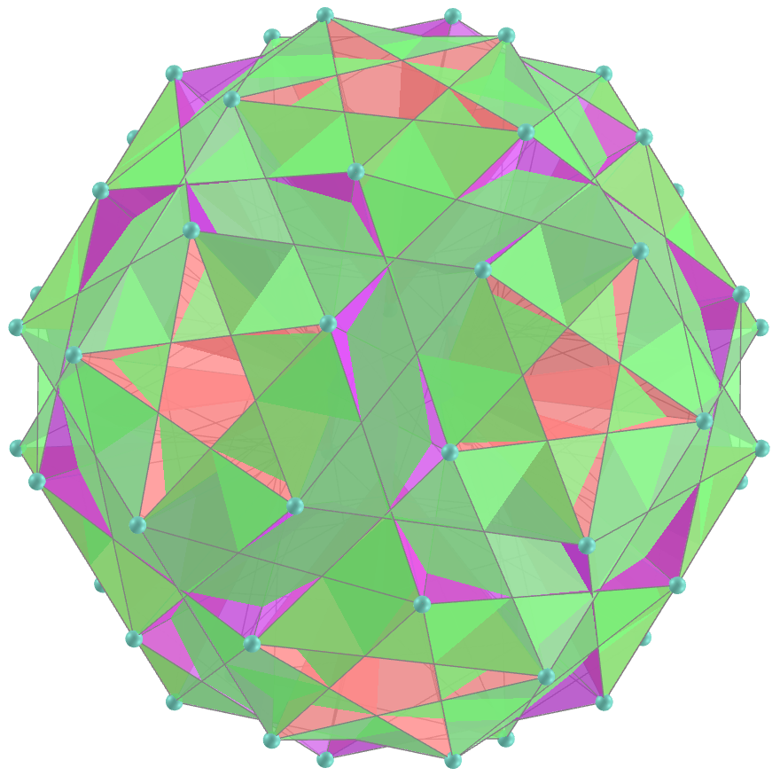</a>
  Este deltaedro é construído a partir de um núcleo de dodecadodecaedro snub, ao qual são escavadas pirâmides pentagrâmicas e pentagonais em suas faces pentagrâmicas e pentagonais.
   <b>faces:</b> 140  |  <b>arestas:</b> 210  |  <b>vértices:</b> 84
  

<a href="#p1" class="topo">voltar ao topo</a>

<h4>51. Dodecadodecaedro snub escavado e aumentado</h4>
<a href="../vr/51_Dodekaugmentedexcavated_Sd.htm" target="_blank" title="modelo 3D" class="fotoA">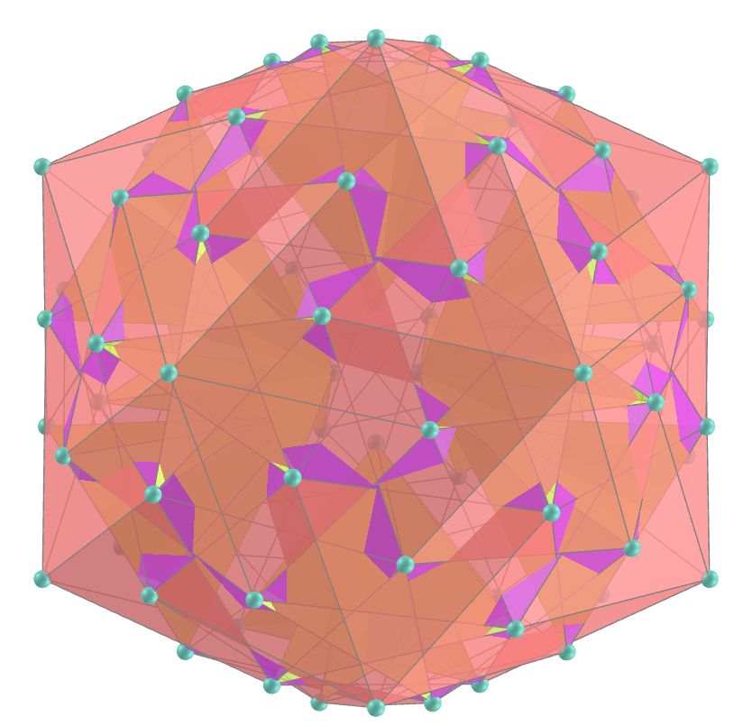</a>
  Este deltaedro é construído a partir de um núcleo de dodecadodecaedro snub, ao qual são escavadas pirâmides pentagrâmicas em suas faces pentagrâmicas, e são anexadas "tampas" em formato de pirâmides pentagonais (aumentos) em suas faces pentagonais.
   <b>faces:</b> 140  |  <b>arestas:</b> 210  |  <b>vértices:</b> 84
  

<h4>52. Dodecadodecaedro snub invertido aumentado</h4>
<a href="../vr/52_Dodekaugmented_Sid.htm" target="_blank" title="modelo 3D" class="fotoA">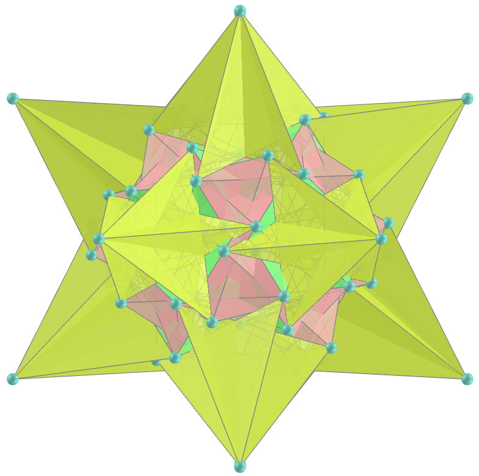</a>
  Este deltaedro é construído a partir de um núcleo de dodecadodecaedro snub invertido, ao qual são anexadas "tampas" em formato de pirâmides pentagrâmicas e pentagonais (aumentos) em suas faces pentagrâmicas e pentagonais.
   <b>faces:</b> 140  |  <b>arestas:</b> 210  |  <b>vértices:</b> 84
  

<h4>53. Dodecadodecaedro snub invertido escavado</h4>
<a href="../vr/53_Dodekexcavated_Sid.htm" target="_blank" title="modelo 3D" class="fotoA">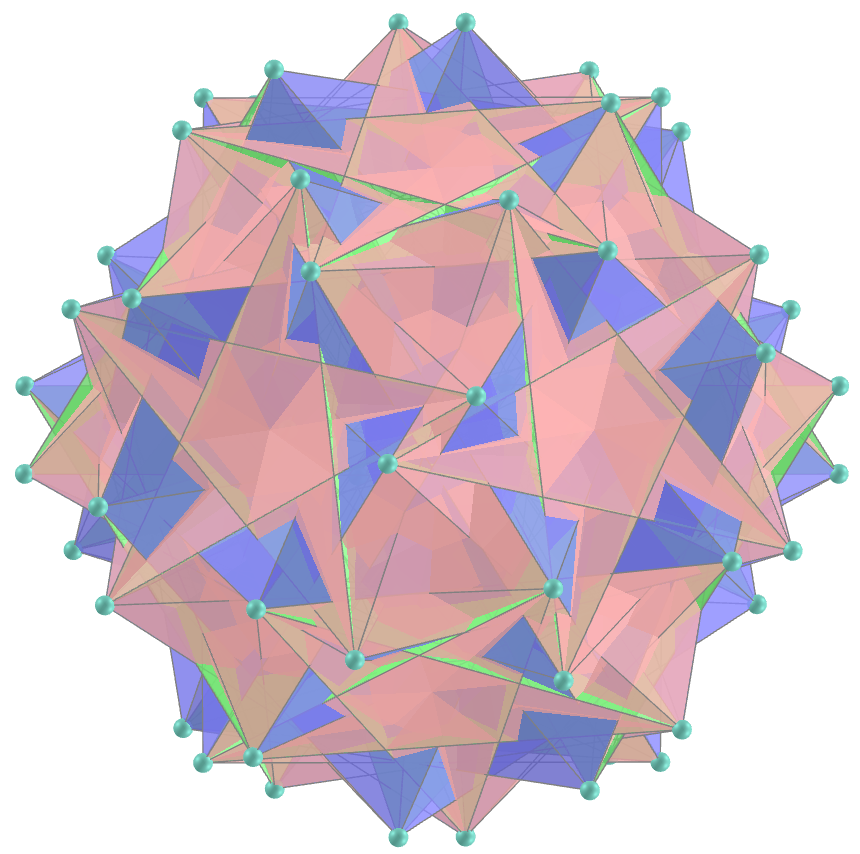</a>
  Este deltaedro é construído a partir de um núcleo de dodecadodecaedro snub invertido, ao qual são escavadas pirâmides pentagrâmicas e pentagonais em suas faces pentagrâmicas e pentagonais.
   <b>faces:</b> 140  |  <b>arestas:</b> 210  |  <b>vértices:</b> 84
  

<h4>54. Dodecadodecaedro snub invertido escavado e aumentado</h4>
<a href="../vr/54_Dodekaugmentedexcavated_Sid.htm" target="_blank" title="modelo 3D" class="fotoA">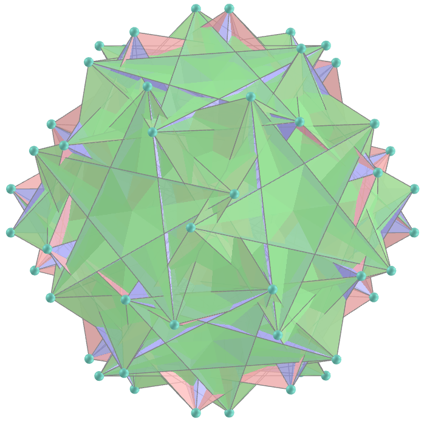</a>
  Este deltaedro é construído a partir de um núcleo de dodecadodecaedro snub invertido, ao qual são escavadas pirâmides pentagrâmicas em suas faces pentagrâmicas, e são anexadas "tampas" em formato de pirâmides pentagonais (aumentos) em suas faces pentagonais.
   <b>faces:</b> 140  |  <b>arestas:</b> 210  |  <b>vértices:</b> 84
  

<h4>55. Icosidodecadodecaedro snub aumentado</h4>
<a href="../vr/57_Dodekaugmented_Sic.htm" target="_blank" title="modelo 3D" class="fotoA">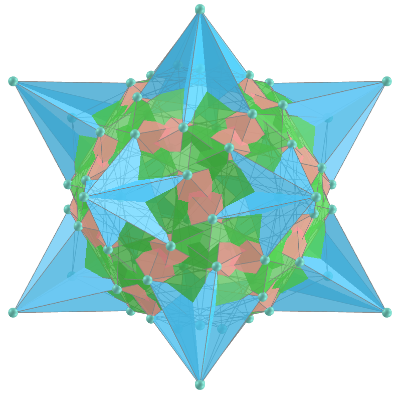</a>
  Este deltaedro é construído a partir de um núcleo de icosidodecadodecaedro snub, ao qual são anexadas "tampas" em formato de pirâmides pentagrâmicas e pentagonais (aumentos) em suas faces pentagrâmicas e pentagonais.
   <b>faces:</b> 140  |  <b>arestas:</b> 210  |  <b>vértices:</b> 84
  

<h4>56. Icosidodecadodecaedro snub escavado</h4>
<a href="../vr/55_Dodekexcavated_Sic.htm" target="_blank" title="modelo 3D" class="fotoA">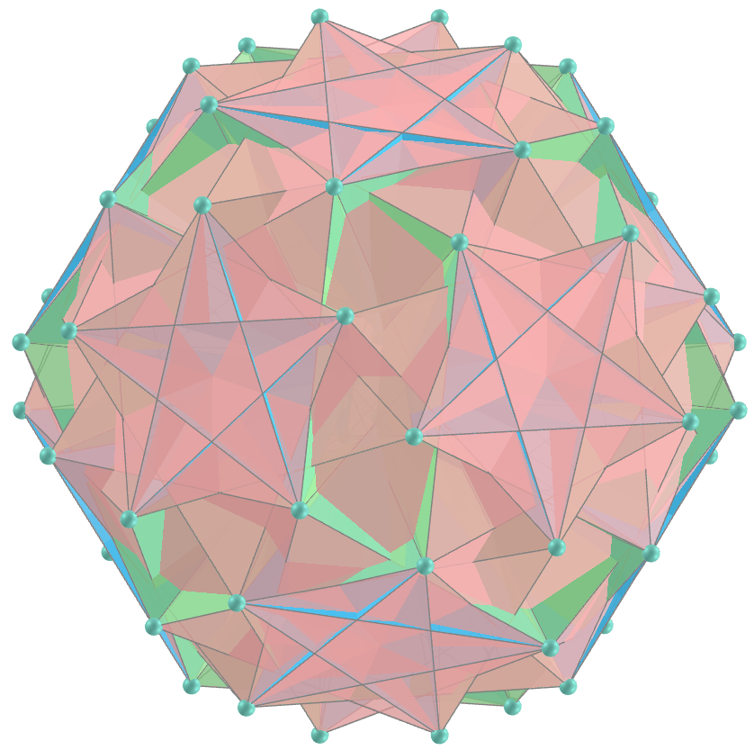</a>
  Este deltaedro é construído a partir de um núcleo de icosidodecadodecaedro snub, ao qual são escavadas pirâmides pentagrâmicas e pentagonais em suas faces pentagrâmicas e pentagonais.
   <b>faces:</b> 140  |  <b>arestas:</b> 210  |  <b>vértices:</b> 84
  

<h4>57. Icosidodecadodecaedro snub escavado e aumentado</h4>
<a href="../vr/56_Dodekaugmentedexcavated_Sic.htm" target="_blank" title="modelo 3D" class="fotoA">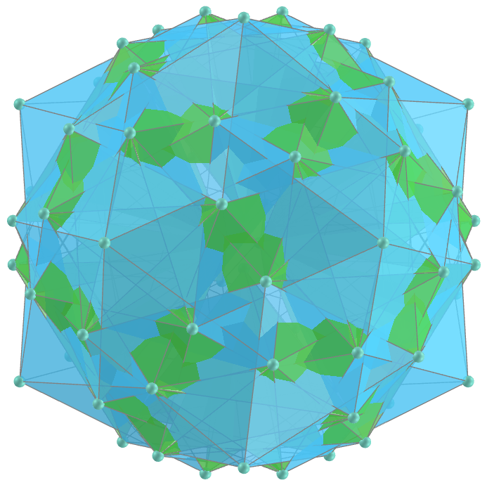</a>
  Este deltaedro é construído a partir de um núcleo de icosidodecadodecaedro snub, ao qual são escavadas pirâmides pentagrâmicas em suas faces pentagrâmicas, e são anexadas "tampas" em formato de pirâmides pentagonais (aumentos) em suas faces pentagonais.
   <b>faces:</b> 140  |  <b>arestas:</b> 210  |  <b>vértices:</b> 84
  

<h4>35. Deltaedro de Möbius</h4>

  Os deltaedros de Möbius são simplesmente isômeros das versões do triângulo de Möbius do tetraedro (24 faces), cubo e dodecaedro.
   <b>faces:</b> 24  |  <b>arestas:</b> 36  |  <b>vértices:</b> 14
  

<h4>36. Hexaedro octakis de Möbius</h4>

  O hexaedro octakis é um deltaedro de Möbius com 48 faces derivado do cubo e do triacontaedro rômbico medial.
   <b>faces:</b> 48  |  <b>arestas:</b> 72  |  <b>vértices:</b> 26
  

<h4>37. Octaedro hexakis de Möbius</h4>

  O octaedro hexakis é um deltaedro de Möbius com 48 faces derivado do cubo e do triacontaedro rômbico medial.
   <b>faces:</b> 48  |  <b>arestas:</b> 72  |  <b>vértices:</b> 26
  

<h4>38. Icosaedro hexakis de Möbius</h4>

  O icosaedro hexakis é um deltaedro de Möbius com 120 faces derivado do icosaedro e do grande triacontaedro rômbico.
   <b>faces:</b> 120  |  <b>arestas:</b> 180  |  <b>vértices:</b> 62
  

<h4>39. Dodecaedro 10-akis de Möbius</h4>

  O Dodecaedro 10-akis é um deltaedro de Möbius com 120 faces derivado do dodecaedro e do grande triacontaedro rômbico.
   <b>faces:</b> 120  |  <b>arestas:</b> 180  |  <b>vértices:</b> 62
  

<a href="#p1" class="topo">voltar ao topo</a>

  Non-convex deltahedra: visualization with Virtual Reality de <a xmlns:cc="http://creativecommons.org/ns#" href="https://paulohscwb.github.io/polyhedra3/deltahedra/pt-br/" property="cc:attributionName" rel="cc:attributionURL">Paulo Henrique Siqueira</a> está licenciado com uma Licença <a rel="license" href="http://creativecommons.org/licenses/by-nc-nd/4.0/">Creative Commons Atribuição-NãoComercial-SemDerivações 4.0 Internacional</a>.

<h4>Como citar este trabalho:</h4> 

Siqueira, P.H., "Non-convex deltahedra: visualization with Virtual Reality". Disponível em: <https://paulohscwb.github.io/polyhedra3/deltahedra/pt-br/>, Junho de 2026.

<!---->
  <b>Referências:</b>
 Weisstein, Eric W. "Archimedean Solid" From MathWorld-A Wolfram Web Resource. <a href="http://mathworld.wolfram.com/ArchimedeanSolid.html" target="_blank">http://mathworld.wolfram.com/ArchimedeanSolid.html</a>
 McCooey, D. I. "Visual Polyhedra". <a href="http://dmccooey.com/polyhedra/" target="_blank">http://dmccooey.com/polyhedra/</a>
 Cundy, H. M. "Deltahedra". Math. Gaz. v. 36, pp. 263-266, 1952
 Kaufman, R. "The Cundy Deltahedra". <a href="http://www.interocitors.com/polyhedra/Deltahedra/Cundy" target="_blank">http://www.interocitors.com/polyhedra/Deltahedra/Cundy</a>