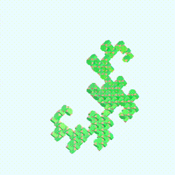
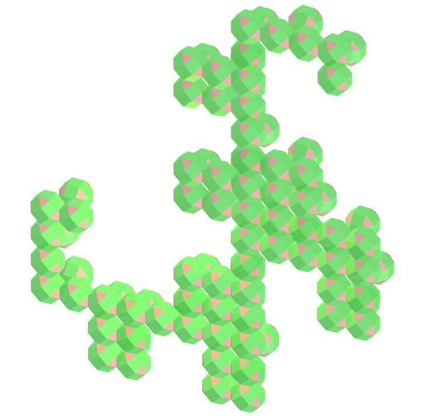
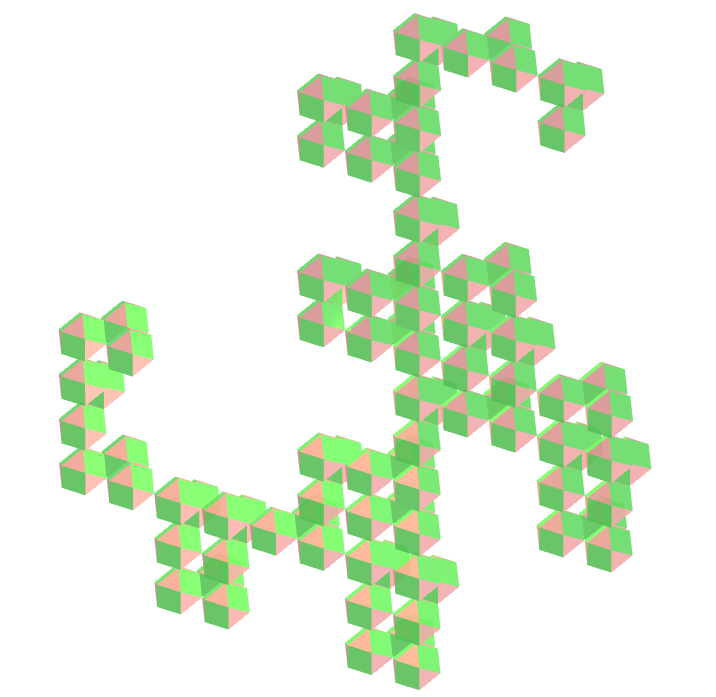
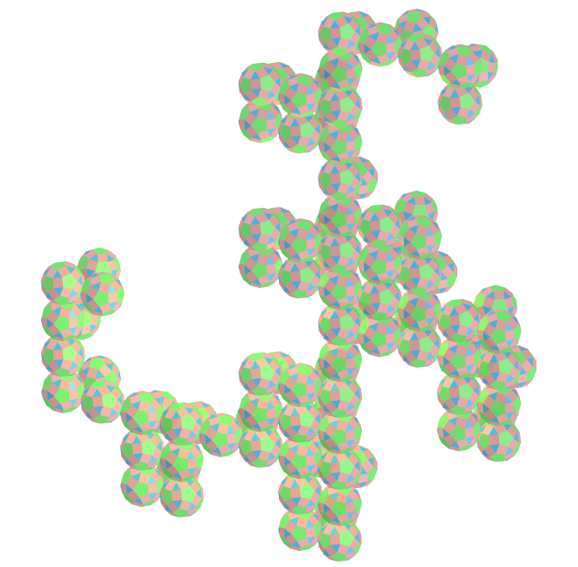
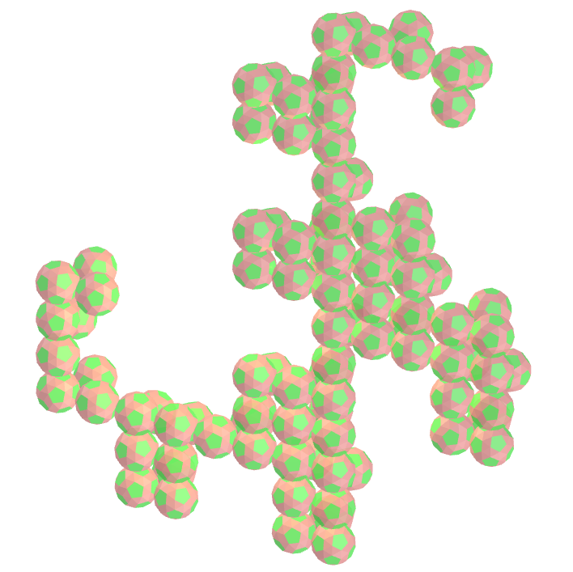
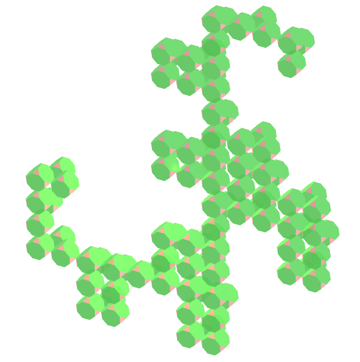

<link rel="stylesheet" href="../scripts/style.css">
<meta charset="utf-8">
<link rel="icon" type="image/png" href="vr/salas/imagens/icone.png">
<h2>Visualization of Polyhedra with Virtual Reality (VR) in A-frame</h2>
 <b>author:</b> Paulo Henrique Siqueira - Universidade Federal do Paraná
  <b>contact:</b> <a href="#">paulohscwb@gmail.com</a>
  <a href="https://paulohscwb.github.io/polyhedra3/dragon-archimedes/pt-br/">versão em português</a>
 <form style="margin: 0 auto; float:right; text-align:right; width:100%; margin-bottom:15px;">
	<select id="url" onchange="urlHandler(this.value)" style="color:royalblue;">
		<option disabled selected value>More solids:</option>
		<option value="../catalangems/">Catalan gems</option>
		<option disabled value="../dragon-archimedes/">Archimedes Dragon Fractals</option>
		<option value="../kites/">Star kites</option>
		<!--<option value="../fractal-catalan/">Catalan fractals</option>
		<option value="../deltahedra/">Deltahedra</option>
		<option value="../unicorn-platonic/">Plato's Unicorn Fractals</option>
		<option value="../dragon-catalan/">Catalan Dragon Fractals</option>
		<option value="../fractalnonconvex1/">Fractals of non-convex polyhedra</option>
		<option value="../truncated-archimedes/">Truncated Archimedean polyhedra</option>
		<option value="../unicorn-catalan/">Catalan Unicorn Fractals</option>
		<option value="../dragon-nonconvex/">Dragon fractals of non-convex polyhedra</option>
		<option value="../fractalnonconvex2/">Fractals of non-convex polyhedra 2</option>
		<option value="../unicorn-archimedes/">Archimedes Unicorn Fractals</option>
		<option value="../fractalnonconvex3/">Fractals of non-convex polyhedra 3</option>
		<option value="../truncated-catalan/">Truncated Catalan polyhedra</option>
		<option value="../unicorn-nonconvex1/">Unicorn fractals of non-convex polyhedra</option>
		<option value="../dragon-nonconvex2/">Dragon fractals of non-convex polyhedra 2</option>
		<option value="../unicorn-nonconvex2/">Unicorn fractals of non-convex polyhedra 2</option>
		<option value="../fractalnonconvex4/">Fractals of non-convex polyhedra 4</option>
		<option value="../dragon-nonconvex3/">Dragon fractals of non-convex polyhedra 3</option>
		<option value="../fractalnonconvex5/">Fractals of non-convex polyhedra 5</option>
		<option value="../unicorn-nonconvex3/">Unicorn fractals of non-convex polyhedra 3</option>
		<option value="../fractalnonconvex6/">Fractals of non-convex polyhedra 6</option>-->
	</select>
</form>

  <h2 align="center"> Archimedes Dragon Fractals</h2>
The dragon curve belongs to the family of self-similar fractal curves, which can be approximated by recursive methods. The dragon curve is probably most commonly thought of as the shape that is generated from a strip of paper repeatedly folded in half.
 This work shows Archimedean polyhedra forming dragon fractals, modeled for visualization in Virtual Reality.

<a href="#m3d">3D Models</a>&nbsp;&nbsp;|&nbsp;&nbsp;<a href="../">Home</a>

 

 

<h3 id="m3d" align="center">3D models</h3>
<iframe width="560" height="315" style="max-width:100%" src="https://www.youtube.com/embed/videoseries?list=PLy0I_lGW8HxU7g9x5hkKKNULwWAdRiCHW" title="YouTube video player" frameborder="0" allow="accelerometer; autoplay; clipboard-write; encrypted-media; gyroscope; picture-in-picture; web-share" allowfullscreen></iframe>
<h4>1. Icosidodecahedron</h4>

  Applying the construction principle of the dragon curve with the icosidodecahedron, we obtain a icosidodecahedron dragon fractal. In the first order of construction of the fractal, we construct two new icosidodecahedron corresponding to one original polyhedron. In this example, we have solid representations in orders from 0 to 10. 
  

<h4>2. Rhombicuboctahedron</h4>

  Rhombicuboctahedron dragon fractal.
  

<h4>3. Cuboctahedron</h4>

  Cuboctahedron dragon fractal.
  

<h4>4. Rhombicosidodecahedron</h4>

  Rhombicosidodecahedron dragon fractal.
  

<h4>5. Truncated dodecahedron</h4>

  Truncated dodecahedron dragon fractal.
  

<h4>6. Truncated tetrahedron</h4>

  Truncated tetrahedron dragon fractal.
  

<h4>7. Truncated icosahedron</h4>

  Truncated icosahedron dragon fractal.
  

<a href="#p1" class="topo">back to top</a>

<h4>8. Truncated icosidodecahedron</h4>

  Truncated icosidodecahedron dragon fractal.
  

<h4>9. Snub dodecahedron</h4>

  Snub dodecahedron dragon fractal. 
  

<h4>10. Truncated octahedron</h4>

  Truncated octahedron dragon fractal.
  

<h4>11. Truncated cube</h4>

  Truncated cube dragon fractal.
  

<h4>12. Truncated cuboctahedron</h4>

  Truncated cuboctahedron dragon fractal.
  

<h4>13. Snub cube</h4>

  Snub cube dragon fractal.
  

<a href="#p1" class="topo">back to top</a>

  Archimedes dragon fractals: polyhedra and visualization with Virtual Reality by <a xmlns:cc="http://creativecommons.org/ns#" href="https://paulohscwb.github.io/polyhedra3/dragon-archimedes/" property="cc:attributionName" rel="cc:attributionURL">Paulo Henrique Siqueira</a> is licensed with a license <a rel="license" href="http://creativecommons.org/licenses/by-nc-nd/4.0/">Creative Commons Attribution-NonCommercial-NoDerivatives 4.0 International</a>.

<h4>How to cite this work:</h4> 

Siqueira, P.H., "Archimedes dragon fractals: polyhedra and visualization with Virtual Reality". Available in: <https://paulohscwb.github.io/polyhedra3/dragon-archimedes/>, March 2025.

<!---->
  <b>References:</b>
 Weisstein, Eric W. "Archimedean Solid" From MathWorld-A Wolfram Web Resource. <a href="http://mathworld.wolfram.com/ArchimedeanSolid.html" target="_blank">http://mathworld.wolfram.com/ArchimedeanSolid.html</a>
 McCooey, D. I. "Visual Polyhedra". <a href="http://dmccooey.com/polyhedra/" target="_blank">http://dmccooey.com/polyhedra/</a>
