<link rel="stylesheet" href="../../scripts/style.css">
<meta charset="utf-8">
<link rel="icon" type="image/png" href="../vr/salas/imagens/icone.png">
<h2>Visualização de Poliedros com Realidade Virtual (RV) em A-frame</h2>
<b>autor:</b> Paulo Henrique Siqueira - Universidade Federal do Paraná
 <b>contato:</b> <a href="#"> paulohscwb@gmail.com </a>
 <a href="https://paulohscwb.github.io/polyhedra3/dragon-nonconvex/">english version</a>
<form style="margin: 0 auto; float:right; text-align:right; width:100%; margin-bottom:15px;">
	<select id="url" onchange="urlHandler(this.value)" style="color:royalblue;">
		<option disabled selected>Mais sólidos:</option>
		<option value="../../catalangems/pt-br/">Gemas de Catalan</option>
		<option value="../../dragon-archimedes/pt-br/">Fractais do dragão de Arquimedes e Catalan</option>
		<option value="../../kites/pt-br/">Estrelas com pipas</option>
		<option value="../../araucaria/pt-br/">Araucárias com poliedros</option>
		<option disabled value="../../dragon-nonconvex/pt-br/">Fractais de dragão de poliedros não convexos</option>
		<!--<option value="../../fractal-catalan/pt-br/">Fractais de Catalan</option>
		<option value="../../deltahedra/pt-br/">Deltaedros</option>
		<option value="../../unicorn-platonic/pt-br/">Fractais do unicórnio de Platão</option>
		<option value="../../dragon-catalan/pt-br/">Fractais do dragão de Catalan</option>
		<option value="../../fractalnonconvex1/pt-br/">Fractais de poliedros não convexos</option>
		<option value="../../truncated-archimedes/pt-br/">Poliedros Arquimedianos truncados</option>
		<option value="../../unicorn-catalan/pt-br/">Fractais do unicórnio de Catalan</option>
		<option value="../../fractalnonconvex2/pt-br/">Fractais de poliedros não convexos 2</option>
		<option value="../../unicorn-archimedes/pt-br/">Fractais do unicórnio de Arquimedes</option>
		<option value="../../fractalnonconvex3/pt-br/">Fractais de poliedros não convexos 3</option>
		<option value="../../truncated-catalan/pt-br/">Poliedros de Catalan truncados</option>
		<option value="../../unicorn-nonconvex1/pt-br/">Fractais do unicórnio de poliedros não convexos</option>
		<option value="../../dragon-nonconvex2/pt-br/">Fractais de dragão de poliedros não convexos 2</option>
		<option value="../../unicorn-nonconvex2/pt-br/">Fractais do unicórnio de poliedros não convexos 2</option>
		<option value="../../fractalnonconvex4/pt-br/">Fractais de poliedros não convexos 4</option>
		<option value="../../dragon-nonconvex3/pt-br/">Fractais de dragão de poliedros não convexos 3</option>
		<option value="../../fractalnonconvex5/pt-br/">Fractais de poliedros não convexos 5</option>
		<option value="../../unicorn-nonconvex3/pt-br/">Fractais do unicórnio de poliedros não convexos 3</option>
		<option value="../../fractalnonconvex6/pt-br/">Fractais de poliedros não convexos 6</option>-->
	</select>
</form>

  <h2 align="center"> Fractais do dragão de poliedros não convexos</h2>
  A curva de dragão pertence à família de curvas fractais autosimilares, que podem ser aproximadas por métodos recursivos. A curva de dragão é provavelmente mais comumente pensada como a forma que é gerada a partir de uma tira de papel dobrada repetidamente ao meio.
 Este trabalho mostra os poliedros não convexos formando fractais de dragão, modelados para visualização em Realidade Virtual.
 
<a href="#m3d">Modelos 3D</a>&nbsp;&nbsp;|&nbsp;&nbsp;<a href="../../pt-br/">Página Inicial</a>

  

 

<h3 id="m3d" align="center">Modelos 3D</h3>
<!--<iframe width="560" height="315" style="max-width:100%" src="https://www.youtube.com/embed/videoseries?list=PLy0I_lGW8HxWGmFjnLlbixXP2VZLbEBW3" title="YouTube video player" frameborder="0" allow="accelerometer; autoplay; clipboard-write; encrypted-media; gyroscope; picture-in-picture; web-share" allowfullscreen></iframe>-->
<h4>1. Antitoróide octogonal de íris</h4>

  Aplicando o princípio de construção da curva do dragão com o antitoróide octogonal de íris, obtemos um fractal dragão antitoróide octogonal de íris. Na primeira ordem de construção do fractal, construímos dois novos antitoróides octogonal de íris correspondentes a um poliedro original. Neste exemplo, temos representações sólidas em ordens de 0 a 10.
  

<h4>2. Sólido de Escher</h4>
<a href="../vr/dragon2.htm" target="_blank" title="modelo 3D" class="fotoA">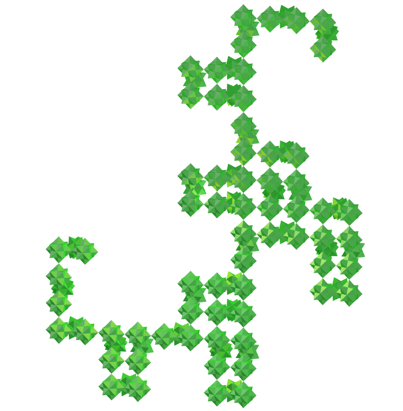</a>
  Fractal de dragão do sólido de Escher.
  

<h4>3. Grande dodecaedro disdiakis</h4>
<a href="../vr/dragon3.htm" target="_blank" title="modelo 3D" class="fotoA">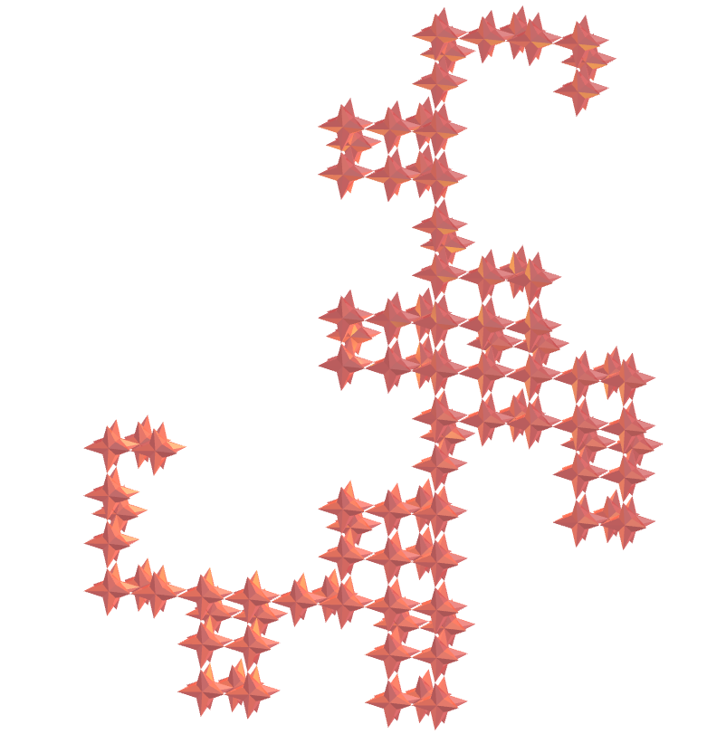</a>
  Fractal de dragão do grande dodecaedro disdiakis.
  

<h4>4. Grande dodecaedro</h4>
<a href="../vr/dragon4.htm" target="_blank" title="modelo 3D" class="fotoA">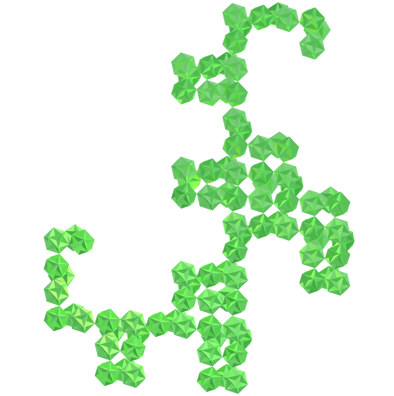</a>
  Fractal de dragão do grande dodecaedro.
  

<h4>5. Grande icosaedro</h4>

  Fractal de dragão do grande icosaedro.
  

<h4>6. Grande dodecaedro pentakis</h4>

  Fractal de dragão do grande dodecaedro pentakis.
  

<h4>7. Grande triacontaedro rômbico</h4>
<a href="../vr/dragon7.htm" target="_blank" title="modelo 3D" class="fotoA">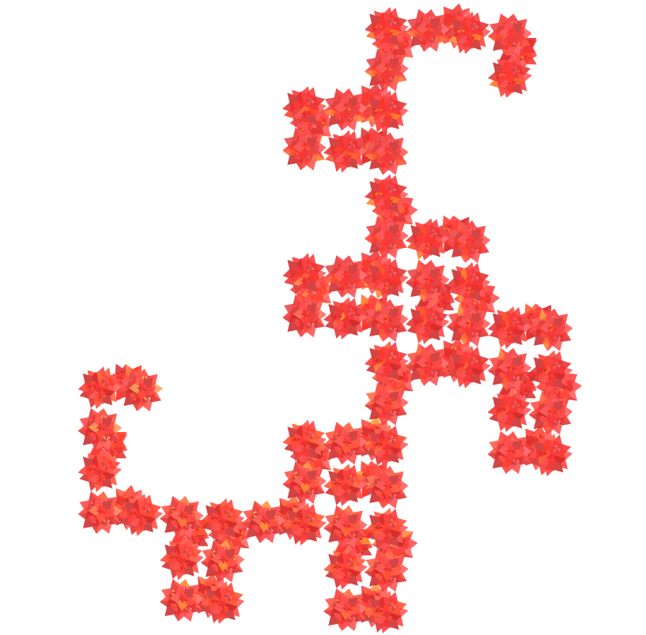</a>
  Fractal de dragão do grande triacontaedro rômbico.
  

<h4>8. Grande dodecaedro stelapentakis</h4>

  Fractal de dragão do grande dodecaedro stelapentakis.
  

<h4>9. Grande dodecaedro estrelado</h4>
<a href="../vr/dragon9.htm" target="_blank" title="modelo 3D" class="fotoA">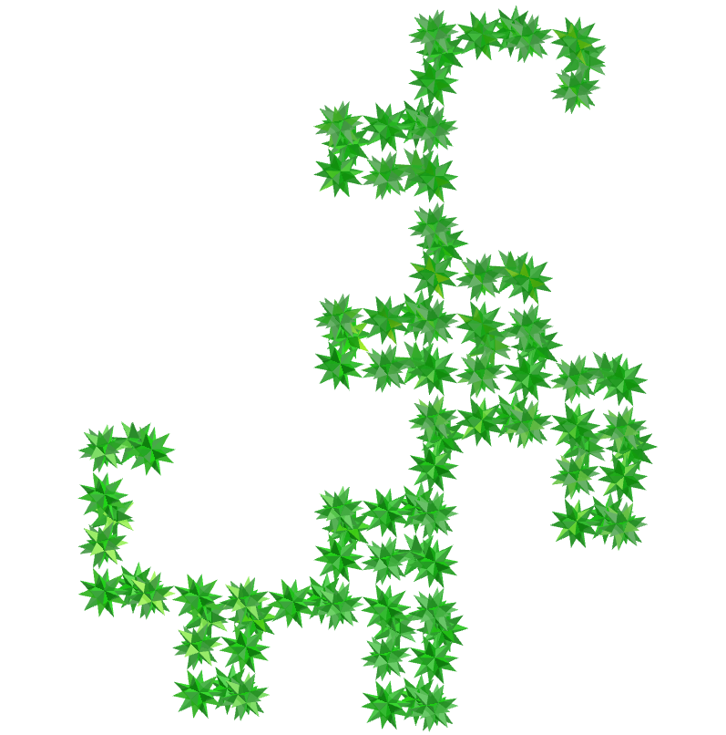</a>
  Fractal de dragão do grande dodecaedro estrelado.
  

<h4>10. Grande icosaedro triakis</h4>
<a href="../vr/dragon10.htm" target="_blank" title="modelo 3D" class="fotoA">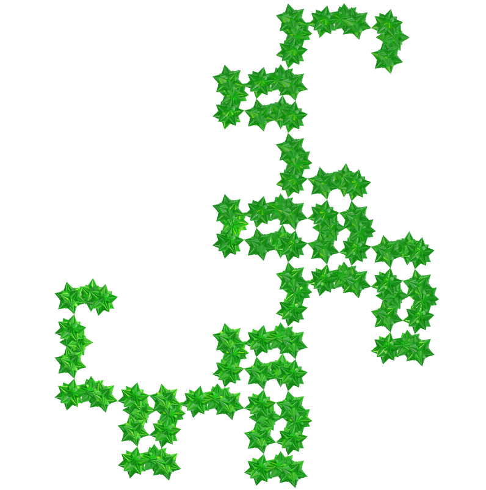</a>
  Fractal de dragão do grande icosaedro triakis.
  

<a href="#p1" class="topo">voltar ao topo</a>

<h4>11. Grande octaedro triakis</h4>

  Fractal de dragão do grande octaedro triakis.
  

<h4>12. Dipirâmide heptagrâmica</h4>

  Fractal de dragão da dipirâmide heptagrâmica.
  

<h4>13. Toroide antiprismático trapezoédrico hexagonal</h4>

  Fractal de dragão do toroide antiprismático trapezoédrico hexagonal.
  

<h4>14. Toroide trapezoédrico antiprismático hexagonal</h4>
<a href="../vr/dragon14.htm" target="_blank" title="modelo 3D" class="fotoA">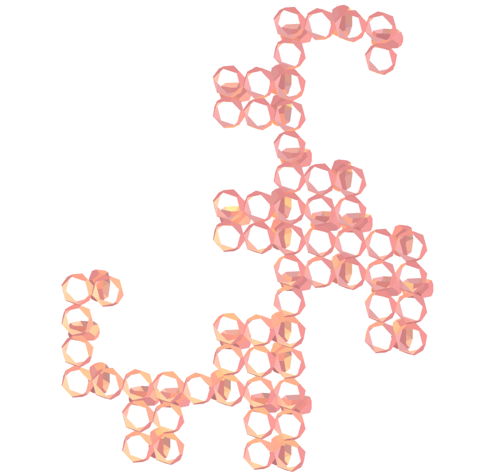</a>
  Fractal de dragão do toroide trapezoédrico antiprismático hexagonal.
  

<h4>15. Grande icosaedro truncado</h4>
<a href="../vr/dragon15.htm" target="_blank" title="modelo 3D" class="fotoA">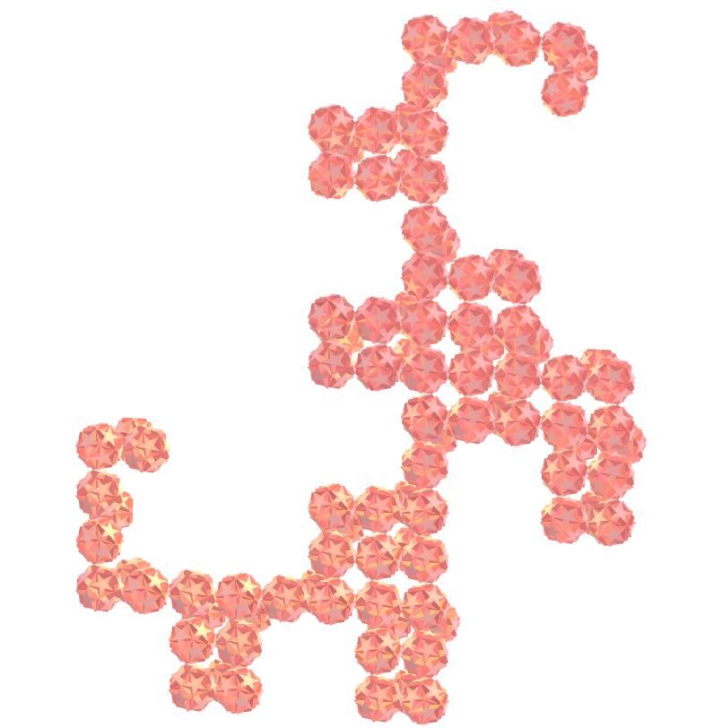</a>
  Fractal de dragão do grande icosaedro truncado.
  

<h4>16. Toroide trapezoédrico hexagonal</h4>
<a href="../vr/dragon16.htm" target="_blank" title="modelo 3D" class="fotoA">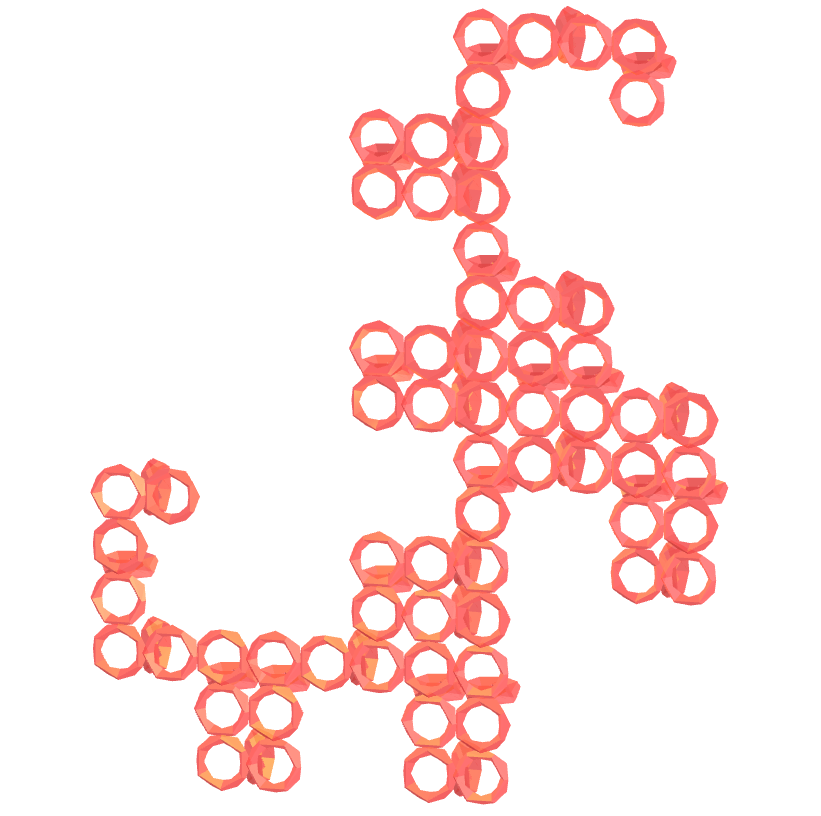</a>
  Fractal de dragão do toroide trapezoédrico hexagonal.
  

<h4>17. Icosidodecadodecaedro</h4>
<a href="../vr/dragon17.htm" target="_blank" title="modelo 3D" class="fotoA">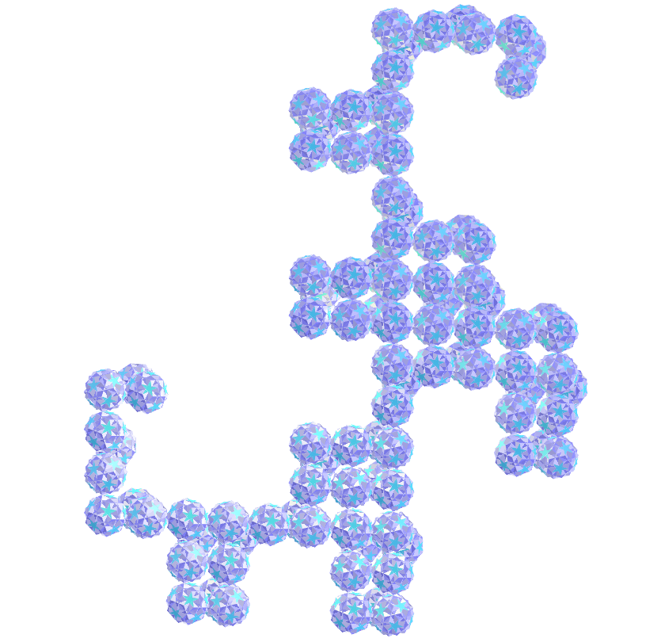</a>
  Fractal de dragão do icosidodecadodecaedro.
  

<h4>18. Hexecontaedro pentagonal medial invertido</h4>
<a href="../vr/dragon18.htm" target="_blank" title="modelo 3D" class="fotoA">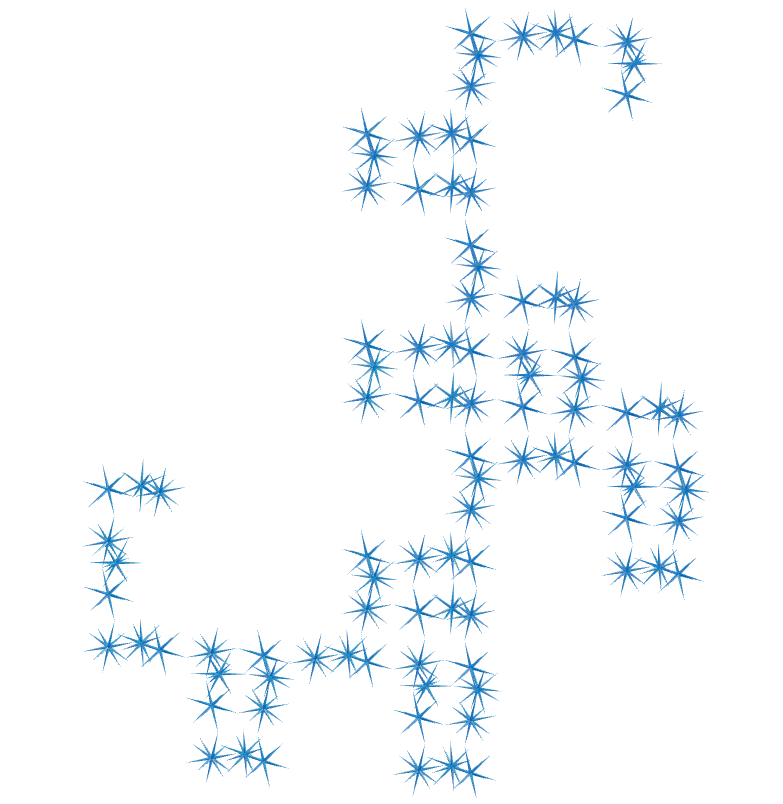</a>
  Fractal de dragão do hexecontaedro pentagonal medial invertido.
  

<h4>19. Triacontaedro rômbico medial</h4>
<a href="../vr/dragon19.htm" target="_blank" title="modelo 3D" class="fotoA">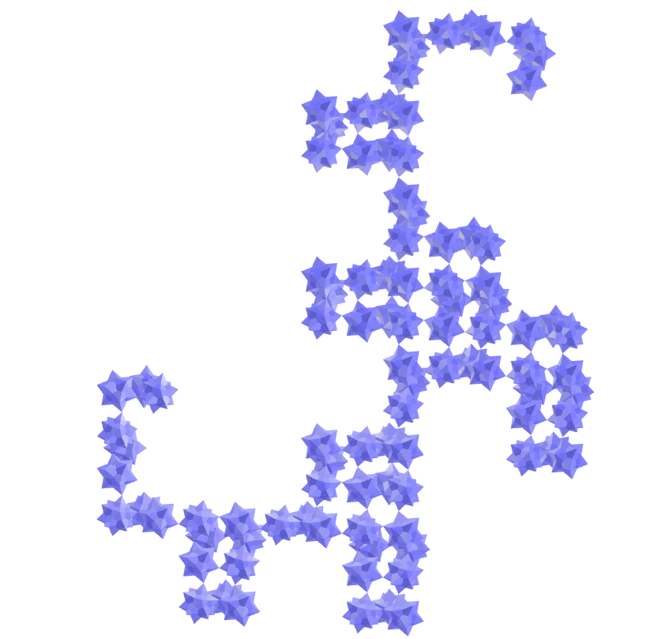</a>
  Fractal de dragão do triacontaedro rômbico medial.
  

<h4>20. Icosaedro triâmbico medial</h4>

  Fractal de dragão do icosaedro triâmbico medial.
  

<a href="#p1" class="topo">voltar ao topo</a>

<h4>21. Pequeno dodecaedro estrelado</h4>
<a href="../vr/dragon21.htm" target="_blank" title="modelo 3D" class="fotoA">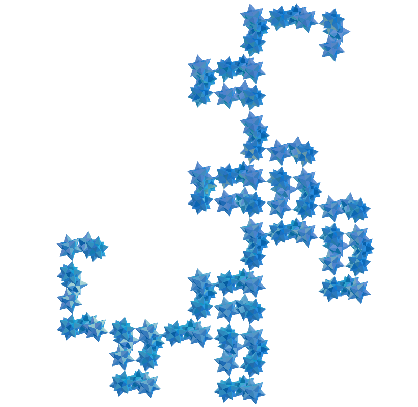</a>
  Fractal de dragão do pequeno dodecaedro estrelado.
  

<h4>22. Toroide tetragonal regular</h4>

  Fractal de dragão do toroide tetragonal regular.
  

<h4>23. Rombicosacro</h4>

  Fractal de dragão do rombicosacro.
  

<h4>24. Rombicosaedro</h4>
<a href="../vr/dragon24.htm" target="_blank" title="modelo 3D" class="fotoA">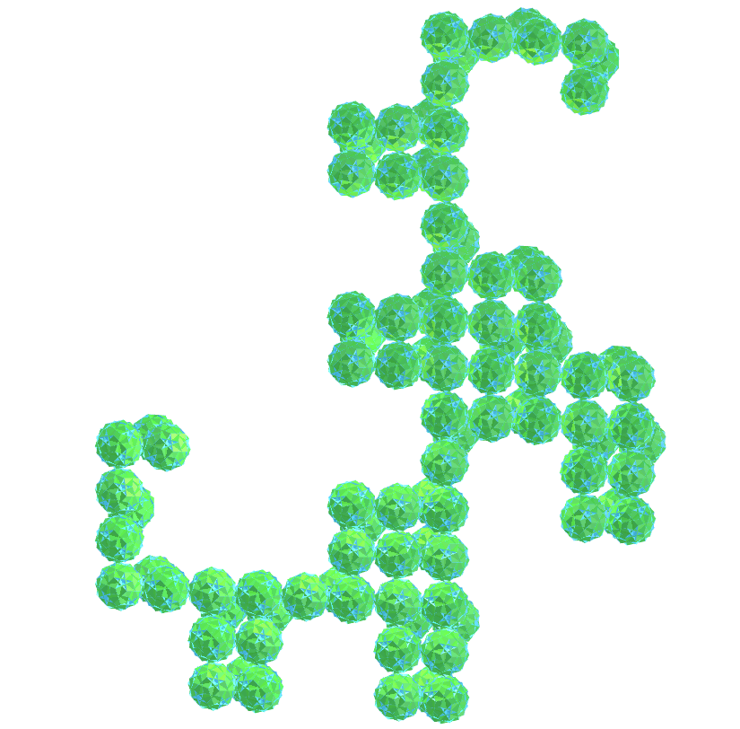</a>
  Fractal de dragão do rombicosaedro.
  

<h4>25. Pequeno hexecontaedro ditrigonal dodecacrônico</h4>

  Fractal de dragão do pequeno hexecontaedro ditrigonal dodecacrônico.
  

<h4>26. Pequeno icositetraedro hexacrônico</h4>
<a href="../vr/dragon26.htm" target="_blank" title="modelo 3D" class="fotoA">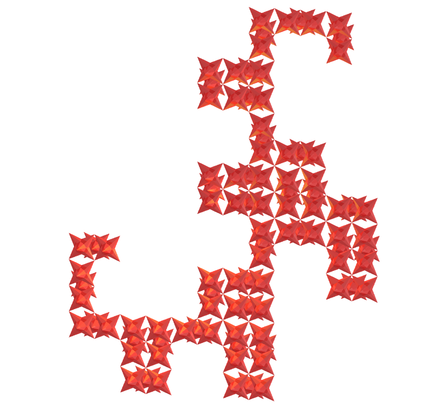</a>
  Fractal de dragão do pequeno icositetraedro hexacrônico.
  

<h4>27. Pequeno rombidodecacrono</h4>

  Fractal de dragão do pequeno rombidodecacrono.
  

<h4>28. Cuboctaedro cubitruncado</h4>
<a href="../vr/dragon28.htm" target="_blank" title="modelo 3D" class="fotoA">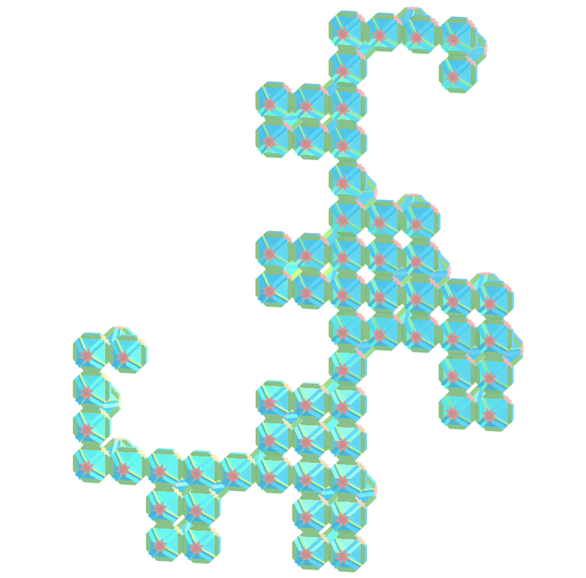</a>
  Fractal de dragão do cuboctaedro cubitruncado.
  

<h4>29. Grande cubicuboctaedro</h4>
<a href="../vr/dragon29.htm" target="_blank" title="modelo 3D" class="fotoA">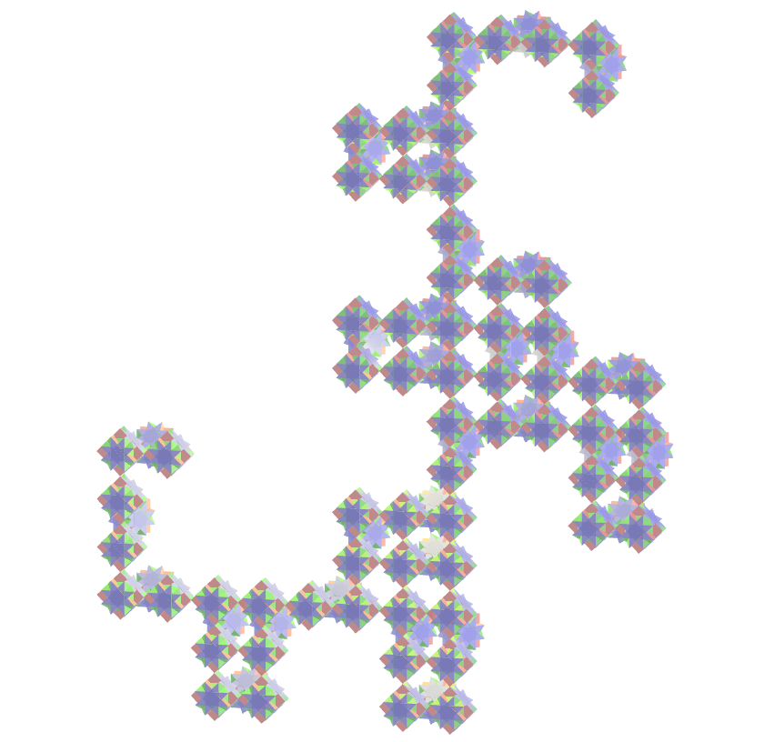</a>
  Fractal de dragão do grande cubicuboctaedro.
  

<h4>30. Grande dirombicosidodecacro</h4>
<a href="../vr/dragon30.htm" target="_blank" title="modelo 3D" class="fotoA">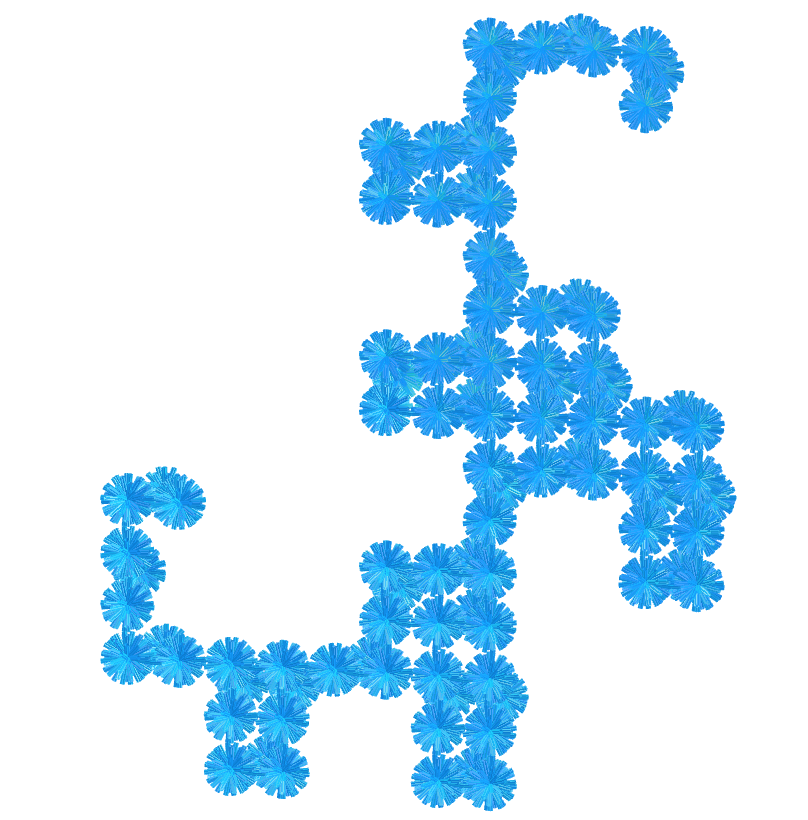</a>
  Fractal de dragão do grande dirombicosidodecacro.
  

<a href="#p1" class="topo">voltar ao topo</a>

<h4>31. Grande dodecahemidodecacro</h4>

  Fractal de dragão do grande dodecahemidodecacro.
  

<h4>32. Grande dodecicosacro</h4>
<a href="../vr/dragon32.htm" target="_blank" title="modelo 3D" class="fotoA">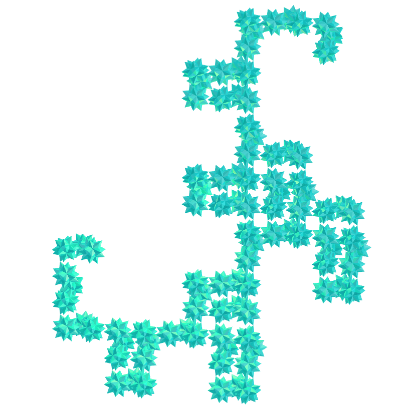</a>
  Fractal de dragão do grande dodecicosacro.
  

<h4>33. Grande rombihexaedro</h4>
<a href="../vr/dragon33.htm" target="_blank" title="modelo 3D" class="fotoA">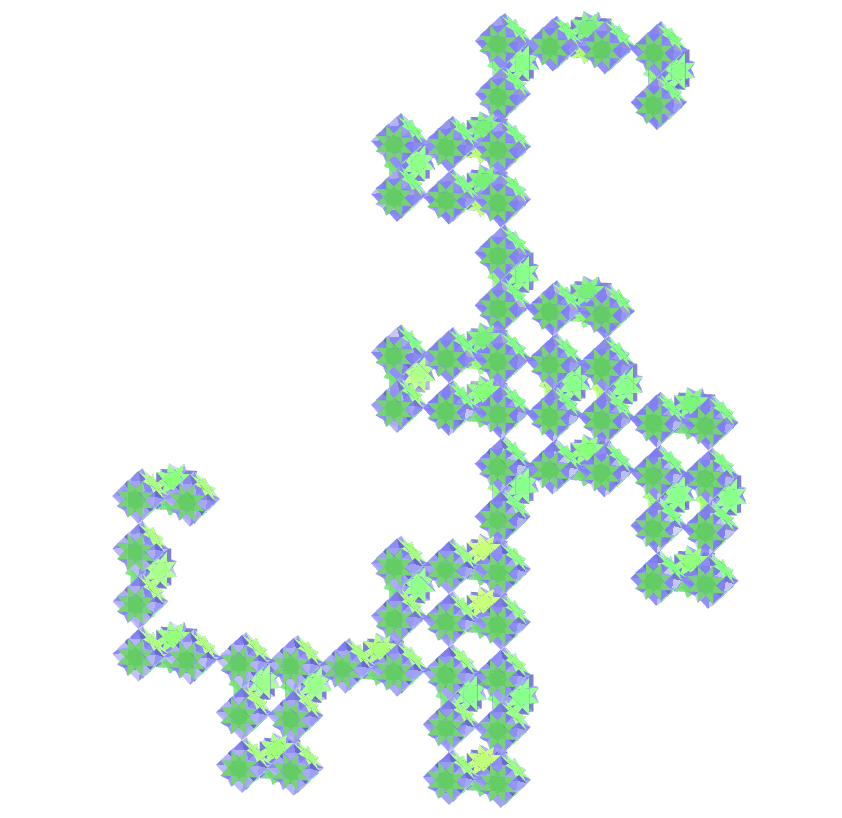</a>
  Fractal de dragão do grande rombihexaedro.
  

<h4>34. Grande cuboctaedro truncado</h4>
<a href="../vr/dragon34.htm" target="_blank" title="modelo 3D" class="fotoA">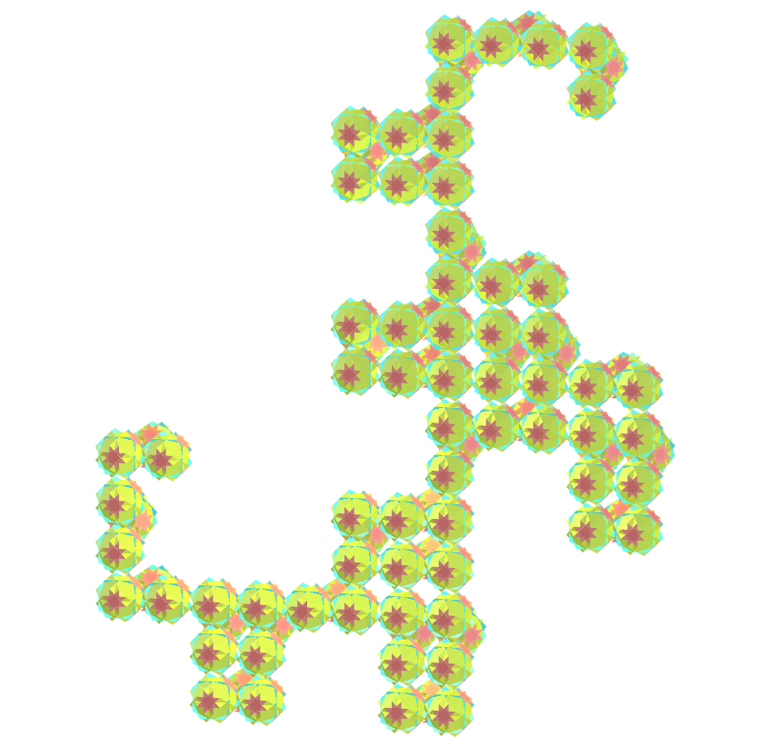</a>
  Fractal de dragão do grande cuboctaedro truncado.
  

<h4>35. Icosaedro ortogonal de Jessen</h4>

  Fractal de dragão do icosaedro ortogonal de Jessen.
  

<h4>36. Toroide tetragonal hexagonal estrelado</h4>
<a href="../vr/dragon36.htm" target="_blank" title="modelo 3D" class="fotoA">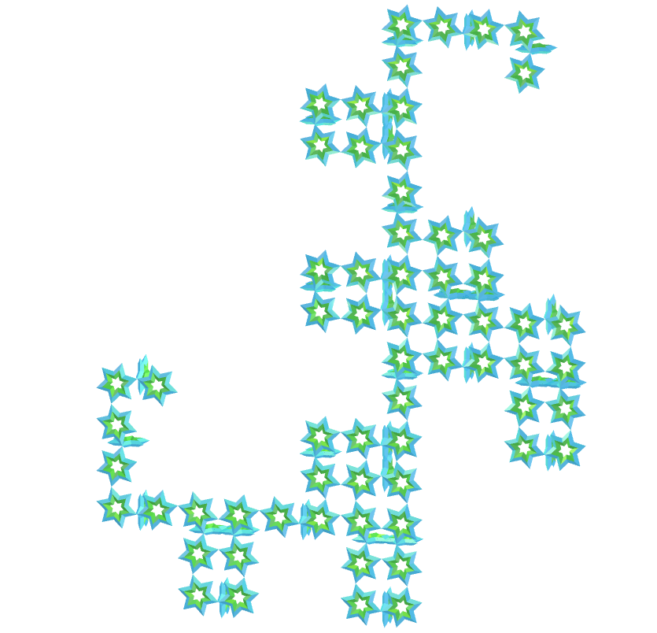</a>
  Fractal de dragão do toroide tetragonal hexagonal estrelado.
  

<h4>37. Toroide tetragonal octogonal estrelado</h4>

  Fractal de dragão do toroide tetragonal octogonal estrelado.
  

<h4>38. Toroide tetragonal decagonal estrelado</h4>
<a href="../vr/dragon38.htm" target="_blank" title="modelo 3D" class="fotoA">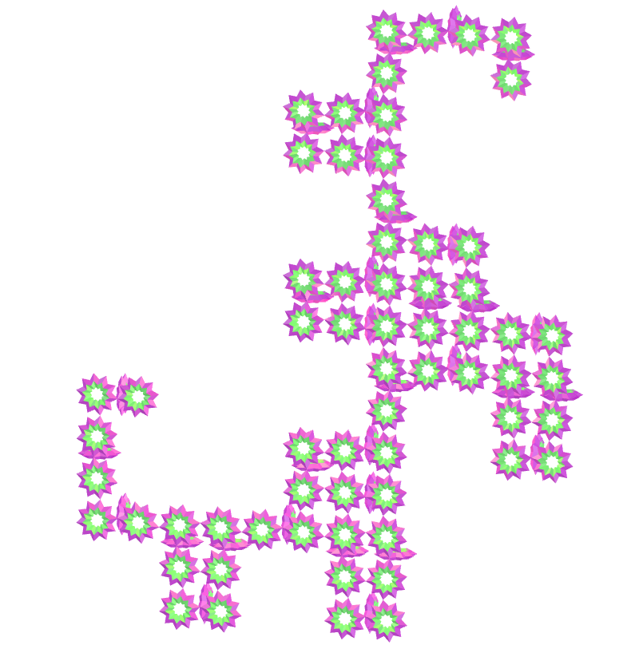</a>
  Fractal de dragão do toroide tetragonal decagonal estrelado.
  

<h4>39. Toroide tetragonal eneagonal estrelado</h4>
<a href="../vr/dragon39.htm" target="_blank" title="modelo 3D" class="fotoA">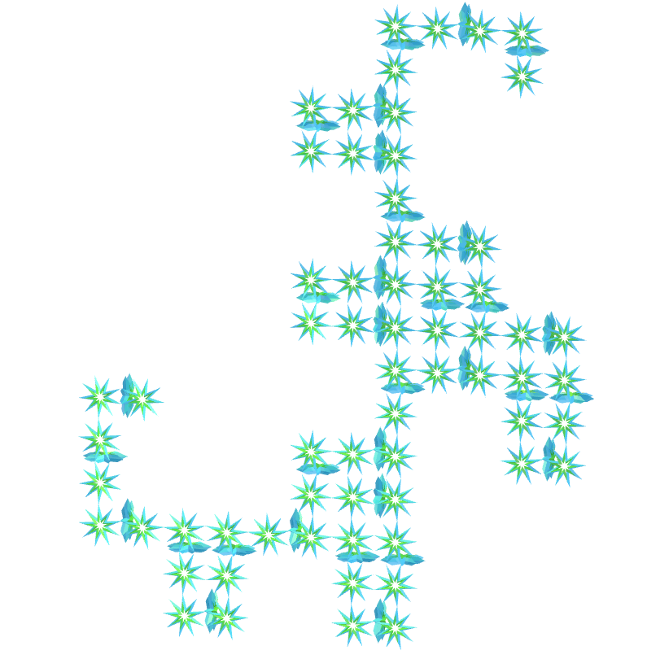</a>
  Fractal de dragão do toroide tetragonal eneagonal estrelado.
  

<h4>40. Toroide tetragonal heptagonal estrelado</h4>

  Fractal de dragão do toroide tetragonal heptagonal estrelado.
  

<a href="#p1" class="topo">voltar ao topo</a>

<h4>41. Toroide tetragonal regular</h4>
<a href="../vr/dragon41.htm" target="_blank" title="modelo 3D" class="fotoA">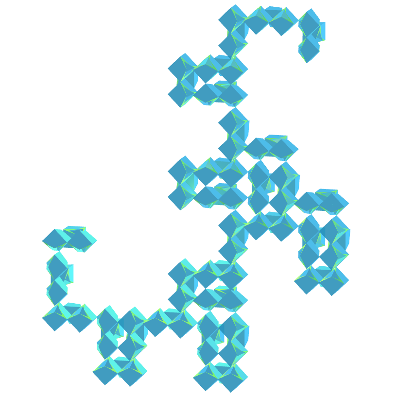</a>
  Fractal de dragão do toroide tetragonal regular.
  

<h4>42. Toroide hexagonal</h4>

  Fractal de dragão do toroide hexagonal.
  

<h4>43. Toroide hexagonal</h4>
<a href="../vr/dragon43.htm" target="_blank" title="modelo 3D" class="fotoA">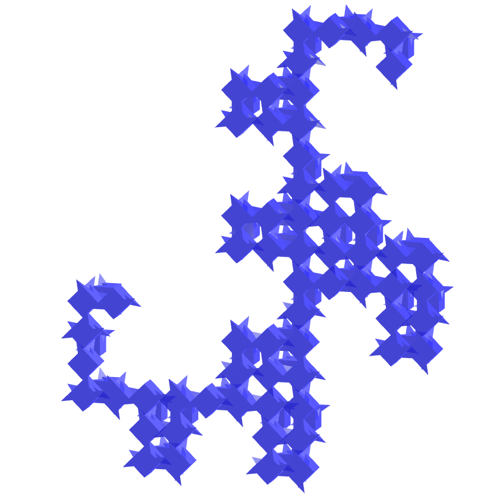</a>
  Fractal de dragão do toroide hexagonal.
  

<h4>44. Toroide hexagonal</h4>

  Fractal de dragão do toroide hexagonal.
  

<h4>45. Toroide hexagonal</h4>
<a href="../vr/dragon45.htm" target="_blank" title="modelo 3D" class="fotoA">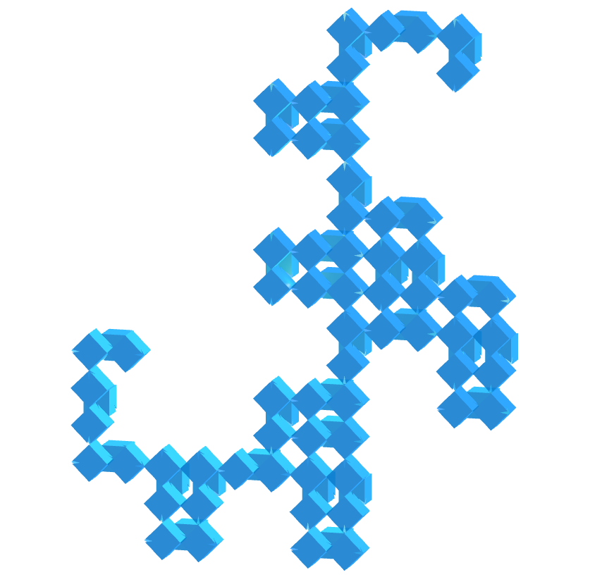</a>
  Fractal de dragão do toroide hexagonal.
  

<h4>46. Toroide hexagonal</h4>

  Fractal de dragão do toroide hexagonal.
  

<h4>47. Toroide hexagonal</h4>

  Fractal de dragão do toroide hexagonal.
  

<h4>48. Toroide hexagonal</h4>
<a href="../vr/dragon48.htm" target="_blank" title="modelo 3D" class="fotoA">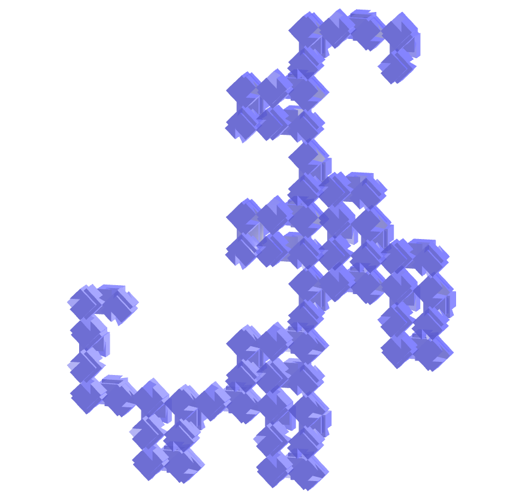</a>
  Fractal de dragão do toroide hexagonal.
  

<h4>49. Toroide hexagonal</h4>
<a href="../vr/dragon49.htm" target="_blank" title="modelo 3D" class="fotoA">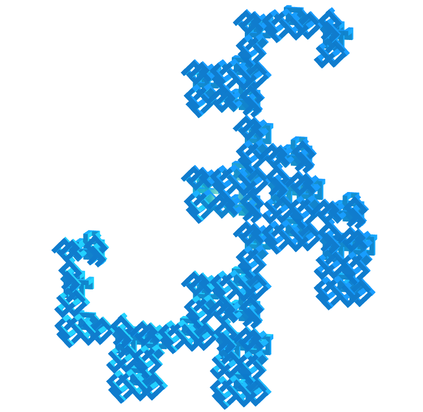</a>
  Fractal de dragão do toroide hexagonal.
  

<a href="#p1" class="topo">voltar ao topo</a>

  Dragon fractals of non-convex polyhedra: visualization with Virtual Reality de <a xmlns:cc="http://creativecommons.org/ns#" href="https://paulohscwb.github.io/polyhedra3/dragon-nonconvex/pt-br/" property="cc:attributionName" rel="cc:attributionURL">Paulo Henrique Siqueira</a> está licenciado com uma Licença <a rel="license" href="http://creativecommons.org/licenses/by-nc-nd/4.0/">Creative Commons Atribuição-NãoComercial-SemDerivações 4.0 Internacional</a>.

<h4>Como citar este trabalho:</h4> 

Siqueira, P.H., "Dragon fractals of non-convex polyhedra: visualization with Virtual Reality". Disponível em: <https://paulohscwb.github.io/polyhedra3/dragon-nonconvex/pt-br/>, Novembro de 2025.

<!---->
  <b>Referências:</b>
 Weisstein, Eric W. "Archimedean Solid" From MathWorld-A Wolfram Web Resource. <a href="http://mathworld.wolfram.com/ArchimedeanSolid.html" target="_blank">http://mathworld.wolfram.com/ArchimedeanSolid.html</a>
 McCooey, D. I. "Visual Polyhedra". <a href="http://dmccooey.com/polyhedra/" target="_blank">http://dmccooey.com/polyhedra/</a>
