<link rel="stylesheet" href="../../scripts/style.css">
<meta charset="utf-8">
<link rel="icon" type="image/png" href="../vr/salas/imagens/icone.png">
<h2>Visualização de Poliedros com Realidade Virtual (RV) em A-frame</h2>
<b>autor:</b> Paulo Henrique Siqueira - Universidade Federal do Paraná
 <b>contato:</b> <a href="#"> paulohscwb@gmail.com </a>
 <a href="https://paulohscwb.github.io/polyhedra3/fractal-catalan/">english version</a>
<form style="margin: 0 auto; float:right; text-align:right; width:100%; margin-bottom:15px;">
	<select id="url" onchange="urlHandler(this.value)" style="color:royalblue;">
		<option disabled selected>Mais sólidos:</option>
		<option value="../../catalangems/pt-br/">Gemas de Catalan</option>
		<option value="../../dragon-archimedes/pt-br/">Fractais do dragão de Arquimedes e Catalan</option>
		<option value="../../kites/pt-br/">Estrelas com pipas</option>
		<option value="../../araucaria/pt-br/">Araucárias com poliedros</option>
		<option value="../../dragon-nonconvex/pt-br/">Fractais de dragão de poliedros não convexos</option>
		<option disabled value="../../fractal-catalan/pt-br/">Fractais de Catalan</option>
		<!--<option value="../../deltahedra/pt-br/">Deltaedros</option>
		<option value="../../unicorn-platonic/pt-br/">Fractais do unicórnio de Platão</option>
		<option value="../../dragon-catalan/pt-br/">Fractais do dragão de Catalan</option>
		<option value="../../fractalnonconvex1/pt-br/">Fractais de poliedros não convexos</option>
		<option value="../../truncated-archimedes/pt-br/">Poliedros Arquimedianos truncados</option>
		<option value="../../unicorn-catalan/pt-br/">Fractais do unicórnio de Catalan</option>
		<option value="../../fractalnonconvex2/pt-br/">Fractais de poliedros não convexos 2</option>
		<option value="../../unicorn-archimedes/pt-br/">Fractais do unicórnio de Arquimedes</option>
		<option value="../../fractalnonconvex3/pt-br/">Fractais de poliedros não convexos 3</option>
		<option value="../../truncated-catalan/pt-br/">Poliedros de Catalan truncados</option>
		<option value="../../unicorn-nonconvex1/pt-br/">Fractais do unicórnio de poliedros não convexos</option>
		<option value="../../dragon-nonconvex2/pt-br/">Fractais de dragão de poliedros não convexos 2</option>
		<option value="../../unicorn-nonconvex2/pt-br/">Fractais do unicórnio de poliedros não convexos 2</option>
		<option value="../../fractalnonconvex4/pt-br/">Fractais de poliedros não convexos 4</option>
		<option value="../../dragon-nonconvex3/pt-br/">Fractais de dragão de poliedros não convexos 3</option>
		<option value="../../fractalnonconvex5/pt-br/">Fractais de poliedros não convexos 5</option>
		<option value="../../unicorn-nonconvex3/pt-br/">Fractais do unicórnio de poliedros não convexos 3</option>
		<option value="../../fractalnonconvex6/pt-br/">Fractais de poliedros não convexos 6</option>-->
	</select>
</form>

  <h2 align="center">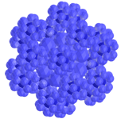 Fractais de Catalan</h2>
  Utilizando o mesmo princípio da construção do triângulo de Sierpinski ou da curva de Koch, podemos construir fractais de outros polígonos regulares. Quando estes polígonos formam um poliedro, temos a construção de um poliedro fractal.
 Este trabalho mostra fractais de poliedros de Catalan e de alguns Arquimedeanos, modelados para visualização em Realidade Virtual.
 
<a href="#m3d">Modelos 3D</a>&nbsp;&nbsp;|&nbsp;&nbsp;<a href="../../pt-br/">Página Inicial</a>

  

 

<h3 id="m3d" align="center">Modelos 3D</h3>
<!--<iframe width="560" height="315" style="max-width:100%" src="https://www.youtube.com/embed/videoseries?list=PLy0I_lGW8HxWGmFjnLlbixXP2VZLbEBW3" title="YouTube video player" frameborder="0" allow="accelerometer; autoplay; clipboard-write; encrypted-media; gyroscope; picture-in-picture; web-share" allowfullscreen></iframe>-->
<h4>1. Hexecontaedro deltoidal</h4>
<a href="../vr/DeltoidalHexecontahedron.htm" target="_blank" title="modelo 3D" class="fotoA">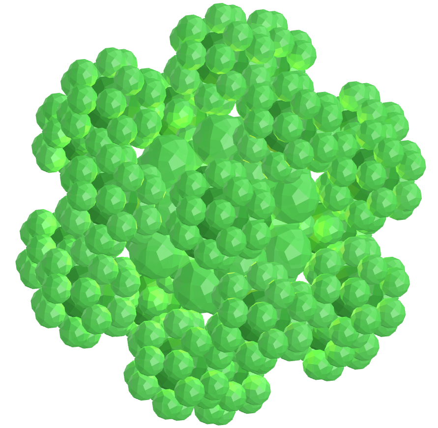</a>
  Aplicando-se o princípio de construção da curva de Koch nas faces do hexecontaedro deltoidal, obtemos um fractal do hexecontaedro deltoidal. Na primeira ordem de construção do fractal, construímos um novo sólido em 20 vértices do poliedro original. Neste exemplo, temos as representações do sólido nas ordens 0, 1, 2 e 3.
 
<table>
	<tr>
		<th>ordem</th>
		<th>poliedros</th>
		<th>faces</th>
		<th>arestas</th>
		<th>vértices</th>
	</tr>
	<tr>
		<td>0</td>
		<td>1</td>
		<td>60</td>
		<td>120</td>
		<td>62</td>
	</tr>
	<tr>
		<td>1</td>
		<td>21</td>
		<td>1260</td>
		<td>2520</td>
		<td>1302</td>
	</tr>
	<tr>
		<td>2</td>
		<td>441</td>
		<td>26460</td>
		<td>52920</td>
		<td>27342</td>
	</tr>
	<tr>
		<td>3</td>
		<td>9261</td>
		<td>555660</td>
		<td>1111320</td>
		<td>574182</td>
	</tr>
 </table>

  

<h4>2. Icositetraedro deltoidal</h4>
<a href="../vr/DeltoidalIcositetrahedron.htm" target="_blank" title="modelo 3D" class="fotoA">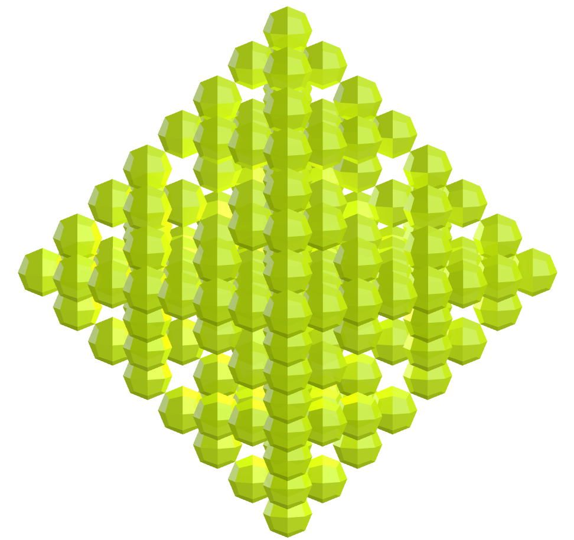</a>
  Aplicando-se o princípio de construção de Sierpinski nas faces do icositetraedro deltoidal, obtemos um fractal do icositetraedro deltoidal. Na primeira ordem de construção do fractal, construímos um novo sólido em 6 vértices do poliedro original. Neste exemplo, temos as representações do sólido nas ordens 0, 1, 2, 3 e 4.
 
<table>
	<tr>
		<th>ordem</th>
		<th>poliedros</th>
		<th>faces</th>
		<th>arestas</th>
		<th>vértices</th>
	</tr>
	<tr>
		<td>0</td>
		<td>1</td>
		<td>24</td>
		<td>48</td>
		<td>26</td>
	</tr>
	<tr>
		<td>1</td>
		<td>6</td>
		<td>144</td>
		<td>288</td>
		<td>156</td>
	</tr>
	<tr>
		<td>2</td>
		<td>36</td>
		<td>864</td>
		<td>1728</td>
		<td>936</td>
	</tr>
	<tr>
		<td>3</td>
		<td>216</td>
		<td>5184</td>
		<td>10368</td>
		<td>5616</td>
	</tr>
	<tr>
		<td>4</td>
		<td>1296</td>
		<td>31104</td>
		<td>62208</td>
		<td>33696</td>
	</tr>
 </table>

  

<h4>3. Dodecaedro disdiakis</h4>
<a href="../vr/DisdyakisDodecahedron.htm" target="_blank" title="modelo 3D" class="fotoA">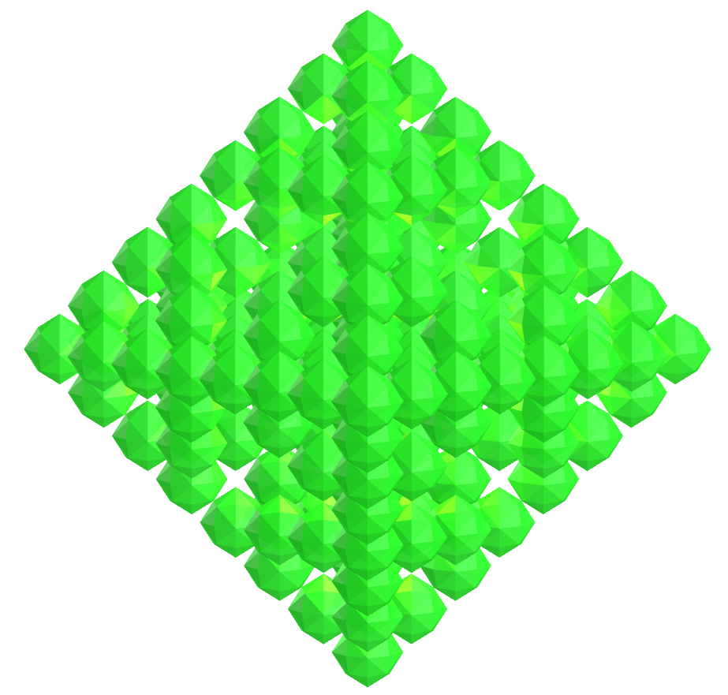</a>
  Aplicando-se o princípio de construção de Sierpinski nas faces do dodecaedro disdiakis, obtemos um fractal do dodecaedro disdiakis. Na primeira ordem de construção do fractal, construímos um novo sólido em 6 vértices do poliedro original. Neste exemplo, temos as representações do sólido nas ordens 0, 1, 2, 3 e 4.
 
<table>
	<tr>
		<th>ordem</th>
		<th>poliedros</th>
		<th>faces</th>
		<th>arestas</th>
		<th>vértices</th>
	</tr>
	<tr>
		<td>0</td>
		<td>1</td>
		<td>48</td>
		<td>72</td>
		<td>26</td>
	</tr>
	<tr>
		<td>1</td>
		<td>6</td>
		<td>288</td>
		<td>432</td>
		<td>156</td>
	</tr>
	<tr>
		<td>2</td>
		<td>36</td>
		<td>1728</td>
		<td>2592</td>
		<td>936</td>
	</tr>
	<tr>
		<td>3</td>
		<td>216</td>
		<td>10368</td>
		<td>15552</td>
		<td>5616</td>
	</tr>
	<tr>
		<td>4</td>
		<td>1296</td>
		<td>62208</td>
		<td>93312</td>
		<td>33696</td>
	</tr>
 </table>

  

<h4>4. Triacontaedro disdiakis</h4>
<a href="../vr/DisdyakisTriacontahedron.htm" target="_blank" title="modelo 3D" class="fotoA">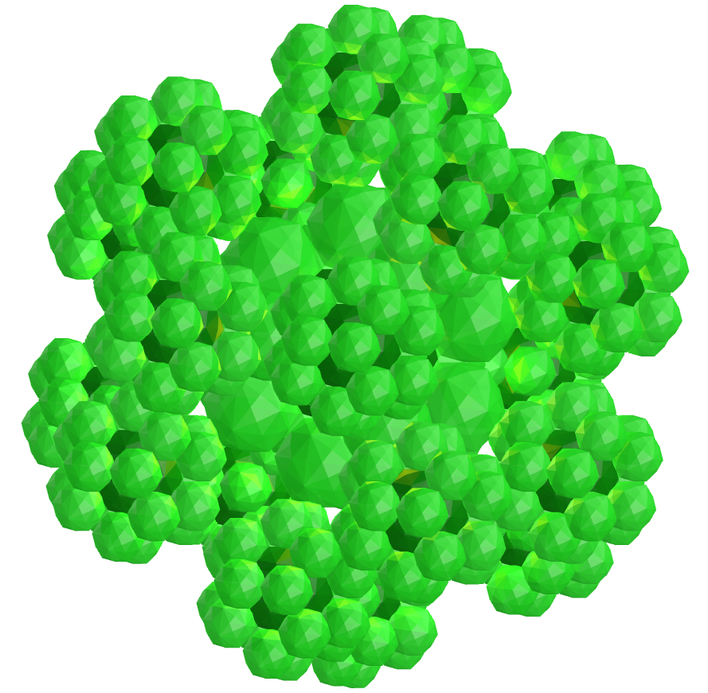</a>
  Aplicando-se o princípio de construção da curva de Koch nas faces do triacontaedro disdiakis, obtemos um fractal do triacontaedro disdiakis. Na primeira ordem de construção do fractal, construímos um novo sólido em 20 vértices do poliedro original. Neste exemplo, temos as representações do sólido nas ordens 0, 1, 2 e 3.
 
<table>
	<tr>
		<th>ordem</th>
		<th>poliedros</th>
		<th>faces</th>
		<th>arestas</th>
		<th>vértices</th>
	</tr>
	<tr>
		<td>0</td>
		<td>1</td>
		<td>120</td>
		<td>180</td>
		<td>62</td>
	</tr>
	<tr>
		<td>1</td>
		<td>21</td>
		<td>2520</td>
		<td>3780</td>
		<td>1302</td>
	</tr>
	<tr>
		<td>2</td>
		<td>441</td>
		<td>52920</td>
		<td>79380</td>
		<td>27342</td>
	</tr>
	<tr>
		<td>3</td>
		<td>9261</td>
		<td>1111320</td>
		<td>1666980</td>
		<td>574182</td>
	</tr>
 </table>

  

<h4>5. Hexecontaedro pentagonal</h4>
<a href="../vr/PentagonalHexecontahedron.htm" target="_blank" title="modelo 3D" class="fotoA">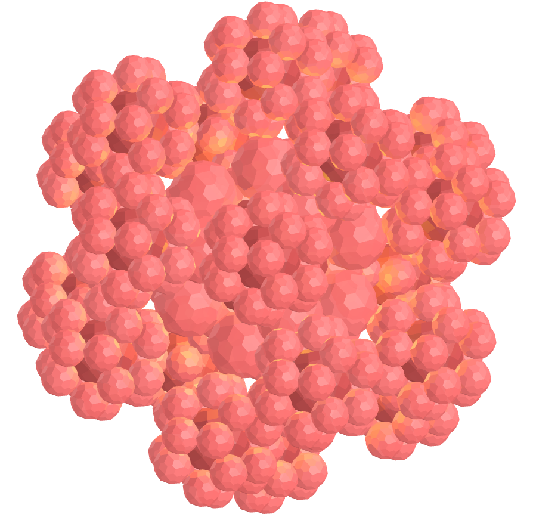</a>
  Aplicando-se o princípio de construção da curva de Koch nas faces do hexecontaedro pentagonal, obtemos um fractal do hexecontaedro pentagonal. Na primeira ordem de construção do fractal, construímos um novo sólido em 20 vértices do poliedro original. Neste exemplo, temos as representações do sólido nas ordens 0, 1, 2 e 3.
 
<table>
	<tr>
		<th>ordem</th>
		<th>poliedros</th>
		<th>faces</th>
		<th>arestas</th>
		<th>vértices</th>
	</tr>
	<tr>
		<td>0</td>
		<td>1</td>
		<td>60</td>
		<td>150</td>
		<td>92</td>
	</tr>
	<tr>
		<td>1</td>
		<td>21</td>
		<td>1260</td>
		<td>3150</td>
		<td>1932</td>
	</tr>
	<tr>
		<td>2</td>
		<td>441</td>
		<td>26460</td>
		<td>66150</td>
		<td>40572</td>
	</tr>
	<tr>
		<td>3</td>
		<td>9261</td>
		<td>555660</td>
		<td>1389150</td>
		<td>852012</td>
	</tr>
 </table>

  

<h4>6. Icositetraedro pentagonal</h4>
<a href="../vr/PentagonalIcositetrahedron.htm" target="_blank" title="modelo 3D" class="fotoA">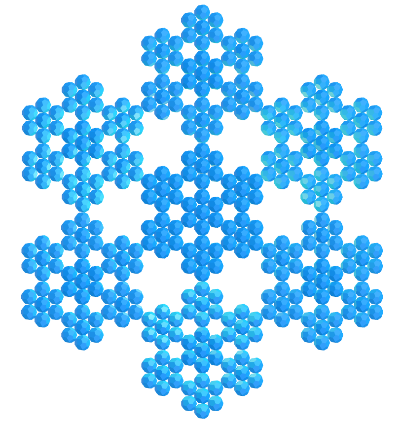</a>
  Aplicando-se o princípio de construção da curva de Koch nas faces do icositetraedro pentagonal, obtemos um fractal do icositetraedro pentagonal. Na primeira ordem de construção do fractal, construímos um novo sólido em 8 vértices do poliedro original. Neste exemplo, temos as representações do sólido nas ordens 0, 1, 2 e 3.
 
<table>
	<tr>
		<th>ordem</th>
		<th>poliedros</th>
		<th>faces</th>
		<th>arestas</th>
		<th>vértices</th>
	</tr>
	<tr>
		<td>0</td>
		<td>1</td>
		<td>24</td>
		<td>60</td>
		<td>38</td>
	</tr>
	<tr>
		<td>1</td>
		<td>8</td>
		<td>192</td>
		<td>480</td>
		<td>304</td>
	</tr>
	<tr>
		<td>2</td>
		<td>64</td>
		<td>1536</td>
		<td>3840</td>
		<td>2432</td>
	</tr>
	<tr>
		<td>3</td>
		<td>512</td>
		<td>12288</td>
		<td>30720</td>
		<td>19456</td>
	</tr>
 </table>

  

<h4>7. Dodecaedro pentakis</h4>
<a href="../vr/PentakisDodecahedron.htm" target="_blank" title="modelo 3D" class="fotoA">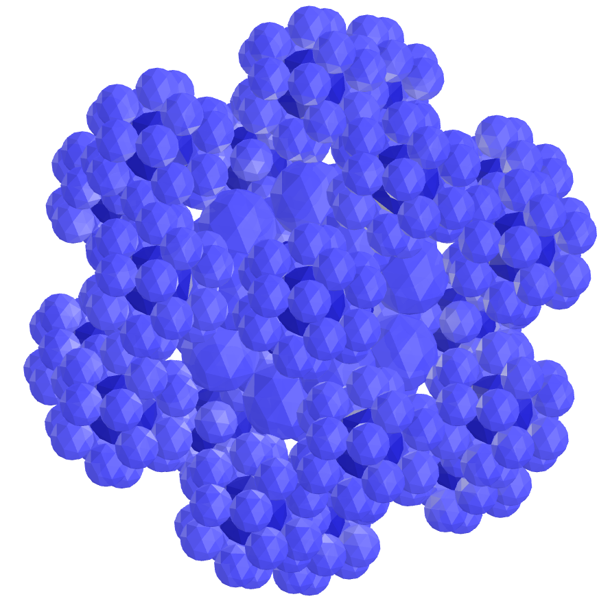</a>
  Aplicando-se o princípio de construção da curva de Koch nas faces do dodecaedro pentakis, obtemos um fractal do dodecaedro pentakis. Na primeira ordem de construção do fractal, construímos um novo sólido em 20 vértices do poliedro original. Neste exemplo, temos as representações do sólido nas ordens 0, 1, 2 e 3.
 
<table>
	<tr>
		<th>ordem</th>
		<th>poliedros</th>
		<th>faces</th>
		<th>arestas</th>
		<th>vértices</th>
	</tr>
	<tr>
		<td>0</td>
		<td>1</td>
		<td>60</td>
		<td>90</td>
		<td>32</td>
	</tr>
	<tr>
		<td>1</td>
		<td>21</td>
		<td>1260</td>
		<td>1890</td>
		<td>672</td>
	</tr>
	<tr>
		<td>2</td>
		<td>441</td>
		<td>26460</td>
		<td>39690</td>
		<td>14112</td>
	</tr>
	<tr>
		<td>3</td>
		<td>9261</td>
		<td>555660</td>
		<td>833490</td>
		<td>296352</td>
	</tr>
 </table>

  

<h4>8. Dodecaedro rômbico</h4>
<a href="../vr/RhombicDodecahedron.htm" target="_blank" title="modelo 3D" class="fotoA">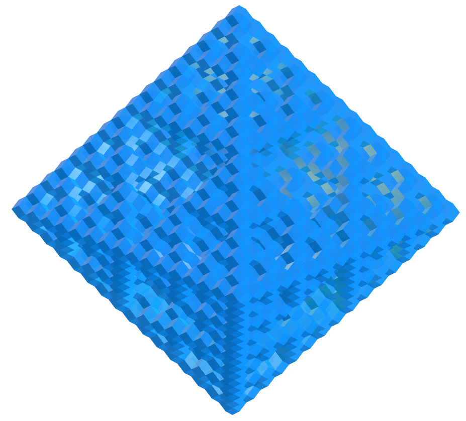</a>
  Aplicando-se o princípio de construção de Sierpinski nas faces do dodecaedro rômbico, obtemos um fractal do dodecaedro rômbico. Na primeira ordem de construção do fractal, construímos um novo sólido em 6 vértices do poliedro original. Neste exemplo, temos as representações do sólido nas ordens 0, 1, 2, 3 e 4.
 
<table>
	<tr>
		<th>ordem</th>
		<th>poliedros</th>
		<th>faces</th>
		<th>arestas</th>
		<th>vértices</th>
	</tr>
	<tr>
		<td>0</td>
		<td>1</td>
		<td>12</td>
		<td>24</td>
		<td>14</td>
	</tr>
	<tr>
		<td>1</td>
		<td>6</td>
		<td>72</td>
		<td>144</td>
		<td>84</td>
	</tr>
	<tr>
		<td>2</td>
		<td>36</td>
		<td>432</td>
		<td>864</td>
		<td>504</td>
	</tr>
	<tr>
		<td>3</td>
		<td>216</td>
		<td>2592</td>
		<td>5184</td>
		<td>3024</td>
	</tr>
	<tr>
		<td>4</td>
		<td>1296</td>
		<td>15552</td>
		<td>31104</td>
		<td>18144</td>
	</tr>
 </table>

  

<h4>9. Rombicosidodecaedro de Arquimedes</h4>
<a href="../vr/Rhombicosidodecahedron2.htm" target="_blank" title="modelo 3D" class="fotoA">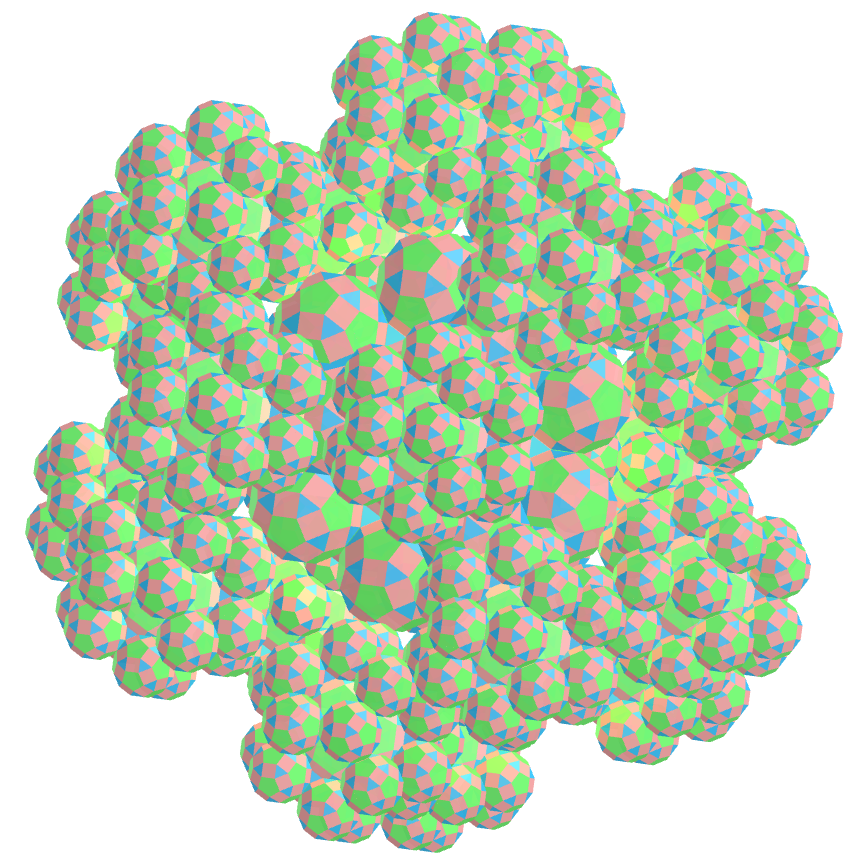</a>
  Aplicando-se o princípio de construção da curva de Koch nas faces do rombicosidodecaedro, obtemos um fractal do rombicosidodecaedro. Na primeira ordem de construção do fractal, construímos um novo sólido em 20 vértices do poliedro original. Neste exemplo, temos as representações do sólido nas ordens 0, 1, 2 e 3.
 
<table>
	<tr>
		<th>ordem</th>
		<th>poliedros</th>
		<th>faces</th>
		<th>arestas</th>
		<th>vértices</th>
	</tr>
	<tr>
		<td>0</td>
		<td>1</td>
		<td>62</td>
		<td>120</td>
		<td>60</td>
	</tr>
	<tr>
		<td>1</td>
		<td>21</td>
		<td>1302</td>
		<td>2520</td>
		<td>1260</td>
	</tr>
	<tr>
		<td>2</td>
		<td>441</td>
		<td>27342</td>
		<td>52920</td>
		<td>26460</td>
	</tr>
	<tr>
		<td>3</td>
		<td>9261</td>
		<td>574182</td>
		<td>1111320</td>
		<td>555660</td>
	</tr>
 </table>

  

<h4>10. Triacontaedro rômbico</h4>
<a href="../vr/RhombicTriacontahedron.htm" target="_blank" title="modelo 3D" class="fotoA">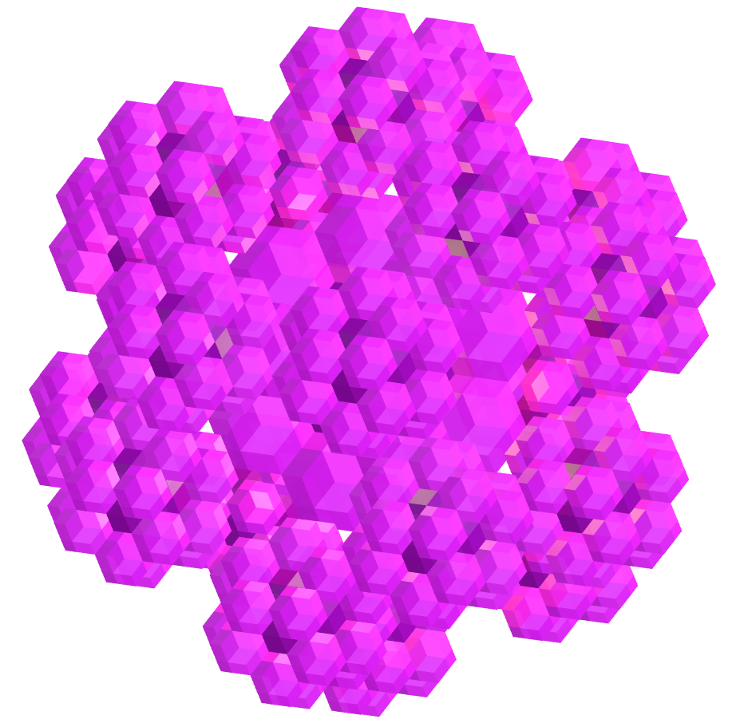</a>
  Aplicando-se o princípio de construção da curva de Koch nas faces do triacontaedro rômbico, obtemos um fractal do triacontaedro rômbico. Na primeira ordem de construção do fractal, construímos um novo sólido em 20 vértices do poliedro original. Neste exemplo, temos as representações do sólido nas ordens 0, 1, 2 e 3.
 
<table>
	<tr>
		<th>ordem</th>
		<th>poliedros</th>
		<th>faces</th>
		<th>arestas</th>
		<th>vértices</th>
	</tr>
	<tr>
		<td>0</td>
		<td>1</td>
		<td>30</td>
		<td>60</td>
		<td>32</td>
	</tr>
	<tr>
		<td>1</td>
		<td>21</td>
		<td>630</td>
		<td>1260</td>
		<td>672</td>
	</tr>
	<tr>
		<td>2</td>
		<td>441</td>
		<td>13230</td>
		<td>26460</td>
		<td>14112</td>
	</tr>
	<tr>
		<td>3</td>
		<td>9261</td>
		<td>277830</td>
		<td>555660</td>
		<td>296352</td>
	</tr>
 </table>

  

<a href="#p1" class="topo">voltar ao topo</a>

<h4>11. Dodecaedro snub de Arquimedes</h4>
<a href="../vr/SnubDodecahedron2.htm" target="_blank" title="modelo 3D" class="fotoA">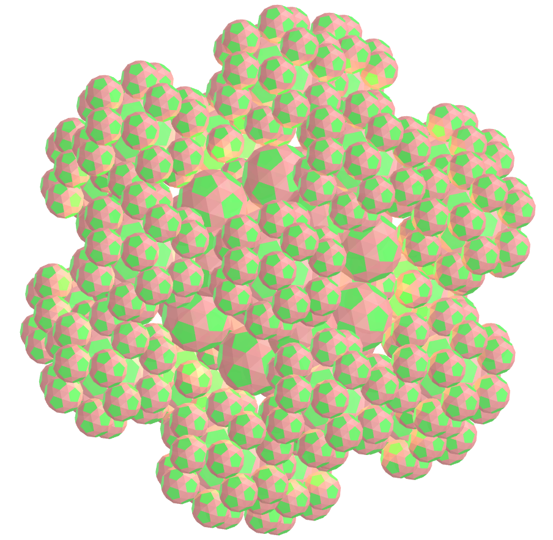</a>
  Aplicando-se o princípio de construção da curva de Koch nas faces do dodecaedro snub, obtemos um fractal do dodecaedro snub. Na primeira ordem de construção do fractal, construímos um novo sólido em 20 vértices do poliedro original. Neste exemplo, temos as representações do sólido nas ordens 0, 1, 2 e 3.
 
<table>
	<tr>
		<th>ordem</th>
		<th>poliedros</th>
		<th>faces</th>
		<th>arestas</th>
		<th>vértices</th>
	</tr>
	<tr>
		<td>0</td>
		<td>1</td>
		<td>92</td>
		<td>150</td>
		<td>60</td>
	</tr>
	<tr>
		<td>1</td>
		<td>21</td>
		<td>1932</td>
		<td>3150</td>
		<td>1260</td>
	</tr>
	<tr>
		<td>2</td>
		<td>441</td>
		<td>40572</td>
		<td>66150</td>
		<td>26460</td>
	</tr>
	<tr>
		<td>3</td>
		<td>9261</td>
		<td>852012</td>
		<td>1389150</td>
		<td>555660</td>
	</tr>
 </table>

  

<h4>12. Hexaedro tetrakis - esponja de Menger</h4>
<a href="../vr/TetrakisHexahedron.htm" target="_blank" title="modelo 3D" class="fotoA">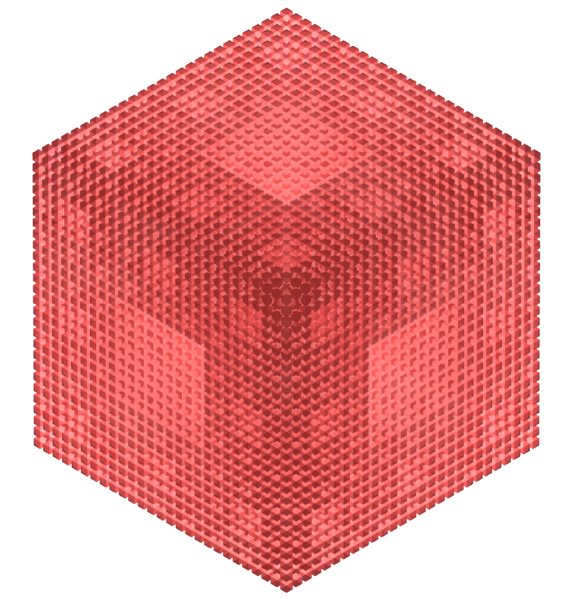</a>
  Aplicando-se o princípio de construção do tapete de Sierpinski nas faces do hexaedro tetrakis, obtemos um hexaedro tetrakis fractal. Na primeira ordem de construção do fractal, construímos 8 novos sólidos nas faces do poliedro original, todas com ⅓ da medida da aresta do hexaedro tetrakis. Neste exemplo, temos as representações do sólido nas ordens 0, 1, 2 e 3. 

<h4>13. Hexaedro tetrakis - cruz de Menger Jerusalém</h4>
<a href="../vr/TetrakisHexahedron2.htm" target="_blank" title="modelo 3D" class="fotoA">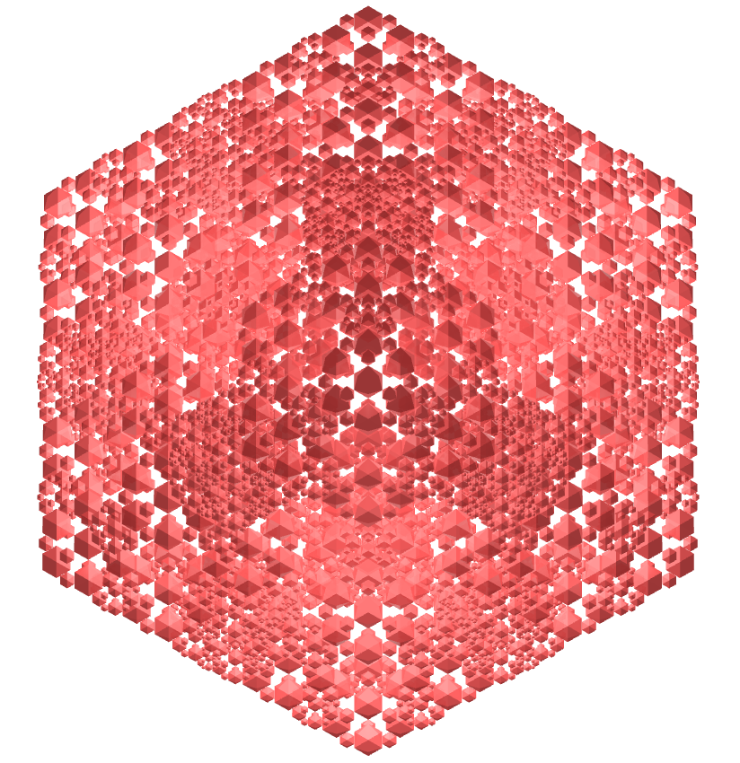</a>
  Considere um hexaedro tetrakis. Podemos aumentar os tamanhos das arestas dos hexaedros tetrakis dos cantos e diminuir os tamanhos das arestas dos hexaedros tetrakis intermediários para revelar uma cruz. Nesta versão, temos 8 hexaedros tetrakis homotéticos com proporção de ⅖ e 12 hexaedros tetrakis homotéticos com proporção de ⅕.

<h4>14. Hexaedro tetrakis - cruz de Menger Jerusalém v2</h4>
<a href="../vr/TetrakisHexahedron3.htm" target="_blank" title="modelo 3D" class="fotoA">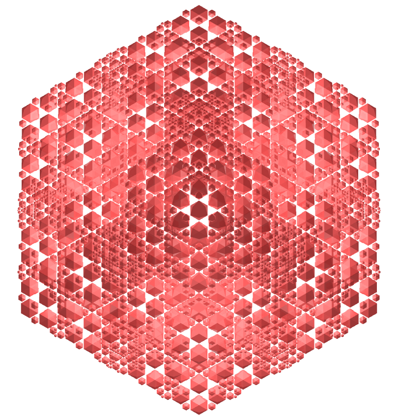</a>
  Considere um hexaedro tetrakis. Podemos aumentar os tamanhos das arestas dos hexaedros tetrakis dos cantos e diminuir os tamanhos das arestas dos hexaedros tetrakis intermediários para revelar uma cruz. Nesta versão, temos 8 hexaedros tetrakis homotéticos com proporção de √2 - 1 e 12 hexaedros tetrakis homotéticos com proporção de (√2 - 1)².  

<h4>15. Hexaedro tetrakis - floco de neve de Mosely</h4>
<a href="../vr/TetrakisHexahedron4.htm" target="_blank" title="modelo 3D" class="fotoA">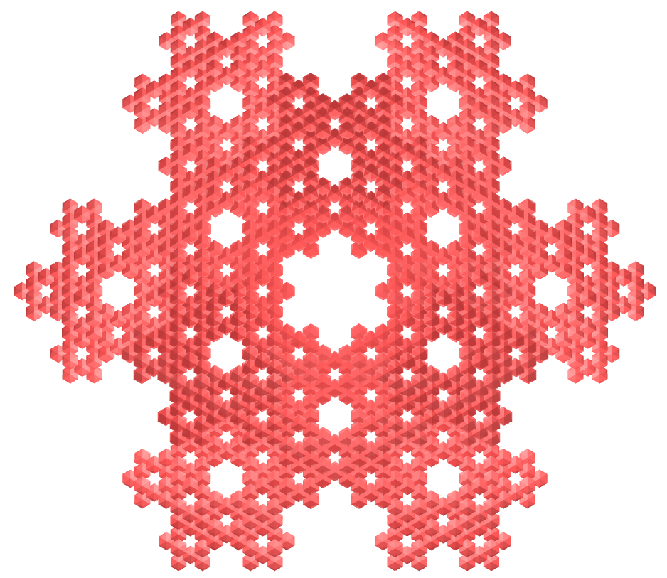</a>
  O floco de neve Mosely é um tipo de fractal Sierpinski-Menger obtido em duas variantes pela operação usada na criação do floco de neve Sierpinski-Menger. Neste caso, removemos oito hexaedros tetrakis dos cantos e o hexaedro tetrakis central em cada iteração. 

<h4>16. Árvore fractal triangular com dodecaedros pentakis</h4>
<a href="../vr/Tree0.htm" target="_blank" title="modelo 3D" class="fotoA">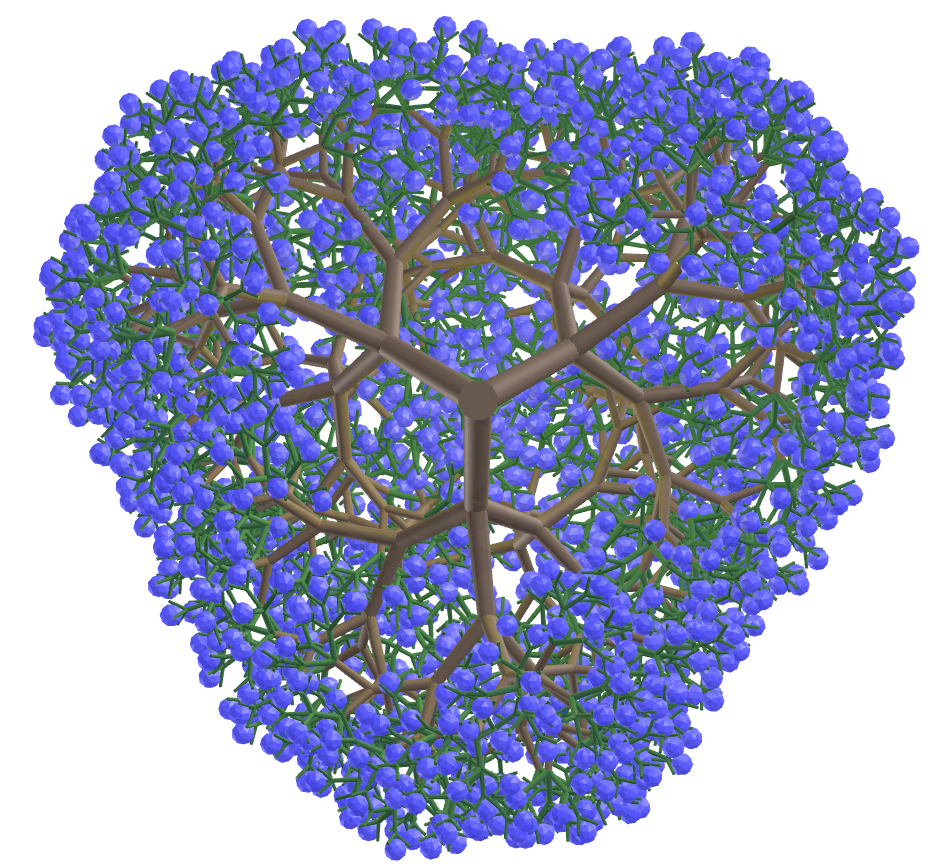</a>
  Aplicando-se o princípio de repetições com troncos de cones, obtemos uma árvore fractal. Neste exemplo, adicionamos dodecaedros pentakis como “frutos” ou “flores” da árvore. Na primeira ordem de construção do fractal, construímos três novos troncos de cone conectados com uma face do tronco de cone original. Neste exemplo, temos as representações do sólido nas ordens de 0 até 6. 
  

<h4>17. Árvore fractal pentagonal com dodecaedros pentakis</h4>
<a href="../vr/Tree0a.htm" target="_blank" title="modelo 3D" class="fotoA">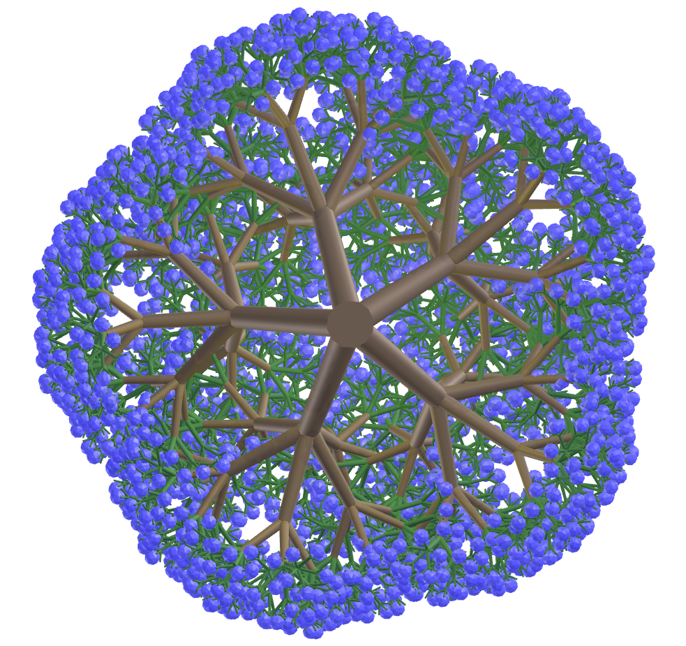</a>
  Aplicando-se o princípio de repetições com troncos de cones, obtemos uma árvore fractal. Neste exemplo, adicionamos dodecaedros pentakis como “frutos” ou “flores” da árvore. Na primeira ordem de construção do fractal, construímos três novos troncos de cone conectados com uma face do tronco de cone original. Neste exemplo, temos as representações do sólido nas ordens de 0 até 5. 
  

<h4>18. Árvore fractal triangular com triacontaedros rômbicos</h4>
<a href="../vr/Tree1.html" target="_blank" title="modelo 3D" class="fotoA">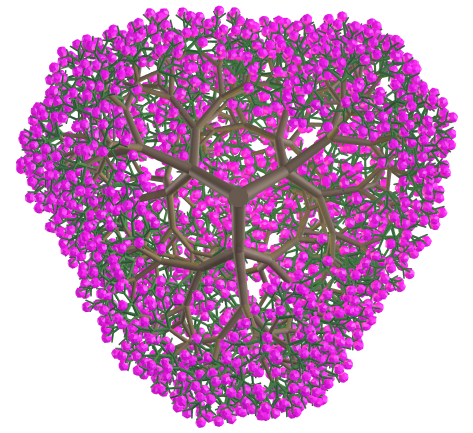</a>
  Aplicando-se o princípio de repetições com troncos de cones, obtemos uma árvore fractal. Neste exemplo, adicionamos triacontaedros rômbicos como “frutos” ou “flores” da árvore. Na primeira ordem de construção do fractal, construímos três novos troncos de cone conectados com uma face do tronco de cone original. Neste exemplo, temos as representações do sólido nas ordens de 0 até 6. 
  

<h4>19. Árvore fractal pentagonal com triacontaedros rômbicos</h4>
<a href="../vr/Tree1a.htm" target="_blank" title="modelo 3D" class="fotoA">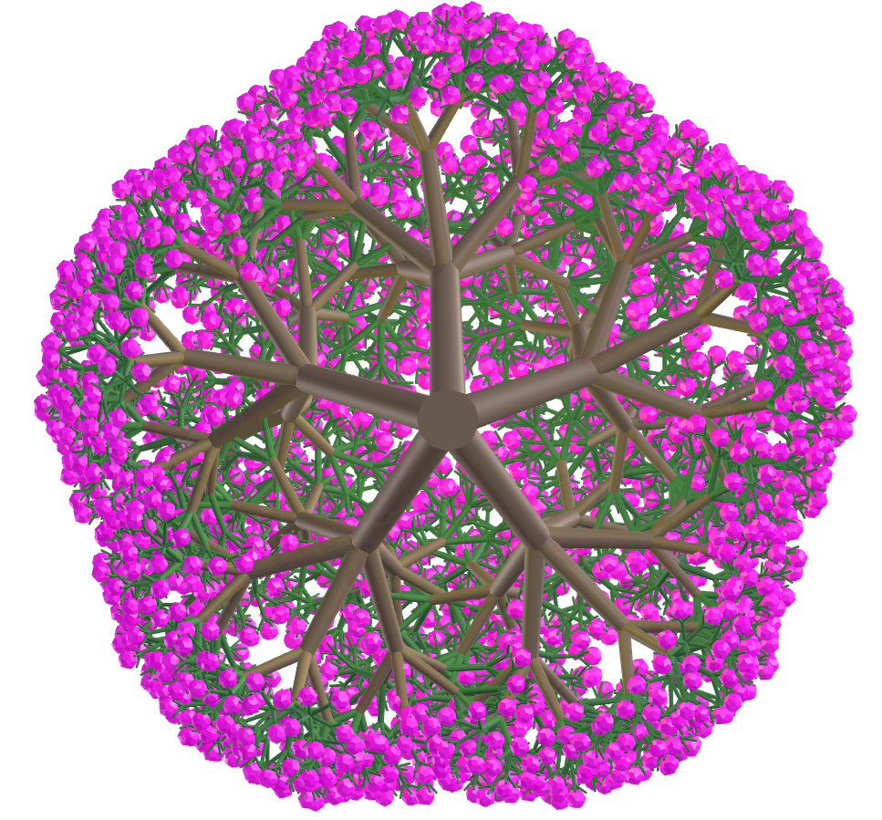</a>
  Aplicando-se o princípio de repetições com troncos de cones, obtemos uma árvore fractal. Neste exemplo, adicionamos triacontaedros rômbicos como “frutos” ou “flores” da árvore. Na primeira ordem de construção do fractal, construímos três novos troncos de cone conectados com uma face do tronco de cone original. Neste exemplo, temos as representações do sólido nas ordens de 0 até 5. 
  

<h4>20. Árvore fractal triangular com icosaedros triakis</h4>
<a href="../vr/Tree2.html" target="_blank" title="modelo 3D" class="fotoA">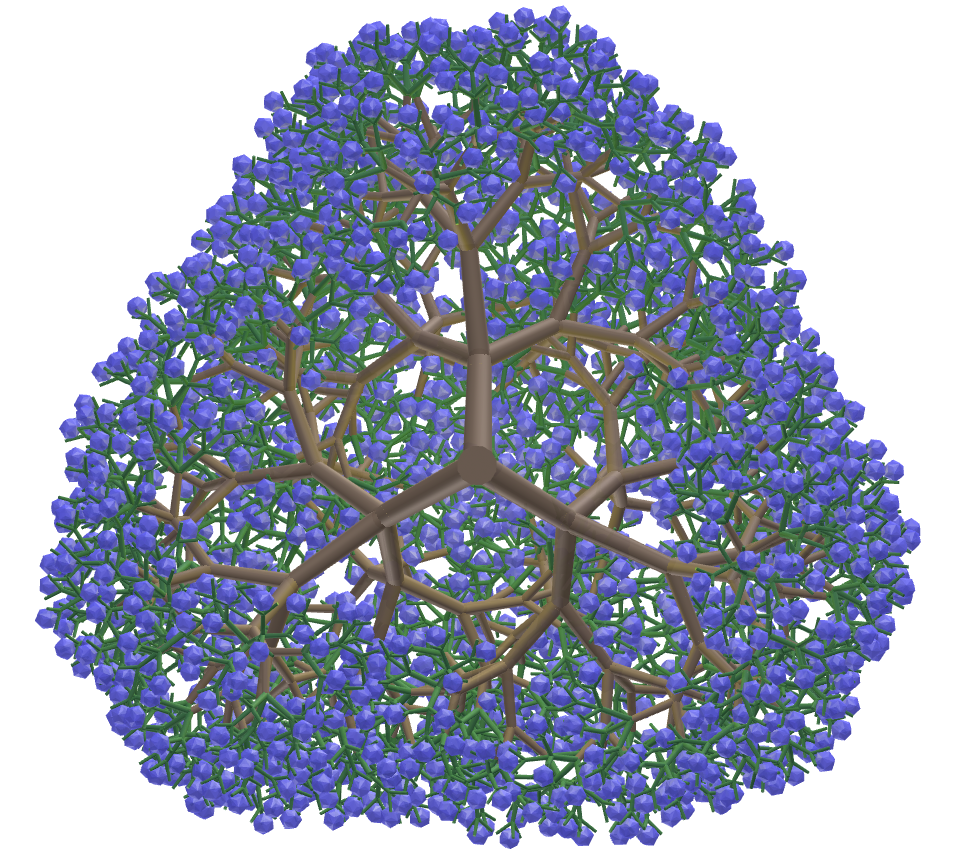</a>
  Aplicando-se o princípio de repetições com troncos de cones, obtemos uma árvore fractal. Neste exemplo, adicionamos icosaedros triakis como “frutos” ou “flores” da árvore. Na primeira ordem de construção do fractal, construímos três novos troncos de cone conectados com uma face do tronco de cone original. Neste exemplo, temos as representações do sólido nas ordens de 0 até 6. 
  

<a href="#p1" class="topo">voltar ao topo</a>

<h4>21. Árvore fractal pentagonal com icosaedros triakis</h4>
<a href="../vr/Tree2a.htm" target="_blank" title="modelo 3D" class="fotoA">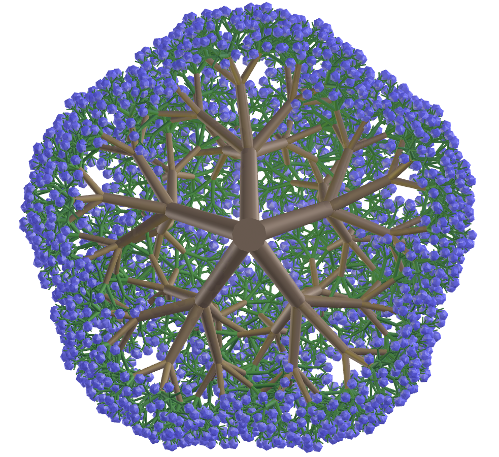</a>
  Aplicando-se o princípio de repetições com troncos de cones, obtemos uma árvore fractal. Neste exemplo, adicionamos icosaedros triakis como “frutos” ou “flores” da árvore. Na primeira ordem de construção do fractal, construímos três novos troncos de cone conectados com uma face do tronco de cone original. Neste exemplo, temos as representações do sólido nas ordens de 0 até 5. 
  

<h4>22. Árvore fractal triangular com hexecontaedros pentagonais</h4>
<a href="../vr/Tree3.htm" target="_blank" title="modelo 3D" class="fotoA">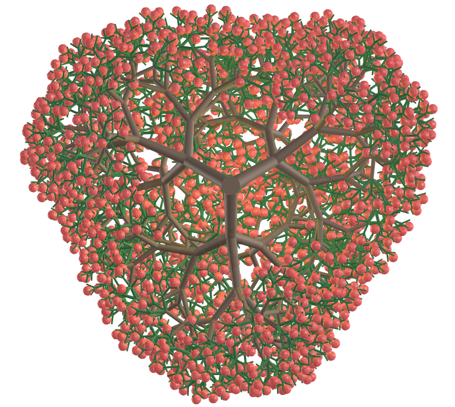</a>
  Aplicando-se o princípio de repetições com troncos de cones, obtemos uma árvore fractal. Neste exemplo, adicionamos hexecontaedros pentagonais como “frutos” ou “flores” da árvore. Na primeira ordem de construção do fractal, construímos três novos troncos de cone conectados com uma face do tronco de cone original. Neste exemplo, temos as representações do sólido nas ordens de 0 até 6. 
  

<a href="#p1" class="topo">voltar ao topo</a>

<h4>23. Árvore fractal pentagonal com hexecontaedros pentagonais</h4>
<a href="../vr/Tree3a.htm" target="_blank" title="modelo 3D" class="fotoA">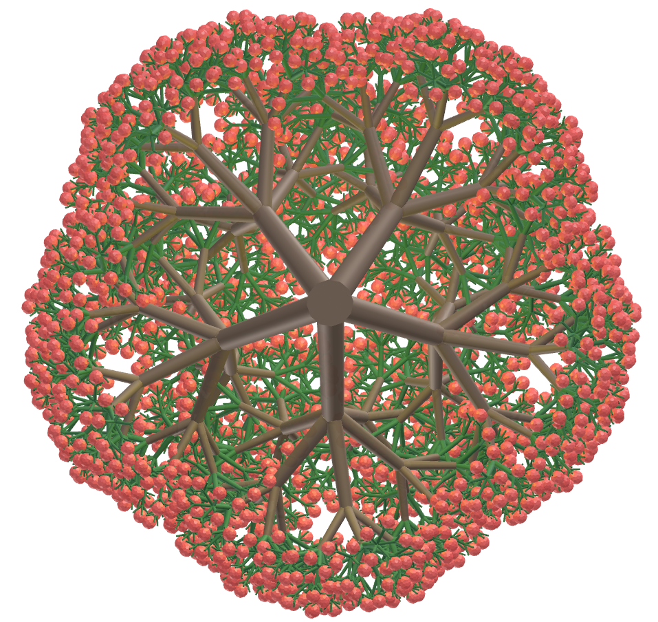</a>
  Aplicando-se o princípio de repetições com troncos de cones, obtemos uma árvore fractal. Neste exemplo, adicionamos hexecontaedros pentagonais como “frutos” ou “flores” da árvore. Na primeira ordem de construção do fractal, construímos três novos troncos de cone conectados com uma face do tronco de cone original. Neste exemplo, temos as representações do sólido nas ordens de 0 até 5. 
  

<h4>24. Árvore fractal triangular com icositetraedros pentagonais</h4>
<a href="../vr/Tree4.htm" target="_blank" title="modelo 3D" class="fotoA">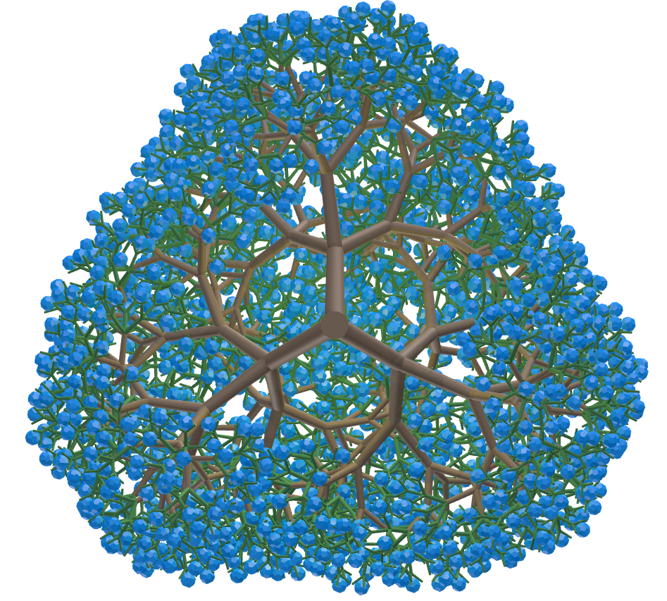</a>
  Aplicando-se o princípio de repetições com troncos de cones, obtemos uma árvore fractal. Neste exemplo, adicionamos icositetraedros pentagonais como “frutos” ou “flores” da árvore. Na primeira ordem de construção do fractal, construímos três novos troncos de cone conectados com uma face do tronco de cone original. Neste exemplo, temos as representações do sólido nas ordens de 0 até 6. 
  

<a href="#p1" class="topo">voltar ao topo</a>

<h4>25. Árvore fractal pentagonal com icositetraedros pentagonais</h4>
<a href="../vr/Tree4a.htm" target="_blank" title="modelo 3D" class="fotoA">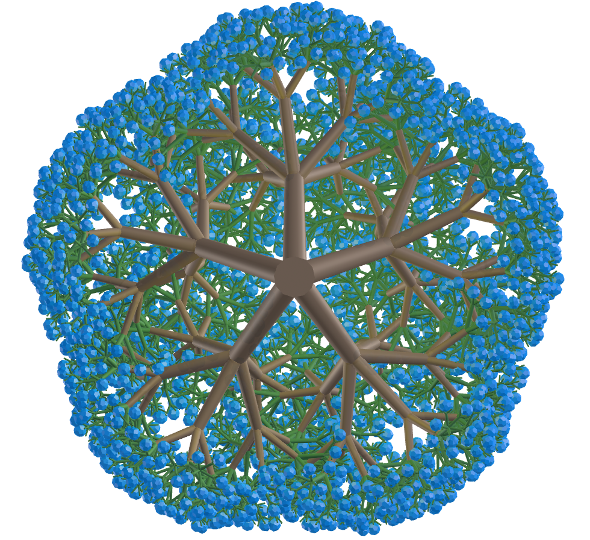</a>
  Aplicando-se o princípio de repetições com troncos de cones, obtemos uma árvore fractal. Neste exemplo, adicionamos icositetraedros pentagonais como “frutos” ou “flores” da árvore. Na primeira ordem de construção do fractal, construímos três novos troncos de cone conectados com uma face do tronco de cone original. Neste exemplo, temos as representações do sólido nas ordens de 0 até 5. 
  

<h4>26. Icosaedro triakis</h4>
<a href="../vr/TriakisIcosahedron.htm" target="_blank" title="modelo 3D" class="fotoA">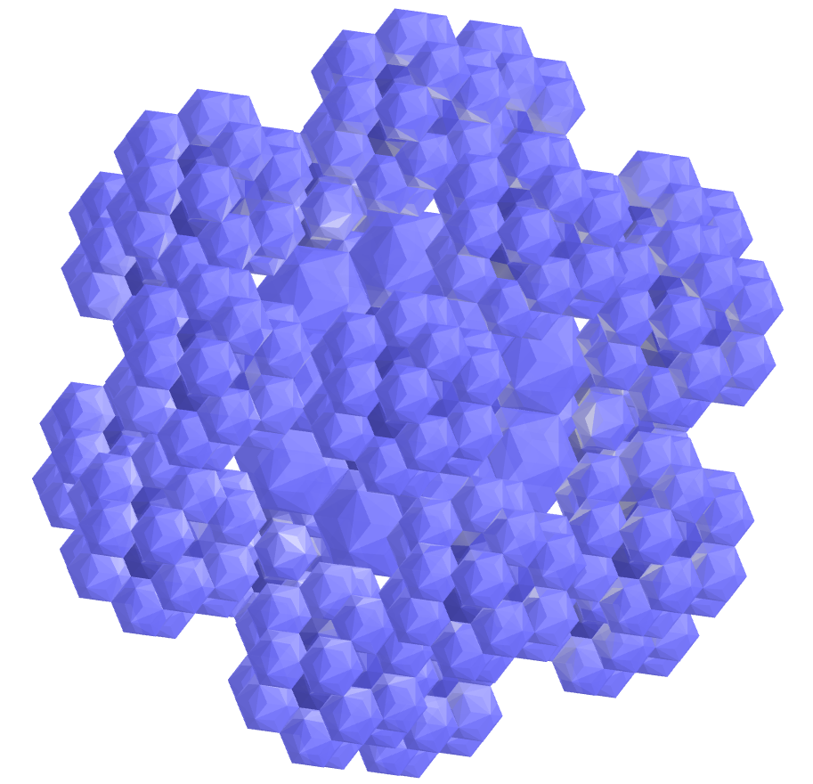</a>
  Aplicando-se o princípio de construção da curva de Koch nas faces do icosaedro triakis, obtemos um fractal do icosaedro triakis. Na primeira ordem de construção do fractal, construímos um novo sólido em 20 vértices do poliedro original. Neste exemplo, temos as representações do sólido nas ordens 0, 1, 2 e 3.
 
<table>
	<tr>
		<th>ordem</th>
		<th>poliedros</th>
		<th>faces</th>
		<th>arestas</th>
		<th>vértices</th>
	</tr>
	<tr>
		<td>0</td>
		<td>1</td>
		<td>60</td>
		<td>90</td>
		<td>32</td>
	</tr>
	<tr>
		<td>1</td>
		<td>21</td>
		<td>1260</td>
		<td>1890</td>
		<td>672</td>
	</tr>
	<tr>
		<td>2</td>
		<td>441</td>
		<td>26460</td>
		<td>39690</td>
		<td>14112</td>
	</tr>
	<tr>
		<td>3</td>
		<td>9261</td>
		<td>555660</td>
		<td>833490</td>
		<td>296352</td>
	</tr>
 </table>

  

<h4>27. Octaedro triakis</h4>
<a href="../vr/TriakisOctahedron.htm" target="_blank" title="modelo 3D" class="fotoA">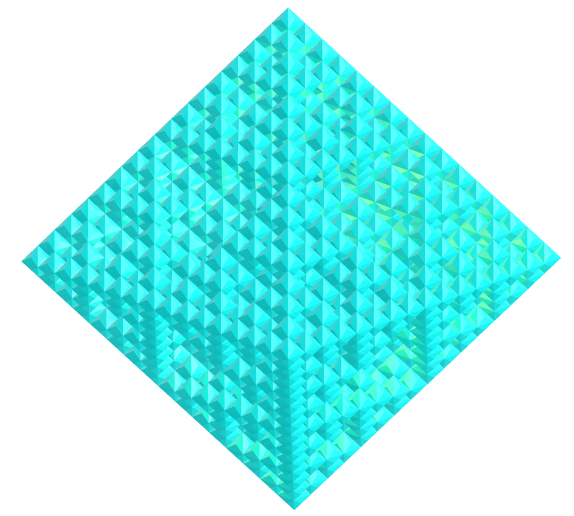</a>
  Aplicando-se o princípio de construção de Sierpinski nas faces do octaedro triakis, obtemos um fractal do octaedro triakis. Na primeira ordem de construção do fractal, construímos um novo sólido em 6 vértices do poliedro original. Neste exemplo, temos as representações do sólido nas ordens 0, 1, 2, 3 e 4.
 
<table>
	<tr>
		<th>ordem</th>
		<th>poliedros</th>
		<th>faces</th>
		<th>arestas</th>
		<th>vértices</th>
	</tr>
	<tr>
		<td>0</td>
		<td>1</td>
		<td>24</td>
		<td>36</td>
		<td>14</td>
	</tr>
	<tr>
		<td>1</td>
		<td>6</td>
		<td>144</td>
		<td>216</td>
		<td>84</td>
	</tr>
	<tr>
		<td>2</td>
		<td>36</td>
		<td>864</td>
		<td>1296</td>
		<td>504</td>
	</tr>
	<tr>
		<td>3</td>
		<td>216</td>
		<td>5184</td>
		<td>7776</td>
		<td>3024</td>
	</tr>
	<tr>
		<td>4</td>
		<td>1296</td>
		<td>31104</td>
		<td>46656</td>
		<td>18144</td>
	</tr>
 </table>

  

<h4>28. Tetraedro triakis</h4>
<a href="../vr/TriakisTetrahedron.htm" target="_blank" title="modelo 3D" class="fotoA">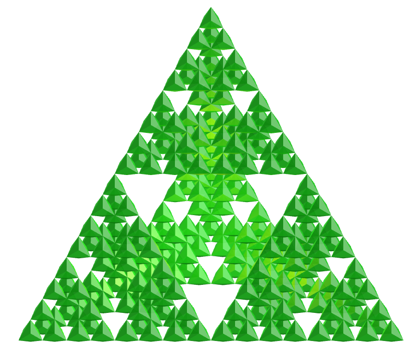</a>
  Aplicando-se o princípio de construção de Sierpinski nas faces do tetraedro triakis, obtemos um fractal do tetraedro triakis. Na primeira ordem de construção do fractal, construímos um novo sólido em 4 vértices do poliedro original. Neste exemplo, temos as representações do sólido nas ordens 0, 1, 2, 3 e 4.
 
<table>
	<tr>
		<th>ordem</th>
		<th>poliedros</th>
		<th>faces</th>
		<th>arestas</th>
		<th>vértices</th>
	</tr>
	<tr>
		<td>0</td>
		<td>1</td>
		<td>12</td>
		<td>18</td>
		<td>8</td>
	</tr>
	<tr>
		<td>1</td>
		<td>4</td>
		<td>48</td>
		<td>72</td>
		<td>32</td>
	</tr>
	<tr>
		<td>2</td>
		<td>16</td>
		<td>192</td>
		<td>288</td>
		<td>128</td>
	</tr>
	<tr>
		<td>3</td>
		<td>64</td>
		<td>768</td>
		<td>1152</td>
		<td>512</td>
	</tr>
	<tr>
		<td>4</td>
		<td>256</td>
		<td>3072</td>
		<td>4608</td>
		<td>2048</td>
	</tr>
 </table>

  

<h4>29. Icosaedro truncado de Arquimedes</h4>
<a href="../vr/TruncatedIcosahedron2.htm" target="_blank" title="modelo 3D" class="fotoA">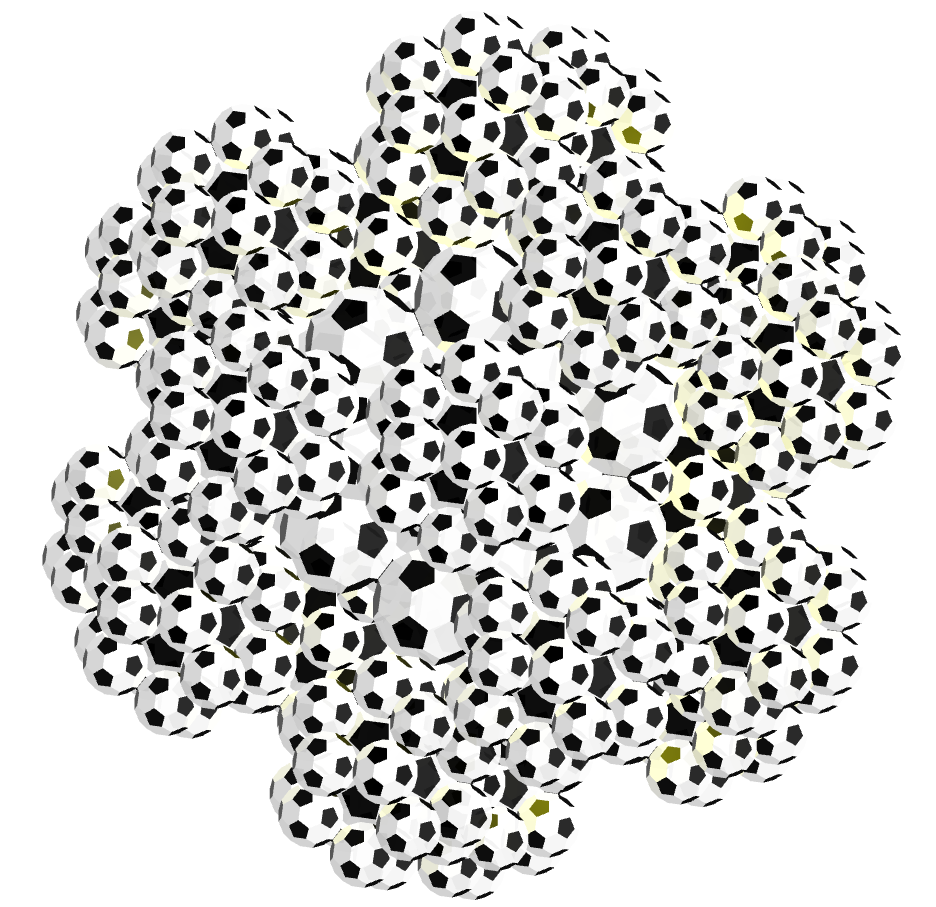</a>
  Aplicando-se o princípio de construção da curva de Koch nas faces do icosaedro truncado, obtemos um fractal do icosaedro truncado. Na primeira ordem de construção do fractal, construímos um novo sólido em 20 vértices do poliedro original. Neste exemplo, temos as representações do sólido nas ordens 0, 1, 2 e 3.
 
<table>
	<tr>
		<th>ordem</th>
		<th>poliedros</th>
		<th>faces</th>
		<th>arestas</th>
		<th>vértices</th>
	</tr>
	<tr>
		<td>0</td>
		<td>1</td>
		<td>32</td>
		<td>90</td>
		<td>60</td>
	</tr>
	<tr>
		<td>1</td>
		<td>21</td>
		<td>672</td>
		<td>1890</td>
		<td>1260</td>
	</tr>
	<tr>
		<td>2</td>
		<td>441</td>
		<td>14112</td>
		<td>39690</td>
		<td>26460</td>
	</tr>
	<tr>
		<td>3</td>
		<td>9261</td>
		<td>296352</td>
		<td>833490</td>
		<td>555660</td>
	</tr>
 </table>

  

<h4>30. Icosidodecaedro truncado de Arquimedes</h4>
<a href="../vr/TruncatedIcosidodecahedron2.htm" target="_blank" title="modelo 3D" class="fotoA">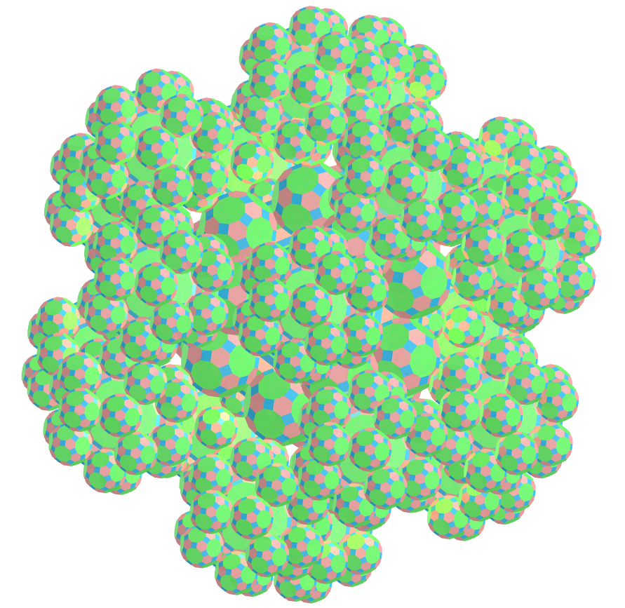</a>
  Aplicando-se o princípio de construção da curva de Koch nas faces do icosidodecaedro truncado, obtemos um fractal do icosidodecaedro truncado. Na primeira ordem de construção do fractal, construímos um novo sólido em 20 vértices do poliedro original. Neste exemplo, temos as representações do sólido nas ordens 0, 1, 2 e 3.
 
<table>
	<tr>
		<th>ordem</th>
		<th>poliedros</th>
		<th>faces</th>
		<th>arestas</th>
		<th>vértices</th>
	</tr>
	<tr>
		<td>0</td>
		<td>1</td>
		<td>62</td>
		<td>180</td>
		<td>120</td>
	</tr>
	<tr>
		<td>1</td>
		<td>21</td>
		<td>1302</td>
		<td>3780</td>
		<td>2520</td>
	</tr>
	<tr>
		<td>2</td>
		<td>441</td>
		<td>27342</td>
		<td>79380</td>
		<td>52920</td>
	</tr>
	<tr>
		<td>3</td>
		<td>9261</td>
		<td>574182</td>
		<td>1666980</td>
		<td>1111320</td>
	</tr>
 </table>

  

<a href="#p1" class="topo">voltar ao topo</a>

  Catalan fractals: visualization with Virtual Reality de <a xmlns:cc="http://creativecommons.org/ns#" href="https://paulohscwb.github.io/polyhedra3/fractal-catalan/pt-br/" property="cc:attributionName" rel="cc:attributionURL">Paulo Henrique Siqueira</a> está licenciado com uma Licença <a rel="license" href="http://creativecommons.org/licenses/by-nc-nd/4.0/">Creative Commons Atribuição-NãoComercial-SemDerivações 4.0 Internacional</a>.

<h4>Como citar este trabalho:</h4> 

Siqueira, P.H., "Catalan fractals: visualization with Virtual Reality". Disponível em: <https://paulohscwb.github.io/polyhedra3/fractal-catalan/pt-br/>, Fevereiro de 2026.

<!---->
  <b>Referências:</b>
 Weisstein, Eric W. "Archimedean Solid" From MathWorld-A Wolfram Web Resource. <a href="http://mathworld.wolfram.com/ArchimedeanSolid.html" target="_blank">http://mathworld.wolfram.com/ArchimedeanSolid.html</a>
 Weisstein, Eric W. "Catalan Solid" From MathWorld-A Wolfram Web Resource. <a href="https://mathworld.wolfram.com/CatalanSolid.html" target="_blank">https://mathworld.wolfram.com/CatalanSolid.html</a>
 McCooey, D. I. "Visual Polyhedra". <a href="http://dmccooey.com/polyhedra/" target="_blank">http://dmccooey.com/polyhedra/</a>
