<link rel="stylesheet" href="../scripts/style.css">
<meta charset="utf-8">
<link rel="icon" type="image/png" href="vr/salas/imagens/icone.png">
<h2>Visualization of Polyhedra with Virtual Reality (VR) in A-frame</h2>
 <b>author:</b> Paulo Henrique Siqueira - Universidade Federal do Paraná
  <b>contact:</b> <a href="#">paulohscwb@gmail.com</a>
  <a href="https://paulohscwb.github.io/polyhedra3/kites/pt-br/">versão em português</a>
 <form style="margin: 0 auto; float:right; text-align:right; width:100%; margin-bottom:15px;">
	<select id="url" onchange="urlHandler(this.value)" style="color:royalblue;">
		<option disabled selected value>More solids:</option>
		<option value="../catalangems/">Catalan gems</option>
		<option value="../dragon-archimedes/">Archimedes and Catalan Dragon Fractals</option>
		<option disabled value="../kites/">Star kites</option>
		<option value="../araucaria/">Araucaria with polyhedrons</option>
		<option value="../dragon-nonconvex/">Dragon fractals of non-convex polyhedra</option>
		<option value="../fractal-catalan/">Catalan fractals</option>
		<!--<option value="../deltahedra/">Deltahedra</option>
		<option value="../unicorn-platonic/">Plato's Unicorn Fractals</option>
		<option value="../dragon-catalan/">Catalan Dragon Fractals</option>
		<option value="../fractalnonconvex1/">Fractals of non-convex polyhedra</option>
		<option value="../truncated-archimedes/">Truncated Archimedean polyhedra</option>
		<option value="../unicorn-catalan/">Catalan Unicorn Fractals</option>
		<option value="../fractalnonconvex2/">Fractals of non-convex polyhedra 2</option>
		<option value="../unicorn-archimedes/">Archimedes Unicorn Fractals</option>
		<option value="../fractalnonconvex3/">Fractals of non-convex polyhedra 3</option>
		<option value="../truncated-catalan/">Truncated Catalan polyhedra</option>
		<option value="../unicorn-nonconvex1/">Unicorn fractals of non-convex polyhedra</option>
		<option value="../dragon-nonconvex2/">Dragon fractals of non-convex polyhedra 2</option>
		<option value="../unicorn-nonconvex2/">Unicorn fractals of non-convex polyhedra 2</option>
		<option value="../fractalnonconvex4/">Fractals of non-convex polyhedra 4</option>
		<option value="../dragon-nonconvex3/">Dragon fractals of non-convex polyhedra 3</option>
		<option value="../fractalnonconvex5/">Fractals of non-convex polyhedra 5</option>
		<option value="../unicorn-nonconvex3/">Unicorn fractals of non-convex polyhedra 3</option>
		<option value="../fractalnonconvex6/">Fractals of non-convex polyhedra 6</option>-->
	</select>
</form>

  <h2 align="center">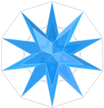 Star kites</h2>
The polyhedra shown on this page are formed by kites, with some vertices coinciding with the polyhedra of Plato and Archimedes. The faces of the Stars kites are congruent, determining monohedral solids. The symmetries of faces, edges and vertices are the same as those of the respective polyhedra of Plato and Archimedes.
 This work shows the Stars kites, modeled for viewing in Virtual Reality. The numbers of vertices Vk, edges Ek and faces Fk have the following relation to the numbers of vertices V, edges E and faces F (n sides) of Archimedes and Plato polyhedra:
 
Ek = 3&middot;E; Vk = F + E + V; Fk = n&middot;F.

<a href="#m3d">3D Models</a>&nbsp;&nbsp;|&nbsp;&nbsp;<a href="../">Home</a>

 
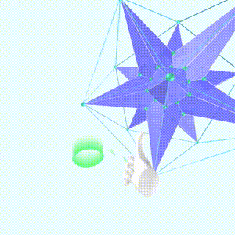
 

<h3 id="m3d" align="center">3D models</h3>
<iframe width="560" height="315" style="max-width:100%" src="https://www.youtube.com/embed/videoseries?list=PLy0I_lGW8HxXE37-GzEiObaiU6cwZwb6y" title="YouTube video player" frameborder="0" allow="accelerometer; autoplay; clipboard-write; encrypted-media; gyroscope; picture-in-picture; web-share" allowfullscreen></iframe>
<h4>1. Cube</h4>
<a href="vr/cube_kites.htm" target="_blank" title="3D model" class="fotoA">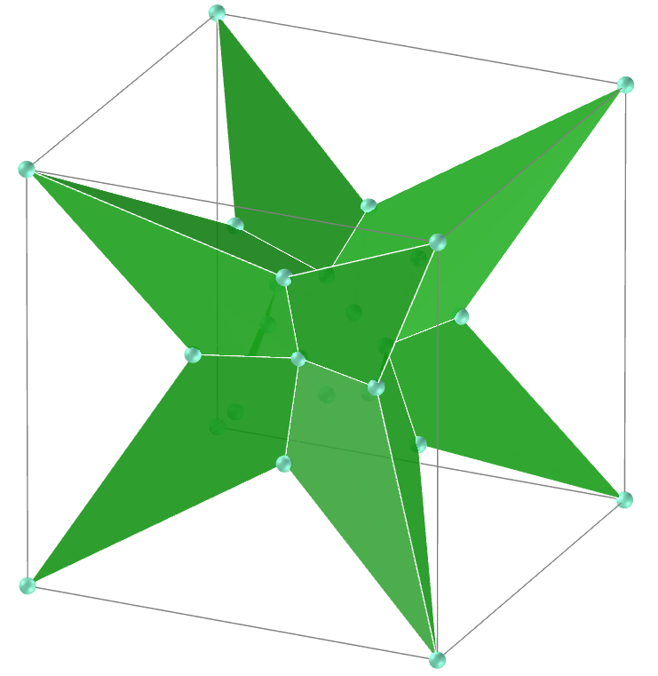</a>
  We build a Star with kites with some vertices coinciding with the vertices of the cube: Cubic star kites.
  <b>faces</b>: 24 | <b>edges</b>: 36 | <b>vertices</b>: 26
  

<h4>2. Octahedron</h4>
<a href="vr/octa_kites.htm" target="_blank" title="3D model" class="fotoA">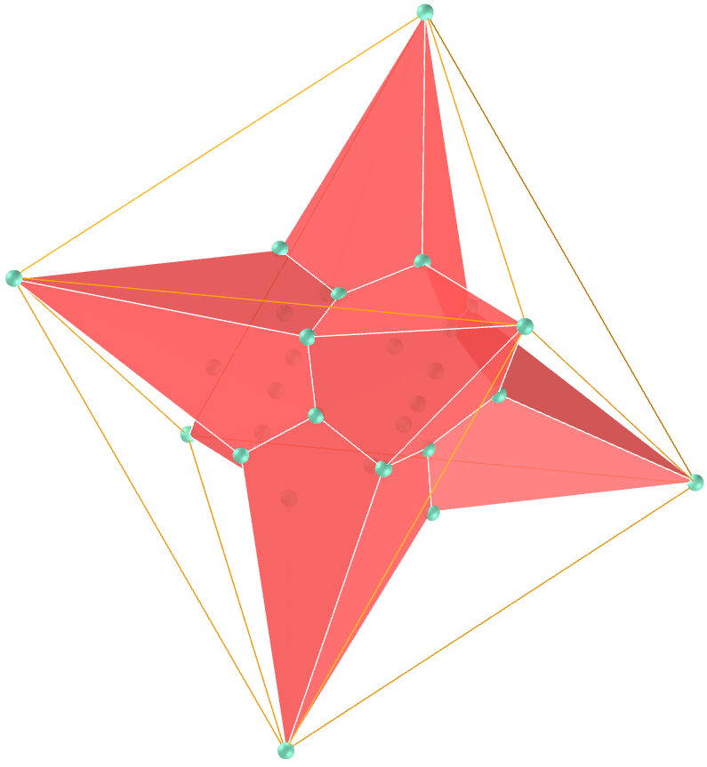</a>
  Octahedral star kites.
  <b>faces</b>: 24 | <b>edges</b>: 36 | <b>vertices</b>: 26
  

<h4>3. Icosahedron</h4>
<a href="vr/ico_kites.htm" target="_blank" title="3D model" class="fotoA">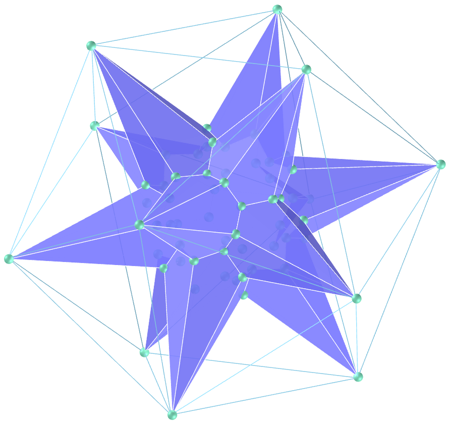</a>
  Icosahedral star kites.
  <b>faces</b>: 60 | <b>edges</b>: 90 | <b>vertices</b>: 62
  

<h4>4. Dodecahedron</h4>

  Dodecahedral star kites.
  <b>faces</b>: 60 | <b>edges</b>: 90 | <b>vertices</b>: 62
  

<h4>5. Tetrahedron</h4>
<a href="vr/tetra_kites.htm" target="_blank" title="3D model" class="fotoA">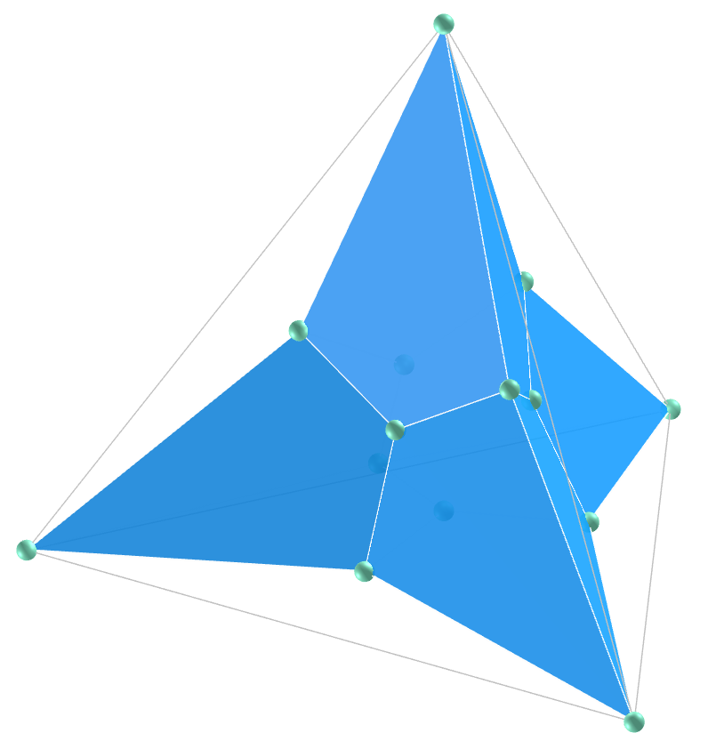</a>
  Tetrahedral star kites (also called trapezohedral tristetrahedron).
  <b>faces</b>: 12 | <b>edges</b>: 18 | <b>vertices</b>: 14
  

<h4>6. Cuboctahedron</h4>
<a href="vr/Cuboctahedron.htm" target="_blank" title="3D model" class="fotoA">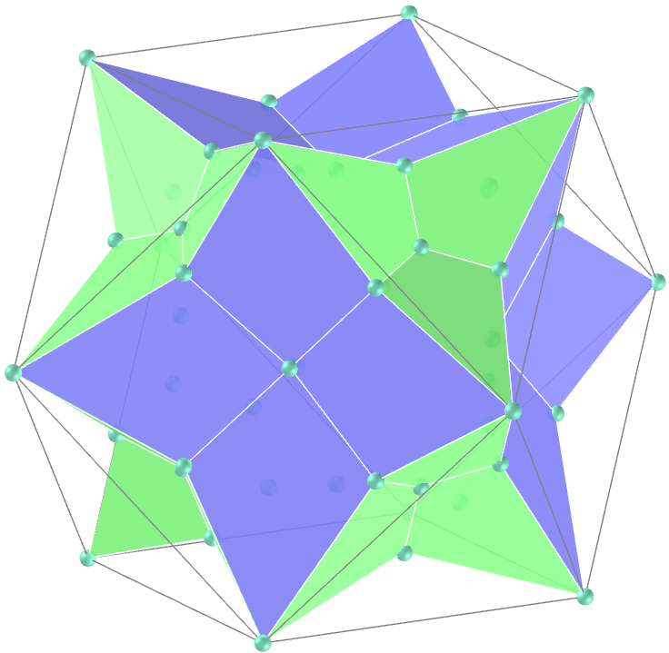</a>
  Cuboctahedral star kites.
  <b>faces</b>: 48 | <b>edges</b>: 72 | <b>vertices</b>: 50
  

<h4>7. Icosidodecahedron</h4>
<a href="vr/Icosidodecahedron.htm" target="_blank" title="3D model" class="fotoA">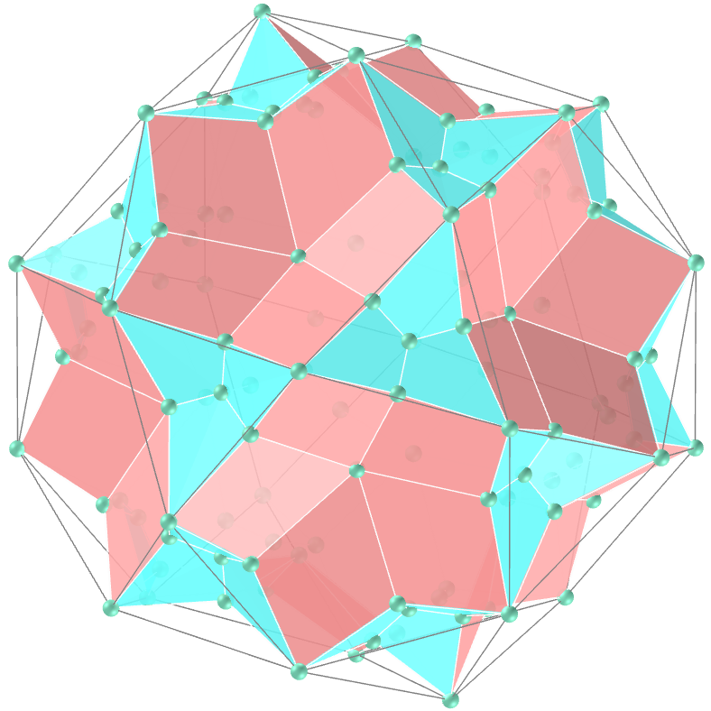</a>
  Icosidodecahedral star kites.
  <b>faces</b>: 120 | <b>edges</b>: 180 | <b>vertices</b>: 122
  

<h4>8. Rhombicosidodecahedron</h4>
<a href="vr/Rhombicosidodecahedron.htm" target="_blank" title="3D model" class="fotoA">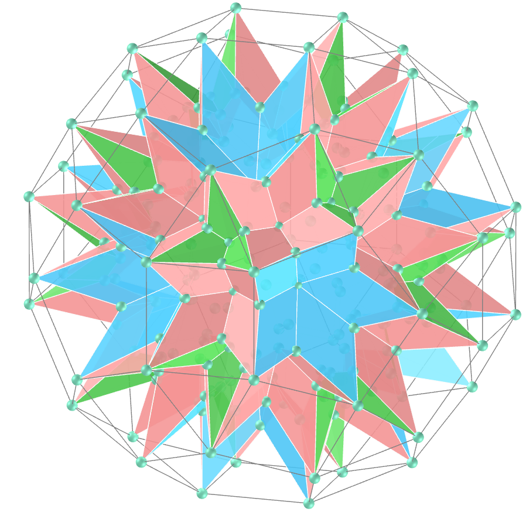</a>
  Rhombicosidodecahedral star kites.
  <b>faces</b>: 240 | <b>edges</b>: 360 | <b>vertices</b>: 242
  

<h4>9. Rhombicuboctahedron</h4>
<a href="vr/Rhombicuboctahedron.htm" target="_blank" title="3D model" class="fotoA">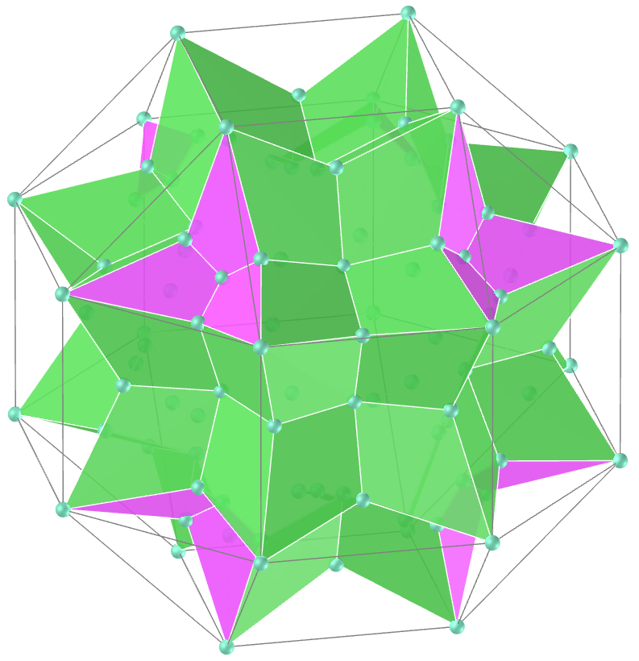</a>
  Rhombicuboctahedral star kites.
  <b>faces</b>: 96 | <b>edges</b>: 144 | <b>vertices</b>: 98
  

<h4>10. Snub Cube</h4>
<a href="vr/Snub_Cube.htm" target="_blank" title="3D model" class="fotoA">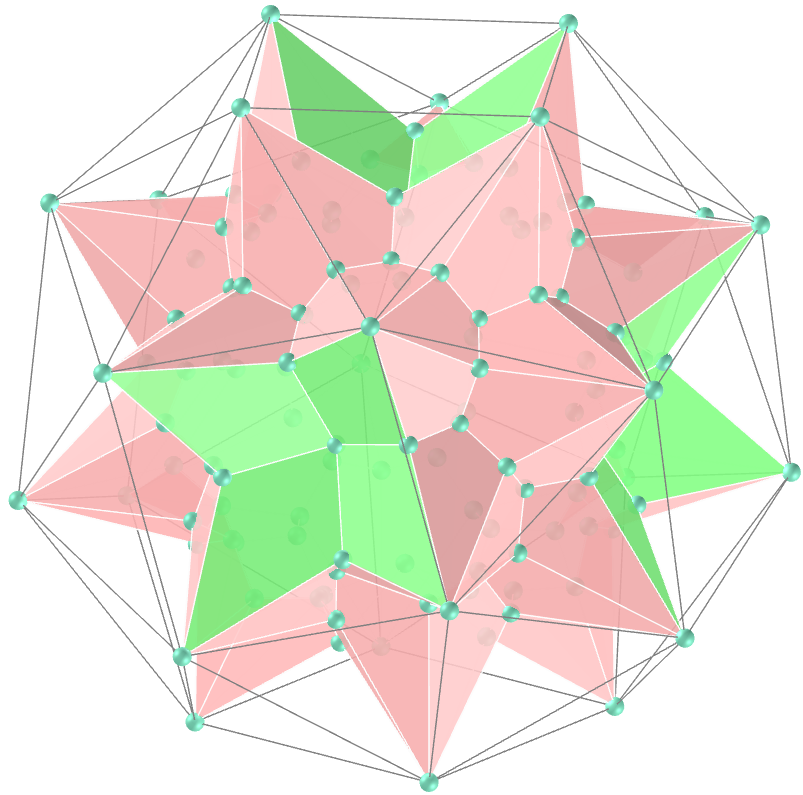</a>
  Snub cube star kites. 
  <b>faces</b>: 120 | <b>edges</b>: 180 | <b>vertices</b>: 122
  

<a href="#p1" class="topo">back to top</a>

<h4>11. Snub Dodecahedron</h4>

  Dodecahedron snub star kites.
  <b>faces</b>: 300 | <b>edges</b>: 450 | <b>vertices</b>: 302
  

<h4>12. Truncated Cube</h4>

  Truncated cube star kites.
  <b>faces</b>: 72 | <b>edges</b>: 108 | <b>vertices</b>: 74
  

<h4>13. Truncated Cuboctahedron</h4>
<a href="vr/Truncated_Cuboctahedron.htm" target="_blank" title="3D model" class="fotoA">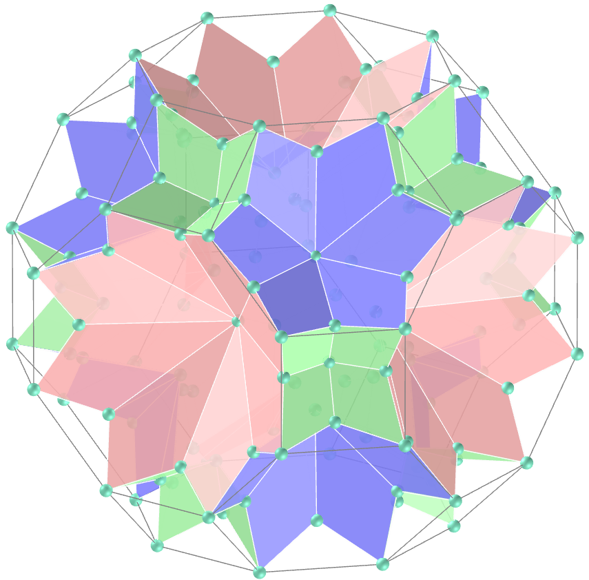</a>
  Truncated cuboctahedron star kites.
  <b>faces</b>: 144 | <b>edges</b>: 216 | <b>vertices</b>: 146
  

<h4>14. Truncated Dodecahedron</h4>

  Truncated dodecahedron star kites.
  <b>faces</b>: 180 | <b>edges</b>: 270 | <b>vertices</b>: 182
  

<h4>15. Truncated Icosahedron</h4>
<a href="vr/Truncated_Icosahedron.htm" target="_blank" title="3D model" class="fotoA">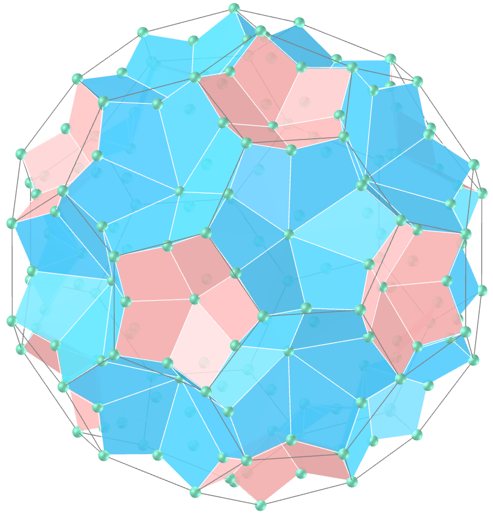</a>
  Truncated icosahedron star kites.
  <b>faces</b>: 180 | <b>edges</b>: 270 | <b>vertices</b>: 182
  

<h4>16. Truncated Icosidodecahedron</h4>

  Truncated icosidodecahedron star kites.
  <b>faces</b>: 360 | <b>edges</b>: 540 | <b>vertices</b>: 362
  

<h4>17. Truncated Octahedron</h4>

  Truncated octahedron star kites.
  <b>faces</b>: 72 | <b>edges</b>: 108 | <b>vertices</b>: 74
  

<h4>18. Truncated Tetrahedron</h4>

  Truncated tetrahedron star kites.
  <b>faces</b>: 36 | <b>edges</b>: 54 | <b>vertices</b>: 38
  

<a href="#p1" class="topo">back to top</a>

  Star kites: polyhedra and visualization with Virtual Reality by <a xmlns:cc="http://creativecommons.org/ns#" href="https://paulohscwb.github.io/polyhedra3/kites/" property="cc:attributionName" rel="cc:attributionURL">Paulo Henrique Siqueira</a> is licensed with a license <a rel="license" href="http://creativecommons.org/licenses/by-nc-nd/4.0/">Creative Commons Attribution-NonCommercial-NoDerivatives 4.0 International</a>.

<h4>How to cite this work:</h4> 

Siqueira, P.H., "Star kites: polyhedra and visualization with Virtual Reality". Available in: <https://paulohscwb.github.io/polyhedra3/kites/>, June 2025.

<!---->
  <b>References:</b>
 Weisstein, Eric W. "Archimedean Solid" From MathWorld-A Wolfram Web Resource. <a href="http://mathworld.wolfram.com/ArchimedeanSolid.html" target="_blank">http://mathworld.wolfram.com/ArchimedeanSolid.html</a>
 McCooey, D. I. "Visual Polyhedra". <a href="http://dmccooey.com/polyhedra/" target="_blank">http://dmccooey.com/polyhedra/</a>
