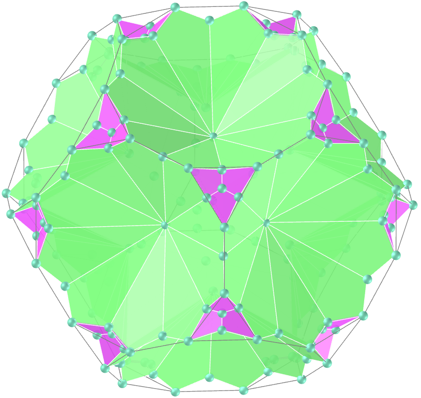
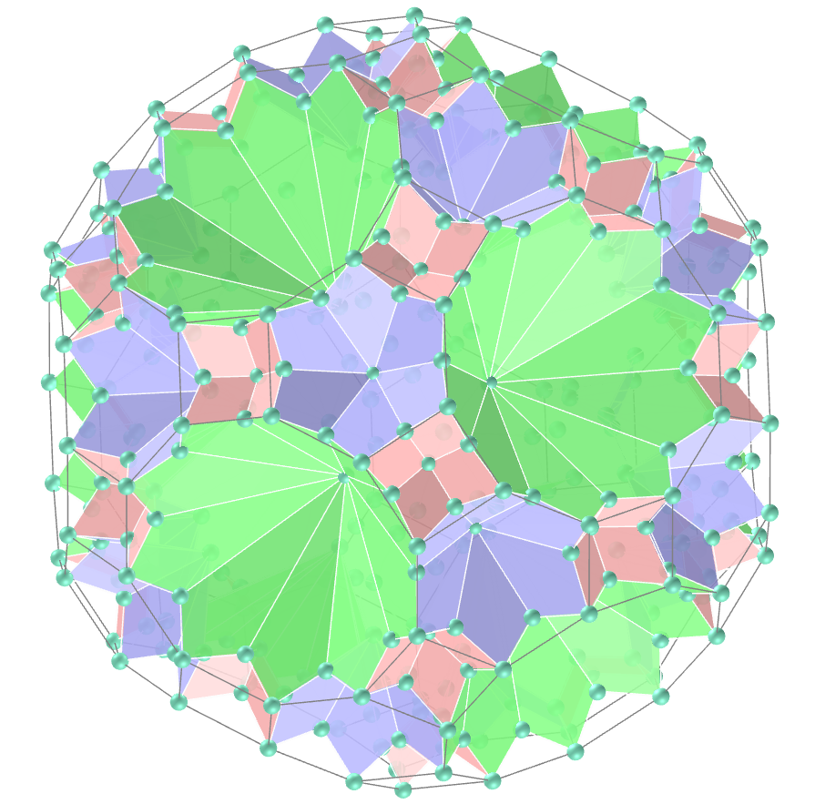

<link rel="stylesheet" href="../../scripts/style.css">
<meta charset="utf-8">
<link rel="icon" type="image/png" href="../vr/salas/imagens/icone.png">
<h2>Visualização de Poliedros com Realidade Virtual (RV) em A-frame</h2>
<b>autor:</b> Paulo Henrique Siqueira - Universidade Federal do Paraná
 <b>contato:</b> <a href="#"> paulohscwb@gmail.com </a>
 <a href="https://paulohscwb.github.io/polyhedra3/kites/">english version</a>
<form style="margin: 0 auto; float:right; text-align:right; width:100%; margin-bottom:15px;">
	<select id="url" onchange="urlHandler(this.value)" style="color:royalblue;">
		<option disabled selected>Mais sólidos:</option>
		<option value="../../catalangems/pt-br/">Gemas de Catalan</option>
		<option value="../../dragon-archimedes/pt-br/">Fractais do dragão de Arquimedes</option>
		<option disabled value="../../kites/pt-br/">Estrelas com pipas</option>
		<!--<option value="../../fractal-catalan/pt-br/">Fractais de Catalan</option>
		<option value="../../deltahedra/pt-br/">Deltaedros</option>
		<option value="../../unicorn-platonic/pt-br/">Fractais do unicórnio de Platão</option>
		<option value="../../dragon-catalan/pt-br/">Fractais do dragão de Catalan</option>
		<option value="../../fractalnonconvex1/pt-br/">Fractais de poliedros não convexos</option>
		<option value="../../truncated-archimedes/pt-br/">Poliedros Arquimedianos truncados</option>
		<option value="../../unicorn-catalan/pt-br/">Fractais do unicórnio de Catalan</option>
		<option value="../../dragon-nonconvex/pt-br/">Fractais de dragão de poliedros não convexos</option>
		<option value="../../fractalnonconvex2/pt-br/">Fractais de poliedros não convexos 2</option>
		<option value="../../unicorn-archimedes/pt-br/">Fractais do unicórnio de Arquimedes</option>
		<option value="../../fractalnonconvex3/pt-br/">Fractais de poliedros não convexos 3</option>
		<option value="../../truncated-catalan/pt-br/">Poliedros de Catalan truncados</option>
		<option value="../../unicorn-nonconvex1/pt-br/">Fractais do unicórnio de poliedros não convexos</option>
		<option value="../../dragon-nonconvex2/pt-br/">Fractais de dragão de poliedros não convexos 2</option>
		<option value="../../unicorn-nonconvex2/pt-br/">Fractais do unicórnio de poliedros não convexos 2</option>
		<option value="../../fractalnonconvex4/pt-br/">Fractais de poliedros não convexos 4</option>
		<option value="../../dragon-nonconvex3/pt-br/">Fractais de dragão de poliedros não convexos 3</option>
		<option value="../../fractalnonconvex5/pt-br/">Fractais de poliedros não convexos 5</option>
		<option value="../../unicorn-nonconvex3/pt-br/">Fractais do unicórnio de poliedros não convexos 3</option>
		<option value="../../fractalnonconvex6/pt-br/">Fractais de poliedros não convexos 6</option>-->
	</select>
</form>

  <h2 align="center"> Estrelas com pipas</h2>
  Os poliedros mostrados nesta página são formados por pipas, com alguns vértices coincidentes com poliedros de Platão e de Arquimedes. As faces das Estrelas com pipas são congruentes, determinando sólidos monoédricos. As simetrias de faces, arestas e vértices é a mesma dos respectivos poliedros de Platão de de Arquimedes.
 Este trabalho mostra as Estrelas com pipas, modeladas para visualização em Realidade Virtual.
 
<a href="#m3d">Modelos 3D</a>&nbsp;&nbsp;|&nbsp;&nbsp;<a href="../../pt-br/">Página Inicial</a>

  

 

<h3 id="m3d" align="center">Modelos 3D</h3>
<!--<iframe width="560" height="315" style="max-width:100%" src="https://www.youtube.com/embed/videoseries?list=PLy0I_lGW8HxU7g9x5hkKKNULwWAdRiCHW" title="YouTube video player" frameborder="0" allow="accelerometer; autoplay; clipboard-write; encrypted-media; gyroscope; picture-in-picture; web-share" allowfullscreen></iframe>-->
<h4>1. Cubo</h4>

  Construímos uma Estrela com pipas com alguns vértices coincidentes com os vértices do cubo: Estrela cúbica com pipas.
  

<h4>2. Octaedro</h4>

  Estrela octaédrica com pipas.
  

<h4>3. Icosaedro</h4>

  Estrela icosaédrica com pipas.
  

<h4>4. Dodecaedro</h4>

  Estrela dodecaédrica com pipas.
  

<h4>5. Tetraedro</h4>

  Estrela tetraédrica com pipas (também chamado de tristetraedro trapezoédrico).
  

<h4>6. Cuboctaedro</h4>

  Estrela cuboctaédrica com pipas.
  

<h4>7. Icosidodecaedro</h4>

  Estrela icosidodecaédrica com pipas.
  

<h4>8. Rombicosidodecaedro</h4>

  Estrela rombicosidodecaédrica com pipas.
  

<h4>9. Rombicuboctaedro</h4>

  Estrela rombicuboctaédrica com pipas.
  

<h4>10. Cubo snub</h4>

  Estrela de cubo snub com pipas.
  

<a href="#p1" class="topo">voltar ao topo</a>

<h4>11. Dodecaedro Snub</h4>

  Estrela de dodecaedro snub com pipas.
  

<h4>12 Cubo truncado</h4>

  Estrela de cubo truncado com pipas.
  

<h4>13. Cuboctaedro truncado</h4>

  Estrela de cuboctaedro truncado com pipas.
  

<h4>14. Dodecaedro truncado</h4>

  Estrela de dodecaedro truncado com pipas.
  

<h4>15. Icosaedro truncado</h4>

  Estrela de icosaedro truncado com pipas.
  

<h4>16. Icosidodecaedro truncado</h4>

  Estrela de icosidodecaedro truncado com pipas.
  

<h4>17. Octaedro truncado</h4>

  Estrela de octaedro truncado com pipas.
  

<h4>18. Tetraedro truncado</h4>

  Estrela de tetraedro truncado com pipas.
  

<a href="#p1" class="topo">voltar ao topo</a>

  Star kites: polyhedra and visualization with Virtual Reality de <a xmlns:cc="http://creativecommons.org/ns#" href="https://paulohscwb.github.io/polyhedra3/kites/pt-br/" property="cc:attributionName" rel="cc:attributionURL">Paulo Henrique Siqueira</a> está licenciado com uma Licença <a rel="license" href="http://creativecommons.org/licenses/by-nc-nd/4.0/">Creative Commons Atribuição-NãoComercial-SemDerivações 4.0 Internacional</a>.

<h4>Como citar este trabalho:</h4> 

Siqueira, P.H., "Star kites: polyhedra and visualization with Virtual Reality". Disponível em: <https://paulohscwb.github.io/polyhedra3/dragon-archimedes/pt-br/>, Junho de 2025.

<!---->
  <b>Referências:</b>
 Weisstein, Eric W. "Archimedean Solid" From MathWorld-A Wolfram Web Resource. <a href="http://mathworld.wolfram.com/ArchimedeanSolid.html" target="_blank">http://mathworld.wolfram.com/ArchimedeanSolid.html</a>
 McCooey, D. I. "Visual Polyhedra". <a href="http://dmccooey.com/polyhedra/" target="_blank">http://dmccooey.com/polyhedra/</a>
