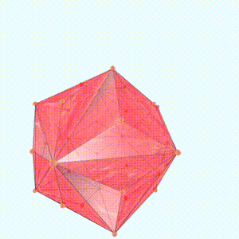
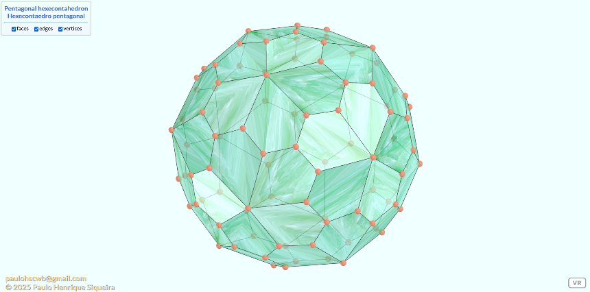

<link rel="stylesheet" href="../scripts/style.css">
<meta charset="utf-8">
<link rel="icon" type="image/png" href="../catalangems/vr/salas/imagens/icone.png">
<h2>Visualização de Poliedros com Realidade Virtual (RV) em A-frame</h2>
<b>autor:</b> Paulo Henrique Siqueira - Universidade Federal do Paraná
 <b>contato:</b> <a href="#"> paulohscwb@gmail.com </a>
 <a href="https://paulohscwb.github.io/polyhedra3/">english version</a>
  Nova página: os modelos 3D dos poliedros e fractais podem ser vistos em Realidade Virtual (RV).

<h3 style="margin-top:3px"><a target="_blank" href="../catalangems/pt-br/"> Gemas de Catalan</a></h3>
<!--<h3 style="margin-top:3px"><a target="_blank" href="../dragon_archimedes/pt-br/"> Fractais do dragão de Arquimedes</a></h3>
<h3 style="margin-top:3px"><a target="_blank" href="../fractal_catalan/pt-br/"> Fractais de Catalan</a></h3>
<h3 style="margin-top:3px"><a target="_blank" href="../kites/pt-br/"> Pipas Platônicas</a></h3>
<h3 style="margin-top:3px"><a target="_blank" href="../unicorn_platonic/pt-br/"> Fractais do unicórnio de Platão</a></h3>
<h3 style="margin-top:3px"><a target="_blank" href="../dragon_catalan/pt-br/"> Fractais do dragão de Catalan</a></h3>
<h3 style="margin-top:3px"><a target="_blank" href="../fractalnonconvex1/pt-br/"> Fractais de poliedros não convexos</a></h3>
<h3 style="margin-top:3px"><a target="_blank" href="../truncated_archimedes/pt-br/"> Poliedros Arquimedianos truncados</a></h3>
<h3 style="margin-top:3px"><a target="_blank" href="../unicorn_catalan/pt-br/"> Fractais do unicórnio de Catalan</a></h3>
<h3 style="margin-top:3px"><a target="_blank" href="../dragon_nonconvex/pt-br/"> Fractais de dragão de poliedros não convexos</a></h3>
<h3 style="margin-top:3px"><a target="_blank" href="../fractalnonconvex2/pt-br/"> Fractais de poliedros não convexos 2</a></h3>
<h3 style="margin-top:3px"><a target="_blank" href="../unicorn_archimedes/pt-br/"> Fractais do unicórnio de Arquimedes</a></h3>
<h3 style="margin-top:3px"><a target="_blank" href="../fractalnonconvex3/pt-br/"> Fractais de poliedros não convexos 3</a></h3>
<h3 style="margin-top:3px"><a target="_blank" href="../truncated_catalan/pt-br/"> Poliedros de Catalan truncados</a></h3>
<h3 style="margin-top:3px"><a target="_blank" href="../unicorn_nonconvex1/pt-br/"> Fractais do unicórnio de poliedros não convexos</a></h3>
<h3 style="margin-top:3px"><a target="_blank" href="../dragon_nonconvex2/pt-br/"> Fractais de dragão de poliedros não convexos 2</a></h3>
<h3 style="margin-top:3px"><a target="_blank" href="../unicorn_nonconvex2/pt-br/"> Fractais do unicórnio de poliedros não convexos 2</a></h3>
<h3 style="margin-top:3px"><a target="_blank" href="../fractalnonconvex4/pt-br/"> Fractais de poliedros não convexos 4</a></h3>
<h3 style="margin-top:3px"><a target="_blank" href="../dragon_nonconvex3/pt-br/"> Fractais de dragão de poliedros não convexos 3</a></h3>
<h3 style="margin-top:3px"><a target="_blank" href="../fractalnonconvex5/pt-br/"> Fractais de poliedros não convexos 5</a></h3>
<h3 style="margin-top:3px"><a target="_blank" href="../unicorn_nonconvex3/pt-br/"> Fractais do unicórnio de poliedros não convexos 3</a></h3>
<h3 style="margin-top:3px"><a target="_blank" href="../fractalnonconvex6/pt-br/"> Fractais de poliedros não convexos 6</a></h3>-->

<h3 align="center">Realidade Virtual</h3>

<h3 align="center">Modelos 3D</h3>

 Os scripts de órbita desenvolvidos por <b>Kevin Ngo</b> foram usados nas páginas de Realidade Virtual dos modelos 3D: <a href="https://github.com/supermedium/superframe/tree/master/components/orbit-controls/" target="_blank"> Orbit controls for A-Frame</a>.
 Os scripts de teleporte desenvolvidos por <b>Fernando Serrano</b> foram usados nas páginas de Realidade Virtual dos modelos 3D: <a  href="https://aframe.io/blog/teleport-component/" target="_blank"> Developing an A-Frame Teleport Component</a>
 

  Polyhedra 3: visualization with Virtual Reality de <a xmlns:cc="http://creativecommons.org/ns#" href="https://paulohscwb.github.io/polyhedra3/" property="cc:attributionName" rel="cc:attributionURL">Paulo Henrique Siqueira</a> está licenciado com uma Licença <a rel="license" href="http://creativecommons.org/licenses/by-nc-nd/4.0/">Creative Commons Atribuição-NãoComercial-SemDerivações 4.0 Internacional</a>.

<h4>Como citar este trabalho:</h4> 

Siqueira, P.H., "Polyhedra 3: Visualization of polyhedra with Augmented Reality and Virtual Reality". Disponível em: <https://paulohscwb.github.io/polyhedra3/>, Fevereiro de 2025.

<!---->
 <b>Referências:</b>
 Weisstein, Eric W. "Archimedean Solid" From MathWorld-A Wolfram Web Resource. <a href="http://mathworld.wolfram.com/ArchimedeanSolid.html" target="_blank">http://mathworld.wolfram.com/ArchimedeanSolid.html</a>
 Weisstein, Eric W. "Platonic Solid" From MathWorld-A Wolfram Web Resource. <a href="http://mathworld.wolfram.com/PlatonicSolid.html" target="_blank">http://mathworld.wolfram.com/PlatonicSolid.html</a>
 Weisstein, Eric W. "Archimedean Dual" From MathWorld-A Wolfram Web Resource. <a href="https://mathworld.wolfram.com/ArchimedeanDual.html" target="_blank">https://mathworld.wolfram.com/ArchimedeanDual.html</a>
 Weisstein, Eric W. "Uniform Polyhedron." From MathWorld--A Wolfram Web Resource. <a href="https://mathworld.wolfram.com/UniformPolyhedron.html" target="_blank">https://mathworld.wolfram.com/UniformPolyhedron.html</a>
 Wikipedia <a href="https://en.wikipedia.org/wiki/Archimedean_solid" target="_blank">https://en.wikipedia.org/wiki/Archimedean_solid</a>
 Wikipedia <a href="https://en.wikipedia.org/wiki/en.wikipedia.org/wiki/Platonic_solid" target="_blank">https://en.wikipedia.org/wiki/Platonic_solid</a>
 McCooey, David I. "Visual Polyhedra". <a href="http://dmccooey.com/polyhedra/" target="_blank">http://dmccooey.com/polyhedra/</a>
